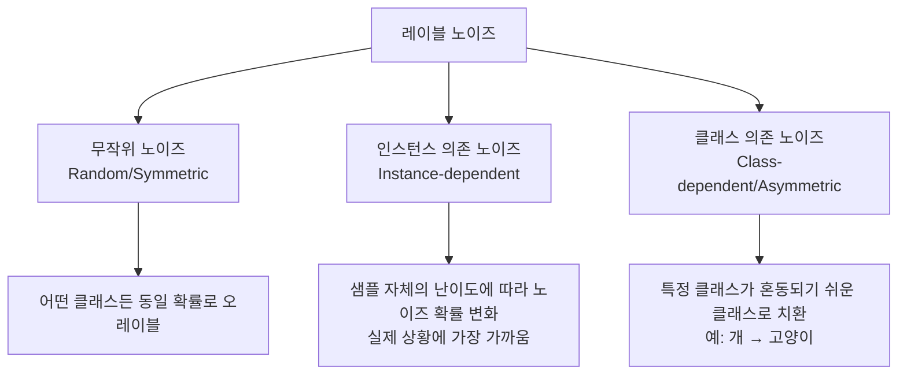
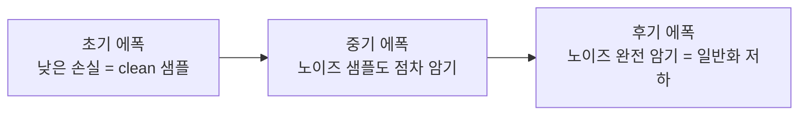
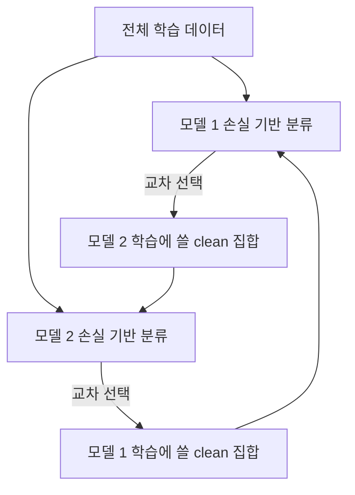
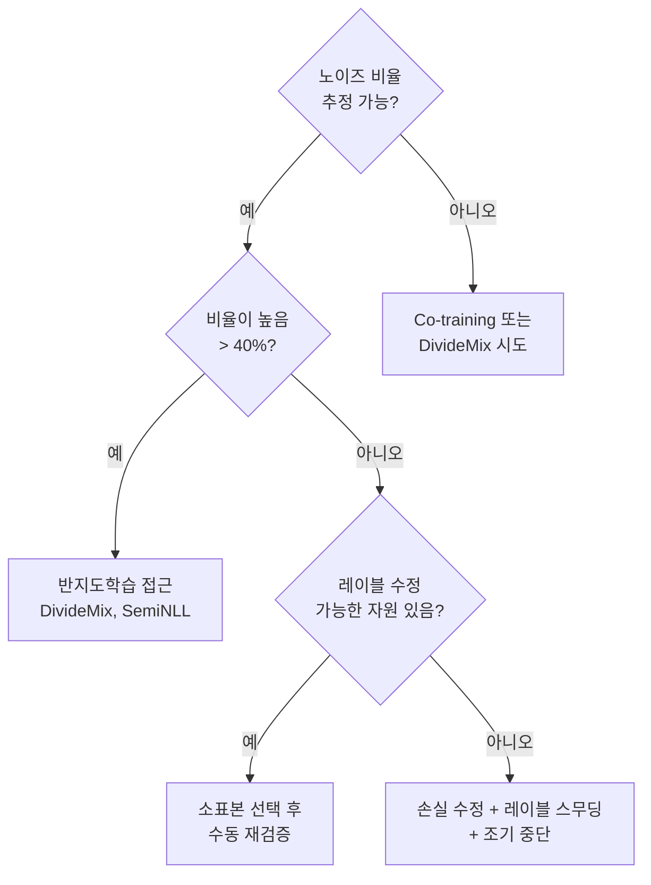

# 레이블 노이즈 학습 (Label Noise Learning)

실제 학습 데이터의 레이블에는 오류(noisy label)가 필연적으로 존재한다. 크라우드소싱, 자동 레이블링, 웹 크롤링 등으로 수집된 데이터에서 노이즈 비율이 10~40%에 달하는 경우도 흔하다. 레이블 노이즈 학습은 이런 환경에서도 강건하게 모델을 훈련하는 방법론이다.

## 노이즈 유형 분류



| 노이즈 유형 | 특징 | 실제 발생 사례 |
|------------|------|--------------|
| 무작위(Symmetric) | 균일 확률로 임의 클래스로 치환 | 이론 분석 단순화용 |
| 비대칭(Asymmetric) | 특정 클래스 쌍 간에 집중 | 시각적으로 유사한 클래스 혼동 |
| 인스턴스 의존 | 샘플별로 다른 노이즈 확률 | 애매한 경계 샘플, 전문 지식 부족 |
| 개방형(Open-set) | 완전히 다른 카테고리로 치환 | 웹 크롤링 오분류 |

## 딥러닝과 레이블 노이즈: 메모라이제이션 효과

Zhang et al. (2017)의 연구에서 딥 뉴럴 네트워크는 순수 무작위 레이블(100% 노이즈)도 완전히 암기(memorization)할 수 있음을 보였다. 그러나 학습 초기에는 깨끗한(clean) 샘플을 먼저 학습하고 노이즈 샘플은 나중에 암기하는 **"작은 손실 먼저(small-loss first)"** 현상이 관찰된다.



이 현상은 역설적으로 **조기 중단(early stopping)**이 노이즈 환경에서 효과적인 이유를 설명한다.

## 주요 방법론

### 1. 소표본 선택 (Sample Selection)

손실이 낮은 샘플을 깨끗한 샘플로 간주하고 학습에 활용한다.

**MentorNet**: 교사 네트워크가 학생 네트워크의 학습에 쓸 샘플을 선별.

**Co-training / DivideMix**: 두 모델이 서로 다른 관점에서 데이터를 분리하여 상호 보완.



### 2. 손실 수정 (Loss Correction)

노이즈 전이 행렬(noise transition matrix) T를 추정하고, 이를 이용해 손실 함수를 보정한다.

노이즈 관찰 확률: $p(\tilde{y}|x) = T \cdot p(y|x)$

보정된 손실: $L_{corrected} = T^{-1} \cdot L_{noisy}$

노이즈 전이 행렬 추정이 핵심 도전이며, 앵커 포인트(anchor point) 기반 추정이 널리 쓰인다.

### 3. 정규화 기법

**믹스업(Mixup)**: 두 샘플을 선형 보간하여 날카로운 결정 경계 완화.

**레이블 스무딩(Label Smoothing)**: 하드 레이블(0/1) 대신 소프트 레이블 사용하여 과신(overconfidence) 억제.

```python
# 레이블 스무딩 적용
smoothing = 0.1
n_classes = 10
targets = targets * (1 - smoothing) + smoothing / n_classes
```

**SAM(Sharpness-Aware Minimization)**: 평탄한(flat) 손실 지형을 찾아 노이즈에 강건한 해(solution) 선호.

### 4. 반지도 학습 접근 (Semi-supervised)

노이즈가 의심되는 샘플을 레이블 없는 데이터로 취급하고 반지도 학습 알고리즘(예: MixMatch, FixMatch)을 적용한다. DivideMix가 이 접근의 대표 사례다.

### 5. 자기 지도 사전 학습 (Self-supervised Pre-training)

레이블 없이 표현을 먼저 학습(contrastive learning 등)한 뒤 노이즈 레이블로 파인튜닝한다. 강한 표현(representation) 자체가 노이즈에 대한 내성을 제공한다.

## 평가 지표와 벤치마크

| 벤치마크 | 설명 |
|----------|------|
| CIFAR-10/100-N | 실제 인간 어노테이터 노이즈 수집본 |
| WebVision | 웹 크롤링 1백만 이미지, 실제 오레이블 포함 |
| Clothing1M | 실제 의류 이미지 1백만 장, ~38% 노이즈 |
| ANIMAL-10N | 시각적으로 유사한 동물 10종, 인간 실수 반영 |

## 실무 적용 가이드

노이즈 비율과 상황에 따른 방법 선택:



- 노이즈 비율 추정: GMM(Gaussian Mixture Model)으로 손실 분포 피팅하여 clean/noisy 분리
- 항상 깨끗한 검증 세트(clean validation set) 별도 확보 필수
- 조기 중단 기준을 검증 세트 성능으로 정의

## 왜 중요한가

[[data-centric-ai]]에서 강조하는 것처럼 모델보다 데이터 품질이 성능을 결정하는 경우가 많다. 레이블 노이즈 학습은 [[data-annotation]] 과정에서 불가피하게 발생하는 오류를 알고리즘 레벨에서 완화하는 실용적 기술이다. 특히 의료, 법률 등 전문 도메인에서 정확한 레이블링이 고비용인 경우 핵심 기술이다.

## 관련 문서

- [[data-centric-ai]] - 데이터 품질 중심 AI 패러다임
- [[data-annotation]] - 레이블링 전략, 품질 관리, 어노테이터 관리
- [[dataset-distillation]] - 소수 합성 예시로 데이터 압축
- [[knowledge-distillation-theory]] - 모델 지식 증류
