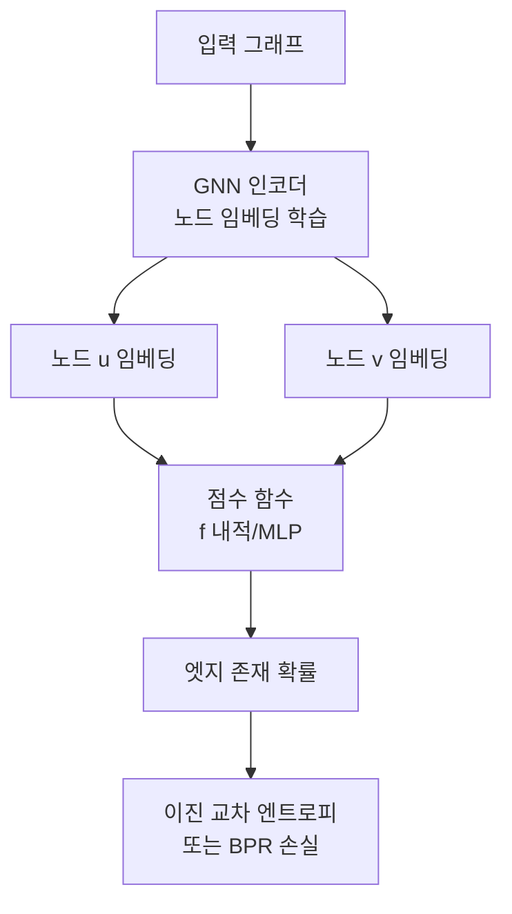
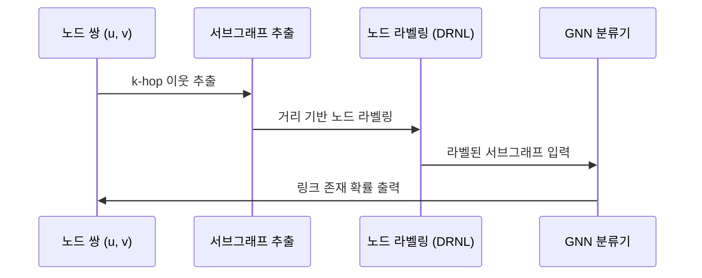

# 링크 예측 (GNN)

링크 예측(link prediction)은 그래프에서 **아직 관측되지 않은(또는 미래의) 엣지**를 예측하는 문제다. 소셜 네트워크에서 친구 추천, 지식 그래프에서 누락된 사실 발견, 생물학적 상호작용 네트워크에서 새로운 단백질 결합 발견 등 광범위하게 응용된다.

[[graph-neural-networks]]는 노드 이웃 정보를 집계해 풍부한 표현을 학습하므로, 전통적인 유사도 기반 방법보다 높은 성능을 보인다.

## 문제 정의

그래프 $G = (V, E)$가 주어졌을 때, 엣지가 없는 노드 쌍 $(u, v) \notin E$에 대해 엣지가 존재할 확률 $P(u, v)$를 예측한다.

링크 예측 점수 계산 방식:
$$\text{score}(u, v) = f(\mathbf{h}_u, \mathbf{h}_v)$$

$\mathbf{h}_u, \mathbf{h}_v$는 GNN으로 학습한 노드 임베딩, $f$는 내적(dot product), 코사인 유사도, MLP 등이다.

## GNN 기반 링크 예측 아키텍처



### 학습 방식: 인코더-디코더

- **인코더**: GNN이 각 노드의 임베딩 $\mathbf{h}_v$를 생성
- **디코더**: 노드 임베딩 쌍으로부터 링크 존재 여부 예측

```python
# 간단한 링크 예측 점수 계산 예시 (PyG 스타일)
def decode(z, edge_index):
    # 내적 기반 점수
    return (z[edge_index[0]] * z[edge_index[1]]).sum(dim=-1)
```

## 주요 접근법

### 1. 노드 임베딩 기반

GNN으로 학습된 노드 임베딩 사이의 유사도로 링크를 예측한다. **GraphSAGE**, **GAT** 등 표준 GNN이 인코더 역할을 한다.

- 장점: 단순하고 확장성 높음
- 단점: 노드 쌍의 지역 구조(local structure)를 명시적으로 포착하지 못함

### 2. 서브그래프 기반 (SEAL)

Zhang & Chen (2018)이 제안한 **SEAL(Subgraph, Edge, Attribute-based Link prediction)**은 각 노드 쌍 주변의 서브그래프를 추출해 그래프 분류 문제로 변환한다.



**DRNL(Double-Radius Node Labeling)**: 노드 $(u, v)$까지의 거리를 기반으로 각 노드에 고유한 정수 라벨을 부여한다.

### 3. 지식 그래프 링크 예측

[[knowledge-graph-embedding]] 방법과 GNN을 결합한다:

- **RGCN**: 관계 타입별 메시지 전달 행렬을 학습
- **CompGCN**: 엔티티와 관계를 동시에 업데이트
- **NBFNet**: 일반화된 벨만-포드 알고리즘으로 경로 기반 추론

## 부정 샘플링

링크 예측은 양성(존재하는 엣지)과 음성(존재하지 않는 엣지) 샘플의 불균형이 심하다. 학습 시 적절한 부정 샘플링이 필수다:

| 전략 | 설명 |
|------|------|
| 무작위 샘플링 | 없는 엣지 중 임의 선택 |
| 구조 기반 | 공통 이웃이 적은 쌍 우선 |
| 하드 네거티브 | 현재 모델이 높게 예측하는 오류 쌍 |

## 평가 지표

- **AUC-ROC**: 임계값 무관 이진 분류 성능
- **Average Precision (AP)**: 정밀도-재현율 균형
- **Hits@K**: 상위 K개 예측에 실제 링크가 포함되는 비율
- **MRR (Mean Reciprocal Rank)**: 정답의 평균 역순위

## 귀납적(Inductive) vs 변환적(Transductive) 설정

| 설정 | 설명 | 적용 모델 |
|------|------|-----------|
| 변환적 | 테스트 노드가 학습 시 존재 | 대부분의 KGE 모델 |
| 귀납적 | 학습에 없던 새 노드에 예측 | GraphSAGE, SEAL, NBFNet |

귀납적 설정이 실제 시스템에서 더 실용적이다 — 신규 사용자, 신규 화합물 등이 지속적으로 추가되기 때문이다.

## 실무 응용

- **추천 시스템**: 사용자-아이템 이분 그래프에서 새 연결 예측 (Pinterest, Uber Eats)
- **지식 그래프 완성**: Wikidata, Freebase의 누락 사실 추론
- **약물 상호작용**: 복수 약물 복용 시 부작용(DDI) 예측
- **논문 인용 예측**: 미래에 인용될 논문 쌍 예측
- **사이버 보안**: 네트워크 이상 연결 탐지

## 관련 문서

- [[graph-neural-networks]] - GNN 기본 메시지 전달 프레임워크
- [[knowledge-graph-embedding]] - 지식 그래프에서의 임베딩 방법 (TransE, RotatE 등)
- [[graph-classification-pooling]] - 그래프 수준 예측 방법
- [[knowledge-graph]] - 지식 그래프 구조와 활용
