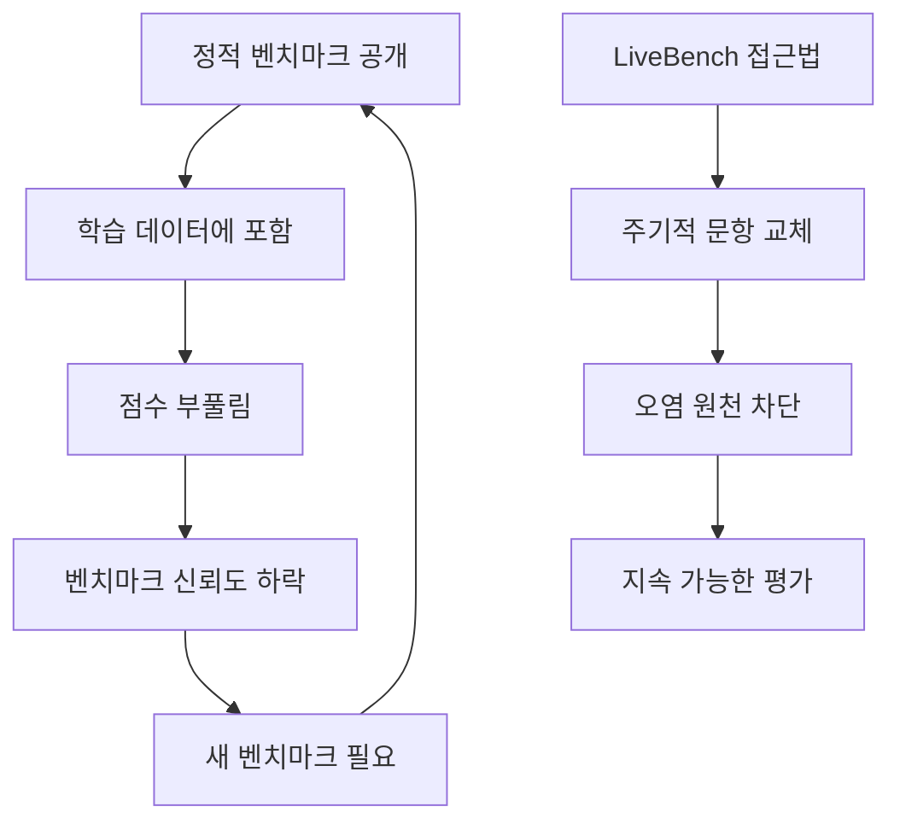

# LiveBench & Next-Gen LLM Evaluation

데이터 오염(contamination)을 원천 차단하기 위해 빈번하게 업데이트되고 자동 채점되는 차세대 LLM 평가 패러다임. LiveBench는 이 흐름의 대표 프로젝트이며, Arena-Hard v2.0과 함께 2026년 평가 생태계를 재편하고 있다.

## 왜 지금 중요한가

기존 정적 벤치마크(MMLU, HumanEval 등)는 학습 데이터 오염으로 점수가 부풀려지는 문제가 심각했다. 283개 대표 벤치마크를 조사한 서베이(arXiv 2508.15361)도 "데이터 오염으로 인한 부풀려진 점수"를 핵심 이슈로 지목했다. LiveBench 계열은 주기적으로 문항을 교체하고, LLM-as-Judge 앙상블 보정 등 자동 채점 방식을 도입하여 이 문제를 구조적으로 해결한다.

## 핵심 문제: 정적 벤치마크의 한계

## LiveBench의 설계 원칙

1. **빈번한 업데이트**: 정기적으로 새 문항을 생성/교체하여 학습 데이터 오염을 방지
2. **자동 채점**: 인간 평가 비용을 줄이면서도 재현 가능한 채점 보장
3. **오염 방지 설계**: 벤치마크 문항이 사전학습 코퍼스에 등장할 수 없는 구조

## 2026년 평가 패러다임 전환

2026년 LLM 평가는 단일 벤치마크 점수에서 **시스템 수준의 결과 기반 평가**로 이동하고 있다.

### 핵심 변화

| 기존 방식 | 차세대 방식 |
|---|---|
| 모델 수준 점수 | 시스템 수준 태스크 성공률 |
| 정적 데이터셋 | 동적 업데이트 데이터셋 |
| 단일 메트릭 | 하이브리드 평가 스택 |
| 오프라인 벤치마크만 | 온라인 행동 신호 병행 |

### 하이브리드 평가 스택

현대적 LLM 평가는 여러 층위를 조합한다.

- **오프라인 시나리오 기반 테스트**: LiveBench, Arena-Hard v2.0
- **온라인 행동 신호**: 사용자 이탈률, 재프롬프트 빈도
- **LLM-as-Judge**: 앙상블 보정으로 편향 완화
- **Human-in-the-Loop**: 품질 관리 최종 방어선

### 핵심 메트릭

- 태스크 성공률
- 신뢰성/일관성
- 환각 감소율 (컨텍스트 인식 기반)
- 지연 시간 및 비용 효율성
- 사용자 만족도 신호

## Arena-Hard v2.0

LMSYS Chatbot Arena에서 파생된 자동 평가 도구. 인간 선호도 데이터를 기반으로 모델 쌍대 비교를 자동화하며, ELO 점수와 높은 상관관계를 보인다. LiveBench와 함께 오염 방지 평가의 양대 축을 형성한다.

## 벤치마크 분류 체계

283개 대표 벤치마크를 다룬 서베이(arXiv 2508.15361)는 세 계층으로 분류한다.

1. **일반 역량**: 언어 기초, 지식 평가, 추론
2. **도메인 특화**: 자연과학, 인문/사회과학, 공학
3. **목적 특화**: 리스크, 신뢰성, 에이전트 등

이 분류에서 LiveBench는 일반 역량의 오염 방지 평가에, [[browsecomp]]와 [[osworld-verified]]는 목적 특화(에이전트) 평가에 해당한다.

## 실무 시사점

- "성공적인 LLM 시스템은 점수가 아니라, 사용자의 문제를 일관되게 해결하는 능력에 의해 결정된다"
- 벤치마크 점수만으로 모델을 선택하는 것은 위험하며, **프로세스 신뢰성과 동적 환경 대응**까지 평가해야 한다
- 에이전트 및 도구 사용 평가, RAG 시스템 평가(검색 품질, 근거 기반성) 등 새로운 차원이 부상

## 대표 자료

- [LiveBench (OpenReview)](https://openreview.net/forum?id=sKYHBTAxVa)
- [Arena-Hard-Auto (GitHub)](https://github.com/lmarena/arena-hard-auto)
- [A Survey on LLM Benchmarks (arXiv 2508.15361)](https://arxiv.org/abs/2508.15361)
- [LLM Evaluation Frameworks 2025 vs 2026 (MLAI Digital)](https://www.mlaidigital.com/blogs/llm-evaluation-frameworks-2025-vs-2026-what-matters-now-2026)

## 관련 문서

- [[browsecomp]] -- 웹 브라우징 에이전트 벤치마크 (목적 특화 평가)
- [[osworld-verified]] -- 컴퓨터 사용 에이전트 벤치마크
- [[swe-bench-pro]] -- SW 엔지니어링 벤치마크
- [[llm-as-judge-calibration]] -- LLM-as-Judge 보정 기법
- [[rubric-based-evals]] -- 루브릭 기반 평가
- [[pairwise-vs-pointwise-evals]] -- 쌍대 vs 포인트 비교 평가
