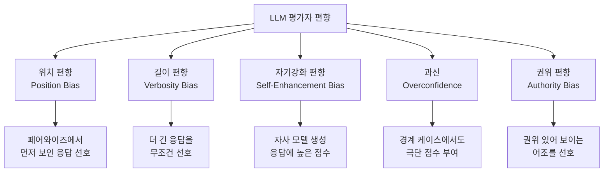

# LLM-as-Judge Calibration & Reliability

LLM을 평가자(judge)로 사용할 때 발생하는 편향과 과신(overconfidence)을 진단하고, 평가자의 신뢰도를 인간 판단 기준으로 보정(calibrate)하는 기법.

## 정의

**LLM-as-Judge**는 인간 평가자 대신 LLM을 사용해 다른 LLM의 응답 품질을 자동으로 채점하는 방법이다. 비용과 속도 면에서 인간 평가 대비 압도적이지만, 체계적 편향(systematic bias)과 과신이 핵심 문제로 남아 있다.

**보정(calibration)**이란 평가자의 "확신 점수"가 실제 정확도와 얼마나 일치하는지를 측정하고 수정하는 과정이다. 완벽하게 보정된 평가자는 "90% 확신"이라고 할 때 실제로 90%의 케이스에서 맞는다.

## 주요 편향 분류



## 과신(Overconfidence) 문제

LLM 평가자의 과신은 두 가지 형태로 나타난다:

1. **점수 극단화**: 애매한 케이스에서도 1점 또는 5점 같은 극단 점수를 부여
2. **확신 오보정**: "매우 확신한다"고 표현했지만 실제 정확도는 낮음

**Brier 스코어**로 측정:
$$\text{Brier} = \frac{1}{N}\sum_{i=1}^{N}(f_i - o_i)^2$$
- $f_i$: 평가자의 확신 점수 (0-1)
- $o_i$: 실제 정답 여부 (0 or 1)
- 낮을수록 보정이 잘 됨

## 보정 방법

### 1. 선형 프로브(Linear Probe) 보정
LLM의 내부 표현에서 평가 불확실성을 추출하는 방법. 평가자 LLM의 숨겨진 상태(hidden state)로 훈련한 선형 분류기가 단순 소프트맥스(softmax) 확신보다 신뢰도가 높다.

### 2. 온도 스케일링(Temperature Scaling)
소프트맥스 출력에 보정 온도 T를 적용:
$$\hat{p} = \text{softmax}(z / T)$$
T > 1이면 더 부드럽고 보수적인 확신 분포 생성.

### 3. 앙상블 보정
복수의 약한 평가자를 앙상블:
- 과신을 집계로 평균화
- 평가자 간 불일치를 "불확실 구간"으로 처리

## 올바른 보고 방법

LLM-as-Judge 평가를 논문이나 보고서에 기술할 때:

```markdown
# 권장 보고 형식

- 평가자 모델: Claude 3.5 Sonnet (2025-10-22)
- 평가 프로토콜: 포인트와이즈, 5점 척도
- 루브릭: [링크] (행동 앵커 포함)
- 인간-LLM 일치율: Cohen's kappa = 0.72 (n=200)
- 위치 편향 검사: 페어와이즈 순서 교환 일치율 89%
- 보정 방법: 없음 / 온도 스케일링 T=1.3 적용
```

포함해야 할 정보:
- [ ] 평가자 모델 버전 명시
- [ ] 인간 골든 셋과의 상관 계수
- [ ] 위치 편향 검사 결과
- [ ] 루브릭 또는 프롬프트 공개
- [ ] 샘플 크기 및 신뢰 구간

## 자기강화 편향 완화

- **제3자 모델 사용**: 평가 대상과 다른 회사의 모델을 평가자로 사용
- **블라인드 평가**: 어떤 모델이 생성했는지 메타데이터를 제거 후 평가
- **교차 평가**: A 모델이 B 모델을, B 모델이 A 모델을 평가하고 평균

## LLM-as-Judge가 잘 작동하는 영역

| 잘 작동 | 어려운 영역 |
|--------|-----------|
| 포맷/구조 준수 | 사실적 정확성 |
| 언어 유창성 | 전문 도메인 지식 |
| 지시 준수 | 주관적 창의성 |
| 안전성 판단 | 문화적 뉘앙스 |

## 대표 레퍼런스

- [Calibrating LLM Judges: Linear Probes for Fast and Reliable Uncertainty Estimation (arXiv:2512.22245)](https://arxiv.org/abs/2512.22245)
- [How to Correctly Report LLM-as-a-Judge Evaluations (arXiv:2511.21140)](https://arxiv.org/abs/2511.21140)
- [Overconfidence in LLM-as-a-Judge: Diagnosis and Confidence-Driven Solution (arXiv:2508.06225)](https://arxiv.org/abs/2508.06225)
- [Evaluating the Effectiveness of LLM-Evaluators (Eugene Yan)](https://eugeneyan.com/writing/llm-evaluators/)
- [A Survey on LLM-as-a-Judge (arXiv:2411.15594)](https://arxiv.org/abs/2411.15594)

## 관련 문서

- [[error-analysis-for-evals|Error Analysis for Evals]]
- [[rubric-based-evals|Rubric-Based Evaluation Frameworks]]
- [[pairwise-vs-pointwise-evals|Pairwise vs Pointwise Evals]]
- [[llm-observability-platforms|LLM Observability Platforms]]
