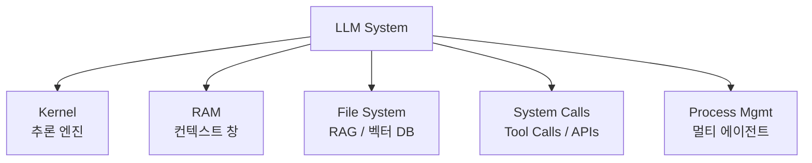

# LLM as OS (운영체제로서의 LLM)

## 정의

**LLM as OS**는 Andrej Karpathy가 제안한 메타포로, LLM 시스템을 **운영체제(Operating System)** 에 빗대어 이해하는 멘탈 모델이다. 이 비유는 [[context engineering]] 시대의 표준 프레임워크가 되었다.

## OS 컴포넌트 대응표

| OS 컴포넌트 | 역할 | LLM OS 대응 |
|---|---|---|
| **Kernel** | 시스템 리소스 관리 | LLM 추론 엔진 (모델 자체) |
| **RAM** | 작업 메모리 | **컨텍스트 창** |
| **File system** | 영구 저장소 | RAG / 벡터 DB / 외부 파일 |
| **System calls** | 하드웨어 제어 인터페이스 | Tool calls / APIs (MCP 등) |
| **Process management** | 멀티태스킹, 스케줄링 | 멀티 에이전트 오케스트레이션, [[subagents]] |

## 핵심 통찰

이 메타포의 가장 중요한 결론:

> **프롬프트는 단일 커맨드 라인 명령어에 불과하다.**
> **실제 성능은 RAM(컨텍스트 창)에 무엇을 채우는지에 달렸다.**

[[prompt engineering]]이 "완벽한 커맨드를 쓰는 법"에 집착했다면, [[context engineering]]은 "RAM을 어떻게 채울 것인가"를 묻는다. OS 관점에서 보면 이 전환은 자연스럽다 — 어떤 프로그램도 RAM 없이는 동작하지 않는다.

## 왜 이 메타포가 강력한가

### 1. 기존 시스템 프로그래밍 직관을 빌려온다

OS 개념은 수십 년간 엔지니어들이 공유해온 멘탈 모델이다. "RAM 부족", "파일 I/O", "컨텍스트 스위칭" 같은 개념을 LLM 개발에 그대로 매핑할 수 있다.

### 2. 병목 지점을 명확히 한다

- **RAM 한계**: 컨텍스트 창 크기 → [[lost in the middle]], 비용, 지연
- **I/O 비용**: Tool call은 system call처럼 비싸다 → KV 캐시, 배칭
- **프로세스 오버헤드**: 서브에이전트는 프로세스 fork/join처럼 비용이 있다

### 3. 아키텍처 패턴을 상속한다

- **페이징/스왑핑** → [[context engineering|Compress 전략]] (긴 대화 요약 후 저장)
- **가상 메모리** → RAG (관련 정보만 컨텍스트로 로드)
- **Isolation/Sandboxing** → 서브에이전트 컨텍스트 격리
- **System call interface** → MCP 같은 표준 도구 프로토콜

## 원본 출처

Karpathy가 2025년 6월 [[context engineering]] 논의가 점화될 때 내놓은 정식화. Tobi Lütke의 용어 제안에 Karpathy가 응답하면서 OS 메타포를 제시했다. 이 메타포는 이후 **컨텍스트 엔지니어링 표준 프레임워크**의 일부가 되었다.

## 한계

OS 메타포는 강력하지만 완벽하진 않다:

- **비결정성**: 실제 OS는 결정적이다. LLM은 같은 입력에 다른 출력을 낸다
- **레이어 경계 모호**: RAM(컨텍스트)과 File system(RAG)의 경계가 OS만큼 명확하지 않다 — RAG 검색 결과는 컨텍스트에 들어가므로
- **보안 모델 부재**: OS는 프로세스 격리와 권한 모델이 성숙했지만, LLM 생태계는 [[lethal trifecta]] 같은 취약점에 직면했다. [[harness engineering]]이 이 공백을 메우려는 시도

## 실무 적용

이 메타포를 기준으로 시스템 설계 시:

1. **RAM 예산을 세워라**: 컨텍스트 창의 몇 %를 시스템 프롬프트에, 몇 %를 대화 히스토리에, 몇 %를 RAG 결과에 할당할 것인가
2. **파일시스템을 설계하라**: 어떤 정보를 외부 저장소에 두고 필요할 때만 로드할 것인가
3. **system call을 표준화하라**: 도구 호출 인터페이스(MCP)를 일관되게 유지
4. **프로세스 경계를 그어라**: 어떤 작업을 서브에이전트에 격리할 것인가

## 관련 문서

- [[evolution of agentic patterns]] — 이 메타포가 등장한 맥락
- [[context engineering]] — LLM OS 메타포의 모체 패러다임
- [[KV cache]] — RAM(컨텍스트 창)의 비용 최적화 메커니즘
- [[subagents]] — 프로세스 관리 대응
- [[prompt engineering]] — "커맨드 라인 명령어" 수준의 레버
- [[harness engineering]] — OS 메타포가 못 다룬 보안/감독 레이어
