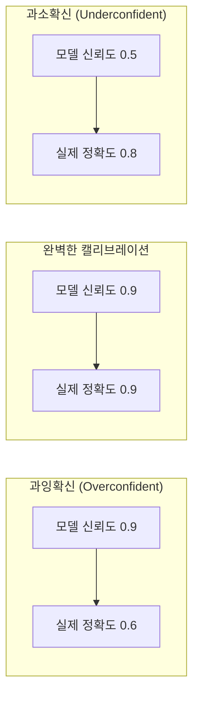
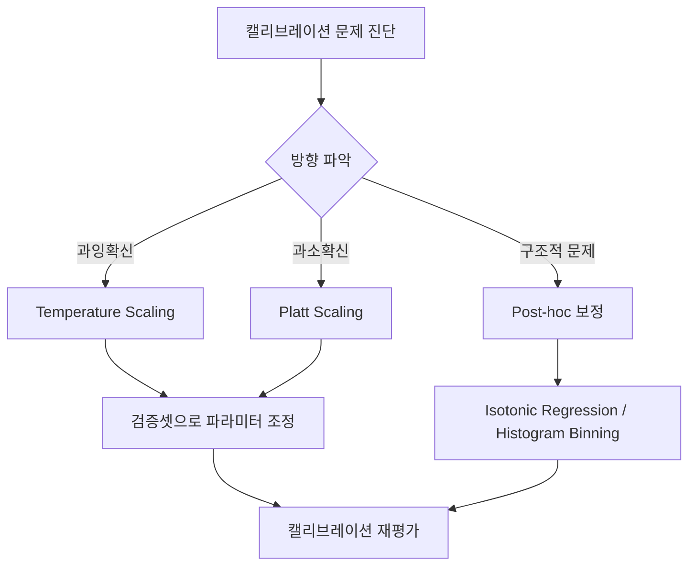

# LLM 캘리브레이션 (Calibration)

## 개요

캘리브레이션(calibration)이란 모델이 예측에 부여하는 **확률(confidence)**이 실제 정확도와 얼마나 잘 일치하는지를 나타내는 개념이다. 완벽하게 캘리브레이션된 모델은 "80% 확률"이라고 말할 때 실제로 80%의 경우에 옳다. LLM 시대에 캘리브레이션은 특히 중요한데, 모델이 틀린 정보를 높은 확신으로 말하는 [[hallucination]] 문제와 직결되기 때문이다.

## 캘리브레이션의 수학적 정의

완벽한 캘리브레이션의 조건:

$$P(\hat{Y} = Y \mid \hat{P} = p) = p, \quad \forall p \in [0, 1]$$

여기서 $\hat{P}$는 모델이 출력하는 신뢰도, $Y$는 정답, $\hat{Y}$는 모델의 예측이다. 즉, 신뢰도 $p$를 부여한 예측들 중 실제로 $p$ 비율만큼이 옳아야 한다.

## 캘리브레이션 측정 지표

### ECE (Expected Calibration Error)

가장 널리 쓰이는 지표. 신뢰도 구간(bin)별로 평균 신뢰도와 실제 정확도의 차이를 가중 평균한다:

$$\text{ECE} = \sum_{m=1}^{M} \frac{|B_m|}{n} \left| \text{acc}(B_m) - \text{conf}(B_m) \right|$$

- ECE가 낮을수록 캘리브레이션이 잘 된 모델
- 일반적으로 0.05 이하면 양호로 간주

### Reliability Diagram (신뢰도 다이어그램)

x축을 모델 신뢰도(0~1), y축을 실제 정확도로 그린 그래프. 완벽한 캘리브레이션은 45도 대각선이다. 대각선 위면 과소확신(underconfidence), 아래면 과잉확신(overconfidence).

## LLM의 캘리브레이션 특성

### RLHF 이후 캘리브레이션 저하

사전학습된 LLM은 비교적 캘리브레이션이 잘 되어 있지만, RLHF(인간 피드백 강화학습)로 파인튜닝한 후 캘리브레이션이 나빠지는 경향이 관찰된다. 인간 평가자가 확신 있게 말하는 출력을 선호하기 때문에, 모델이 자신없는 경우에도 높은 확신을 표현하도록 학습될 수 있다.

### Verbalized Confidence vs. Token Probability

LLM의 캘리브레이션을 측정하는 방법에는 두 가지가 있다:

1. **토큰 확률 기반**: softmax 출력의 로그 확률을 신뢰도로 사용
2. **언어 표현 기반**: "확실합니다", "아마도", "잘 모르겠습니다" 등의 표현을 신뢰도로 해석

언어 표현 기반 캘리브레이션은 Chain-of-Thought 등과 함께 사용 시 더 의미 있는 신뢰도를 추출할 수 있다.

## 캘리브레이션 개선 기법

### Temperature Scaling

가장 단순하고 효과적인 post-hoc 보정 방법. 모델 가중치를 건드리지 않고 softmax 온도 파라미터 $T$만 조정한다:

$$\hat{p}_i = \frac{\exp(z_i / T)}{\sum_j \exp(z_j / T)}$$

- $T > 1$: 분포를 평탄하게 만들어 과잉확신 완화
- $T < 1$: 분포를 날카롭게 만들어 과소확신 완화
- 검증셋의 NLL을 최소화하는 $T$를 찾는다

### Platt Scaling

로지스틱 회귀를 이용한 보정. 원래 확률 출력을 시그모이드 함수로 변환한다.

### 프롬프트 기반 접근

[[evaluation-harness]]에서 자주 쓰는 방법으로, 모델에게 "확신도를 0~100으로 표현하라"는 지시를 주고 출력된 숫자를 신뢰도로 사용한다. Few-shot 예시를 통해 캘리브레이션을 유도할 수 있다.

## 평가에서의 실용적 의미

캘리브레이션이 잘 된 모델은:
- 불확실한 질문에 "모르겠다"고 말할 수 있다
- 선택적 예측(selective prediction)에서 높은 성능을 보인다
- 사용자가 모델 출력에 얼마나 의존해야 하는지 판단하는 데 도움을 준다

[[evaluation-harness]] 구축 시 ECE와 reliability diagram을 표준 지표로 포함하는 것이 권장된다.

## 관련 문서

- [[hallucination]] - 과잉확신과 직결된 허위 정보 생성 문제
- [[evaluation-harness]] - 캘리브레이션 측정 파이프라인 구현
- [[uncertainty-quantification]] - 불확실성을 정량화하는 폭넓은 프레임워크
