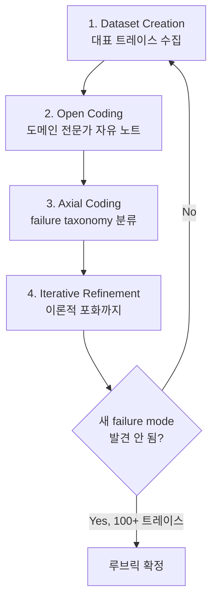

# LLM Evals: Everything You Need to Know (Hamel Husain & Shreya Shankar)

Hamel Husain과 Shreya Shankar가 700+ 엔지니어/PM 대상 AI Evals 코스 운영 경험을 정리한 종합 FAQ. 산업 표준 LLM eval 가이드의 사실상 레퍼런스 구실.

## 정의: Product LLM Evals

LLM Evals = **제품 특화 LLM 애플리케이션에 대한 체계적 평가** (foundation 모델 벤치마크와 구분).

3단계 평가 프레임워크:
- **Unit tests**
- **Human/model evaluation**
- **A/B testing**

## Error Analysis 4단계 방법론

## 예산 할당 (Critical 임계값)

> "60-80% of development time on error analysis and evaluation."

> "If you're passing 100% of evals, you're likely not challenging your system enough. **A 70% pass rate** might indicate more meaningful evaluation."

100% 통과 = eval이 시스템을 충분히 도전하지 못한다는 신호. 70% 정도가 의미 있는 평가의 적절한 통과율.

## Binary vs Likert: 항상 Binary

권고: **Binary (pass/fail) 강력 추천** over 1-5 Likert.

이유:
- Binary는 명확한 의사결정 강제
- Likert는 인접 점수 사이 주관적 일관성 부재
- Binary는 error analysis 시 더 빠름

## Minimum Viable Evaluation

시작점:
- **30분 동안 20-50개 출력 검토**
- 도메인 전문가 1명 ("benevolent dictator")
- 노트북 또는 커스텀 어노테이션 인터페이스
- 인프라는 나중에

## Synthetic Data Generation

구조화된 접근 (dimensions 사용):
1. Dimensions 수동 정의 (예: dietary restrictions, cuisine type, complexity)
2. 손으로 20개 tuples 선택 (dimension 조합)
3. LLM 사용한 2단계 생성: tuples 먼저, 그다음 자연어로 변환
4. 100개 합성 트레이스 샘플링하여 error analysis

**제한사항**: 합성 데이터는 다음에서 실패:
- 복잡한 도메인 콘텐츠
- 저자원 언어
- 고위험 도메인
- 과소 표현 사용자 그룹

## LLM-as-Judge 권고

- 발견된 모든 failure mode에 자동 evaluator 만들지 말 것
- 비용-효익 분석: **프롬프트 수정 후에도 지속되는 문제**만
- LLM-as-Judge는 **100+ labeled examples + 지속적 유지보수** 필요
- Simple assertions, reference-based checks가 더 저렴

## Generic Metrics 경고

> "All you get from using these prefab evals is you don't know what they actually do and in the best case they waste your time and in the worst case they create an illusion of confidence that is unjustified."

BERTScore, ROUGE 같은 similarity metrics는 일반 LLM 출력 평가에 비유용. (단, RAG retrieval 최적화에는 도움)

## 단일 어노테이터 접근 (Benevolent Dictator)

도메인 전문가 한 명 임명 → 일관성과 명확한 책임. Product/Engineering 협업:
- 엔지니어: 기술적 이슈 식별
- PM: 제품 실패 식별
- **결정은 단일 PM 또는 도메인 전문가**가

## 커스텀 어노테이션 도구

> "Build a custom annotation tool. This is the single most impactful investment you can make for your AI evaluation workflow."

AI 어시스턴트로 몇 시간 만에 빌드 가능. 핵심 기능:
- 도메인에 맞는 트레이스 렌더링
- 1-click 피드백 캡처 + 키보드 네비게이션
- 필터링, 클러스터링, 시맨틱 검색
- guardrails/automated evaluators의 우선순위 플래그

## CI/CD vs Production

| 측면 | CI/CD | Production |
|---|---|---|
| 데이터셋 | 작고 큐레이션 (100+) | 라이브 트레이스 비동기 샘플링 |
| 포커스 | Assertions, 결정적 체크 | Reference-free evaluators |
| 실행 | 빈번 (비용 고려) | 신뢰구간, 임계값 추적 |

## Guardrails vs Evaluators

| | Guardrails | Evaluators |
|---|---|---|
| 시기 | 동기 (inline) | 비동기 |
| 종류 | regex, validation, lightweight classifiers | 주관적 quality 측정 |
| 목적 | 사용자 가시 실패 방지 | 대시보드, 개선 루프 |

## RAG 평가 (분리)

retrieval과 generation 분리:
- **Retrieval**: IR 메트릭 (Recall@k, Precision@k, MRR)
- **Generation**: error analysis + LLM-as-judge

실제 문서로부터 query-document 쌍을 reverse-engineer해 합성 평가 데이터셋 생성.

## Agentic Workflows 평가

2단계:
1. **End-to-end task success** (black box)
2. **Step-level diagnostics** (tool selection, parameter extraction, error handling)

**Transition failure matrices** 사용 — rows = last successful state, columns = first failure location.

## 핵심 경고

- **Eval-driven development 금지** — error analysis로 evaluator 발견
- 같은 모델이 자기 자신을 평가하는 게 반드시 편향은 아니다 (인간 판단과 일치하면 OK)
- 가능하면 **prompts in Git**, proprietary tool 회피
- **automated prompt optimization 조급히 도입 금지** — 실패 모드 이해 후

## 메모

- 게시일: 2026-01-15 (지속 업데이트되는 living document)
- "These represent general principles, not universal rules"

## 관련 문서

- [[error-analysis-for-evals]] — Error Analysis 깊이 있는 가이드
- [[llm-judge-pattern]] — Critique Shadowing 7단계
- [[improving-ai-products-field-guide]] — 빠른 개선 6원칙 (Hamel)
- [[llm-as-judge]] — LLM-as-Judge 평가 패러다임
- [[agent-evals-anthropic-perspective]] — Anthropic의 에이전트 평가 가이드
- [[ai-evaluation]] — 일반 AI 평가 개요
