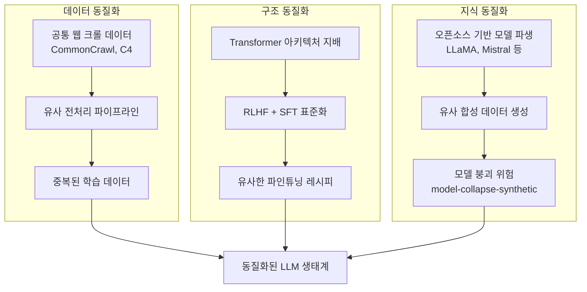
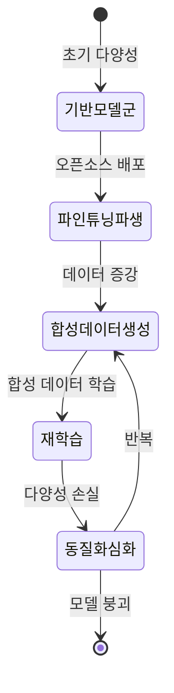

# LLM 동질화 현상 (LLM Homogenization)

## 개요

LLM 동질화(LLM Homogenization)는 수십 개 이상의 서로 다른 언어 모델이 **내부 표현, 실패 패턴, 편향, 세계관을 점점 유사하게 공유**하게 되는 현상이다. 외관상 다양한 모델이 존재하는 것처럼 보이지만, 실제로는 소수의 기반 모델과 데이터셋에서 파생되어 유사한 내부 구조를 가지게 된다.

2024-2025년 연구들은 70개 이상의 공개 LLM을 분석해 내부 표현의 구조적 반복을 확인했으며, 이는 AI 생태계의 취약성(fragility)과 다양성 부재라는 우려로 이어지고 있다.

## 동질화의 원인

### 1. 데이터 수렴

대부분의 LLM이 CommonCrawl, C4, The Pile 같은 동일한 대규모 웹 크롤 데이터셋에서 학습된다. 데이터 큐레이션 파이프라인도 유사해 필터링 규칙, 언어 비율, 도메인 구성이 비슷하다.

### 2. 아키텍처 단일화

Transformer 아키텍처가 사실상 표준으로 자리잡았으며, Attention 메커니즘, 토크나이저(BPE), 학습률 스케줄러 등 핵심 구성 요소가 모델 간에 매우 유사하다.

### 3. 기반 모델 파생

Meta의 LLaMA, Mistral 같은 오픈 가중치 모델을 파인튜닝하거나 병합한 모델이 수십 개에 이른다. 이들은 기반 모델의 표현 공간 구조를 상속한다.

## 내부 표현의 구조적 반복

연구자들이 70개 이상의 LLM의 은닉 상태(hidden state) 표현을 비교한 결과, 여러 흥미로운 패턴이 발견되었다:

- **표현 정렬(Representation Alignment)**: 서로 다른 모델의 내부 표현을 선형 변환으로 정렬하면 높은 유사도를 보임
- **개념 배치 일관성**: "파리가 프랑스의 수도"와 같은 사실이 유사한 방향 벡터로 인코딩됨
- **실패 패턴 공유**: 한 모델이 틀리는 경우 다른 모델도 동일하게 틀리는 경향

## [[model-collapse-synthetic]]과의 관계

[[model-collapse-synthetic]](모델 붕괴)은 동질화의 가장 심각한 형태로, 모델이 자신이 생성한 합성 데이터로 반복 학습할 때 발생한다. 동질화된 기반 모델들이 유사한 합성 데이터를 생성하고, 이를 다시 학습에 사용하면 생태계 전체의 다양성이 급속히 감소한다.

## [[emergent-abilities]]와의 역설

동질화는 [[emergent-abilities]](창발적 능력)와 흥미로운 역설 관계에 있다. 창발적 능력은 모델 스케일이 커질 때 갑자기 나타나는 능력인데, 동질화된 모델 생태계에서는 이러한 능력도 동시에 여러 모델에서 동시에 나타날 가능성이 높다. 즉, 능력의 다양성보다는 능력의 출현 타이밍이 동기화된다.

## 동질화의 위험성

### 시스템 취약성

동질화된 생태계에서는 하나의 취약점이 전체 생태계에 영향을 미친다:
- 특정 데이터 오염이 다수 모델에 동일하게 전파
- 공통 약점을 노리는 공격이 여러 서비스에 동시 효과
- 단일 실패 모드(single point of failure)

### 의견 다양성 감소

유사한 세계관과 편향을 공유하는 LLM들이 사회 전반에서 사용될 때, 인간의 인지 다양성을 보완하기보다 동일한 관점을 증폭시킬 위험이 있다.

## 대응 방향

- **아키텍처 다양화**: Mamba, RWKV, Hyena 같은 비-Transformer 구조의 발전
- **데이터 다양화**: 다양한 언어, 문화, 도메인의 균형 있는 학습 데이터
- **평가 다양화**: 단일 벤치마크가 아닌 다차원 평가 체계
- **출처 추적**: 모델 파생 관계 문서화로 동질화 정도 모니터링

## 관련 문서

- [[model-collapse-synthetic]] - 합성 데이터 반복 학습으로 인한 모델 붕괴
- [[emergent-abilities]] - 대규모 모델에서 나타나는 창발적 능력
- [[open-source-vs-proprietary-ai]] - 오픈소스 생태계가 동질화에 미치는 영향
- [[ai-benchmarks-overview]] - 동질화 측정에 사용되는 벤치마크 체계
