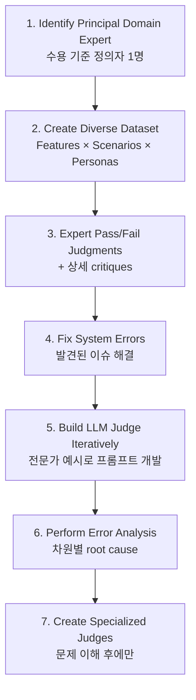
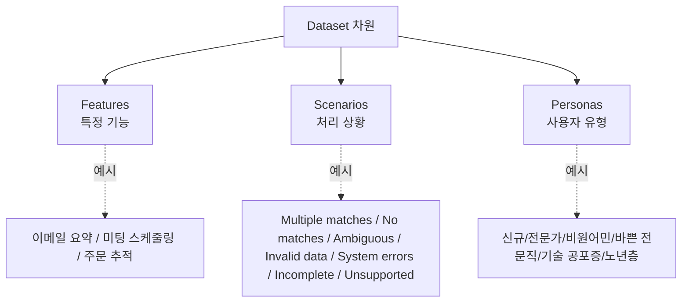

# Using LLM-as-a-Judge For Evaluation: A Complete Guide (Hamel Husain 2024-10)

Hamel Husain의 LLM-as-Judge 가이드. 핵심 명제는 **"LLM judge 자체보다 데이터를 들여다보는 동기 부여 측면이 더 큰 가치"** — judge 인프라를 만드는 과정 자체가 데이터 분석의 동력이 된다.

## 핵심 프레임워크: Critique Shadowing 7단계

## 핵심 원칙: Binary > Likert

> "Simple pass/fail metrics are important. People don't know what to do with a 3 or 4."

Multi-point scales (1-5)는 행동 가능한 임계값에 대한 모호함을 만든다. **무엇이 진짜 중요한지 명료화 강제**.

## Critique 요건 (좋은 critique란)

좋은 critique는:
- 신입사원도 이해할 수 있을 만큼 상세
- 무엇이 통과/실패했는지 구체적
- 외부 컨텍스트 포함 (사용자 메타데이터, 시스템 상태, DB 검색 결과)
- 균형 잡힘 — 통과한 예시도 개선 영역 인정

## Dataset 구조 차원

### Features
특정 기능 (이메일 요약, 미팅 스케줄링, 주문 추적)

### Scenarios
처리 상황 — Multiple matches / No matches / Ambiguous requests / Invalid data / System errors / Incomplete information / Unsupported features

### Personas
사용자 유형 — 신규 사용자 / 전문가 / 비원어민 / 바쁜 전문직 / 기술 공포증 / 노년층

## 판사 프롬프트 엔지니어링

구조 예시:
- 시스템 컨텍스트 + 도메인 지식
- 평가 가이드라인
- 풀 인터랙션 컨텍스트가 있는 few-shot 예시
- 명시적 출력 형식

**Honeycomb Query Assistant 사례**: 전문가 예시로부터 반복, agreement rate 추적, **>90% agreement** 달성.

## Validation 접근

원시 정확도가 아니라 **precision과 recall을 별도 측정** (특히 imbalanced 데이터셋):
- 도메인 전문가의 대표 샘플 평가
- 스프레드시트 기반 judge vs human 비교
- 불일치 기반 반복적 프롬프트 정제
- 큰 변경 후 지속적 평가

## 데이터 볼륨

시작: **약 30개 예시**, 새 failure mode가 더 안 나올 때까지 계속.

## 자주 발생하는 실수

1. critique 예시 미제공
2. 너무 짧은 설명
3. 평가 시점 외부 컨텍스트 누락
4. 입력 범위 다양성 부족

## 중요 통찰: 진짜 가치는 데이터 검토

> "The real value...is looking at your data and doing careful analysis."

LLM judge 자체보다 **데이터를 들여다보는 동기 부여** 측면이 더 큰 가치를 만든다.

## FAQ 요약

- **Model selection**: 비용/지연 안에서 가장 강력한 모델
- **Fine-tuning**: judge fine-tune 회피, 대신 judge로 학습 데이터 큐레이션
- **Off-the-shelf judges**: 검증 없이 사용 금지
- **Scaling**: 인간 완전 제거 절대 금지, 대표 샘플링으로 인간 노력 감소

## 참조 리소스

- "criteria drift" 관련 논문
- ALIGN Eval 도구
- 동적 in-context learning with continual example selection

## 메모

- 게시일: 2024-10-29
- "The LLM judge itself serves primarily as motivation for rigorous data examination"

## 관련 문서

- [[llm-eval-best-practices]] — Hamel/Shreya FAQ (관련 후속 글)
- [[llm-as-judge]] — LLM-as-Judge 일반 패러다임
- [[llm-as-judge-calibration]] — 판사 calibration
- [[error-analysis-for-evals]] — Error analysis 방법론
- [[improving-ai-products-field-guide]] — 빠른 개선 6원칙
- [[rubric-based-evals]] — 루브릭 기반 평가
