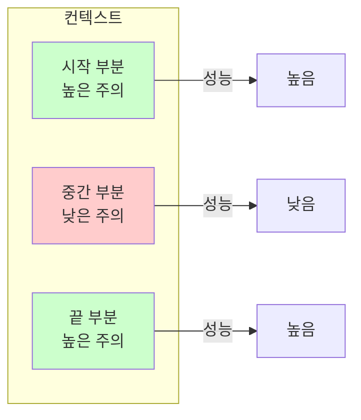
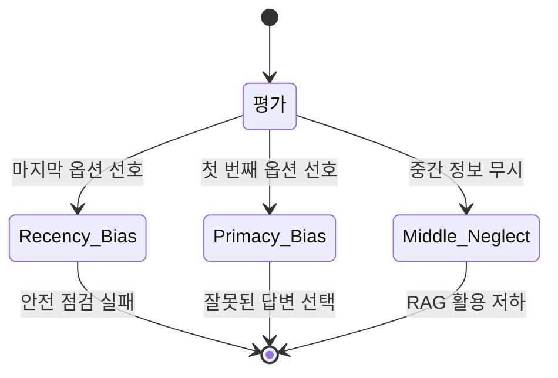
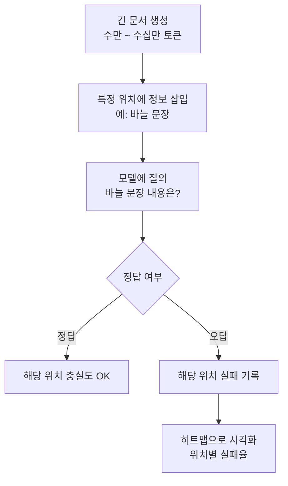

# LLM 장문 컨텍스트 충실도

## 개요

LLM의 컨텍스트 창이 수십만 토큰으로 확장되면서 "긴 컨텍스트를 올바르게 사용할 수 있는가"라는 새로운 문제가 부각되었다. 장문 컨텍스트 충실도(long-context faithfulness)란 모델이 주어진 긴 컨텍스트의 **모든 부분을 균등하게 주의 깊게 활용**하는 능력을 말한다. 현실은 다소 냉혹한데, 모델들은 컨텍스트의 위치에 따라 정보 활용 능력에 큰 차이를 보인다.

## Lost in the Middle

Liu et al.(2023)의 연구 "Lost in the Middle"은 이 문제를 체계적으로 분석한 선구적 연구다. [[lost-in-the-middle-paper]] 참조.

### 핵심 발견

Multi-document QA 태스크에서 정답 문서를 컨텍스트의 서로 다른 위치에 배치했을 때, **중간 부분에 있을 때 성능이 현저히 떨어지는 U자형 곡선**이 나타났다. 이 패턴은 GPT-3.5-Turbo, Claude 2 등 다양한 모델에서 공통적으로 관찰되었다.

### 왜 발생하는가?

1. **Recency bias**: 훈련 데이터 특성상 최근 컨텍스트(끝 부분)에 더 주의를 기울이도록 학습
2. **Primacy bias**: 대화 모델에서 시스템 프롬프트(시작 부분) 처리 강화
3. **Attention 희석**: 컨텍스트가 길어질수록 중간 토큰에 대한 attention score 희석

## 위치 편향 (Position Bias)의 유형

### Recency Bias

모델이 가장 최근에 본 정보(컨텍스트 끝부분)를 과도하게 가중. LLM 기반 평가(LLM-as-judge)에서 특히 문제가 됨 - 마지막으로 제시된 답변이 더 좋게 평가되는 경향.

### Primacy Bias

첫 번째로 제시된 정보를 과도하게 가중. 멀티 문서 요약이나 옵션 선택에서 첫 번째 항목 편향.

### Middle Neglect

Lost in the Middle의 핵심. 긴 문서에서 중간 섹션의 정보가 활용되지 않는 현상.

## [[long-context-scaling]]과의 관계

컨텍스트 창 크기를 늘리는 것(long-context scaling)이 곧 충실도 향상을 의미하지 않는다:

| 컨텍스트 길이 | 처리 가능 여부 | 균등 활용 여부 |
|-------------|--------------|--------------|
| 4K 토큰 | O | 대체로 양호 |
| 32K 토큰 | O | 중간 약화 시작 |
| 128K 토큰 | O | 중간 부분 심각한 저하 |
| 1M 토큰 | O (일부 모델) | 충실도 연구 진행 중 |

## 개선 방법

### 프롬프트 엔지니어링

- **중요 정보를 앞뒤에 배치**: 가장 중요한 지시나 맥락을 처음과 끝에 반복
- **명시적 인용 지시**: "문서 X의 Y 섹션을 참조하여 답하라"는 명시적 지시 추가
- **청크 단위 처리**: 긴 문서를 청크로 나눠 순차 처리 후 합산

### 모델 학습 개선

- **Position Interpolation**: RoPE 등 위치 인코딩을 더 긴 컨텍스트에 맞게 조정
- **Landmark Attention**: 특정 토큰(landmark)을 중심으로 attention 계산을 최적화
- **S2-Attention (Shifted Sparse Attention)**: 중간 부분에도 균등한 attention을 유지하는 sparse 패턴

### 평가 방법

NIAH(Needle-in-a-Haystack) 테스트가 장문 컨텍스트 충실도의 표준 평가 방법으로 자리잡았다. 긴 텍스트(건초더미) 속에 짧은 정보(바늘)를 삽입하고 모델이 올바르게 검색하는지 평가한다.

## RAG 설계 함의

장문 컨텍스트 충실도 문제는 [[lost-in-the-middle-paper]] 이후 RAG 시스템 설계에 직접적인 영향을 미쳤다:

1. **Reranking 강화**: 단순 유사도가 아니라 최종 답변 품질 기준으로 재순위
2. **청크 개수 제한**: 검색 결과를 3-5개로 제한해 컨텍스트 오염 방지
3. **위치 전략**: 가장 관련 높은 청크를 앞뒤에 배치
4. **압축(Compression)**: LLMLingua 등으로 청크 내 불필요한 토큰 제거 후 주입

## 관련 문서

- [[lost-in-the-middle-paper]] - 위치 편향 원 연구 논문 요약
- [[long-context-scaling]] - 컨텍스트 창 확장 기술
- [[rag-pipeline]] - 검색 증강 생성 전반
- [[attention-mechanism-overview]] - Attention 희석 문제의 근원
