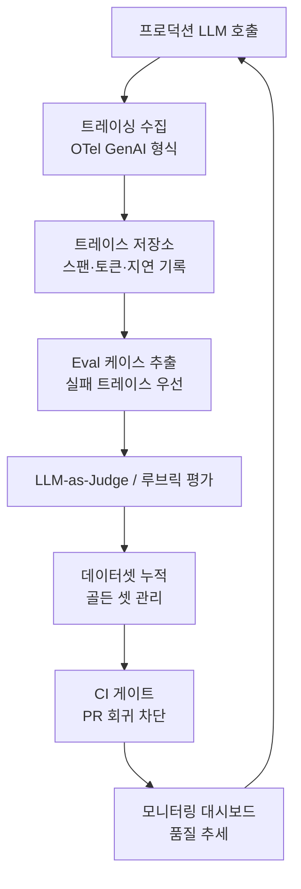

# Production Observability Platforms Convergence

트레이싱(tracing), 평가(evaluation), 데이터셋 관리, CI 게이팅을 단일 스택으로 통합하는 LLM 옵저버빌리티(observability) 플랫폼들이 2026년 기준 공통된 설계 패턴으로 수렴하고 있다.

## 왜 지금 중요한가

Braintrust, Langfuse, LangSmith, Phoenix, W&B Weave가 모두 "프로덕션 트레이스 -> eval 케이스 -> CI 게이트 -> 회귀 테스트" 플라이휠을 핵심 기능으로 채택하면서, 2026년 eval 인프라의 사실상 표준 설계 패턴이 되었다. OpenTelemetry(OTel) GenAI 시맨틱 컨벤션이 표준화되면서 플랫폼 간 트레이스 형식도 수렴하고 있다.

## 핵심 기능 구조

위 플라이휠은 Braintrust, LangSmith, Langfuse, Phoenix, Weave가 공통적으로 구현하는 핵심 루프다.

## 주요 플랫폼 비교

| 플랫폼 | 운영 주체 | 핵심 강점 | 오픈소스 |
|--------|----------|-----------|---------|
| LangSmith | LangChain | LangGraph 통합, Multi-turn eval | 부분 공개 |
| Langfuse | Langfuse Inc. | 자체 호스팅 가능, 비용 효율 | 완전 오픈소스 |
| Braintrust | Braintrust Data | CI 통합, 프롬프트 버전 관리 | 비공개 |
| Phoenix | Arize AI | Tool invocation 전용 평가자 | 완전 오픈소스 |
| W&B Weave | Weights & Biases | 실험 트래킹과 eval 통합 | 부분 공개 |

## OTel GenAI 표준화

OpenTelemetry GenAI Semantic Conventions는 LLM 호출의 스팬(span)에 공통 속성을 정의한다. 주요 속성:
- `gen_ai.system`: 모델 제공자 식별 (예: `anthropic`, `openai`)
- `gen_ai.request.model`: 요청 모델명
- `gen_ai.usage.input_tokens` / `gen_ai.usage.output_tokens`: 토큰 사용량
- `gen_ai.operation.name`: 작업 유형 (`chat`, `embeddings` 등)

이 표준 덕분에 플랫폼을 교체해도 기존 계측(instrumentation) 코드를 재사용할 수 있다.

## 플라이휠 작동 원리

1. **트레이스 수집**: 프로덕션 LLM 호출을 OTel 형식으로 기록. 스팬 단위로 레이턴시, 토큰, 오류를 캡처
2. **실패 케이스 추출**: 낮은 점수 또는 사용자 피드백이 달린 트레이스를 자동으로 eval 후보로 추출
3. **평가 실행**: LLM-as-Judge 또는 루브릭 기반 평가자로 자동 채점
4. **데이터셋 축적**: 검증된 케이스를 골든 데이터셋에 추가
5. **CI 게이팅**: PR 머지 전 회귀 여부를 자동 차단

## 실전 적용

- **개발 초기**: 수동 에러 분석 -> 루브릭 설계 -> 최소 평가 셋 구축
- **스케일업**: 프로덕션 트레이스에서 자동으로 어려운 케이스 수집
- **CI 통합**: `pytest`나 `vitest` 훅에 eval 게이트를 삽입해 모델 교체 시 회귀 자동 감지
- **비용 관리**: 저렴한 Langfuse 자체 호스팅 + Phoenix 오픈소스 조합으로 초기 비용 절감

## 대표 레퍼런스

- [Braintrust AI Observability Platform](https://www.braintrust.dev)
- [Langfuse GitHub Repository](https://github.com/langfuse/langfuse)
- [Phoenix GitHub Repository (Arize)](https://github.com/Arize-ai/phoenix)
- [W&B Weave Evaluations](https://wandb.ai/site/evaluations/)
- [LangSmith Observability Platform](https://www.langchain.com/langsmith/observability)

## 2026-05-06 보강 — 6 개 플랫폼 심층 비교

### LangSmith — LangChain native

- LangChain 과 LangGraph 에 가장 깊은 통합
- node-by-node state diff, full agent execution graph
- model + tool call breakdown
- replay against new model versions

> "native tracing for popular agent frameworks and OpenTelemetry... SDKs
> supporting Python, TypeScript, Go, and Java."

> "send LangSmith trace data to your tools or ingest OTel data into LangSmith"

→ 양방향 OTel pipeline 지원. 기존 OTel collector 와 결합 가능.

**Multi-turn**: "message threading for multi-turn chat interactions"

**Auto-insight**: "unsupervised topic clustering... templates for error analysis"

**Deployment 옵션**:

- Managed cloud (GCP us-central-1)
- BYOC (bring-your-own-cloud)
- Self-hosted Kubernetes (data residency 대응)

**Privacy**: "we will not train on your data"

### Langfuse — OSS 리더

- Postgres + ClickHouse stack
- 2026-01 ClickHouse 가 인수, OSS code 활성 maintain
- framework-agnostic, OTel 통해 모든 LLM SDK / agent framework 지원

**Data Model**:

- **Trace**: 전체 request lifecycle
- **Observation**: trace 안의 개별 op (LLM call, tool exec, retrieval step)
- **Score**: trace/observation 평가
- **Session**: multi-turn 그루핑

> "Langfuse SDKs send tracing data asynchronously in the background"

→ 호출 latency overhead 없음.

### Helicone — Proxy 패턴

> "Helicone routes LLM API calls through its proxy, capturing observability
> without SDK changes — change one base URL, get traces."

→ 가장 simple 한 install. trade-off: trace depth 가 framework-native 보다 얕음
(API call level, agent execution level 아님).

**적합 시나리오**:

- 비-LangChain 환경의 빠른 monitoring 도입
- multi-provider routing 과 결합

### Arize Phoenix — OSS / OTel 정통

> "Phoenix is fully open source and self-hostable — no feature gates or restrictions."
> "Phoenix is built on top of OpenTelemetry and is powered by OpenInference instrumentation."
> "agnostic of vendor, framework, and language."

**OpenInference**:

- Arize 의 OTel-기반 LLM instrumentation 표준
- repo: https://github.com/Arize-ai/openinference
- Phoenix 는 OpenInference 의 reference receiver

**Auto-instrumentation**: "popular frameworks (LlamaIndex, LangChain, DSPy,
Mastra, Vercel AI SDK), providers (OpenAI, Bedrock, Anthropic), and languages
(Python, TypeScript, Java)"

**Agent 지원**: "out-of-the-box support for popular frameworks including OpenAI
Agents SDK, Claude Agent SDK, LangGraph, Vercel AI SDK, Mastra, and CrewAI."

### Datadog LLM Observability — Enterprise default

> "Workflows that worked in dev fail in prod for reasons traditional APM doesn't
> surface — model drift, tool-call retry loops, prompt regressions."

→ infra observability 와 LLM observability 는 별개 layer, 둘 다 필요.

### Honeycomb LLM Observability

- event-based deep tracing
- OTel 기반

### OTel `gen_ai.*` 채택 현황

| 플랫폼 | OTel 채택 |
|---|---|
| LangSmith | trace 양방향 호환 |
| Langfuse | OTel 직접 ingest |
| Helicone | API call 단위 |
| Arize Phoenix | OpenInference (OTel-기반) → 표준 정합 |
| Datadog LLM Obs | OTel + Datadog APM |
| Honeycomb | OTel 기반 |

→ OTel `gen_ai.*` semconv 표준화로 vendor lock-in 감소. 단 spec 이 Development
단계라 정착에 시간 필요.

### 선택 가이드 (production 기준)

| 시나리오 | 권장 |
|---|---|
| LangChain/LangGraph 기반 | LangSmith |
| 자체 호스팅 + 데이터 주권 | Langfuse / Phoenix |
| Datadog 사용 중 | Datadog LLM Observability |
| 빠른 install, 다양한 provider | Helicone |
| OTel 표준 + multi-vendor | Phoenix + OpenInference |
| ML 정밀도 + Eval | Phoenix or Arize AX |

### 두 layer 동시 필요

> "LLM observability and infrastructure observability are different layers. The
> LLM platform (LangSmith, Langfuse, Arize) handles agent traces, eval, and
> LLM-specific metrics. The infra platform (Datadog, Honeycomb, New Relic)
> handles host metrics, app errors, request traces, deployment health. Most
> production deployments need both"

### Trace 표준화 권장 패턴

1. **LangChain/LangGraph 사용 시**: LangSmith 자동 trace + OTel export
2. **그 외**: OpenInference (Phoenix instrumentation) 또는 직접 OTel + `gen_ai.*` attribute
3. **Multi-vendor**: OTel collector 가 fan-out → LLM platform + APM 둘 다 송신
4. **Sensitive 데이터**: `gen_ai.input.messages`/`output.messages` 는 opt-in,
   PII redaction layer 사이에 끼워 넣기

## 관련 문서

- [[agent-trajectory-evaluation|Agent Trajectory Evaluation]]
- [[llm-as-judge-calibration|LLM-as-Judge Calibration]]
- [[multi-turn-agent-evaluation|Multi-Turn Agent Evaluation]]
- [[rubric-based-evals|Rubric-Based Evaluation Frameworks]]
- [[opentelemetry-genai-semconv]] — OTel attribute 명세
- [[opentelemetry-genai-metrics]] — OTel metric 명세
- [[eval-in-loop-pattern]] — 플랫폼이 구현하는 eval 루프
- [[agent-error-budget-sre]] — observability 기반 SRE 운영
