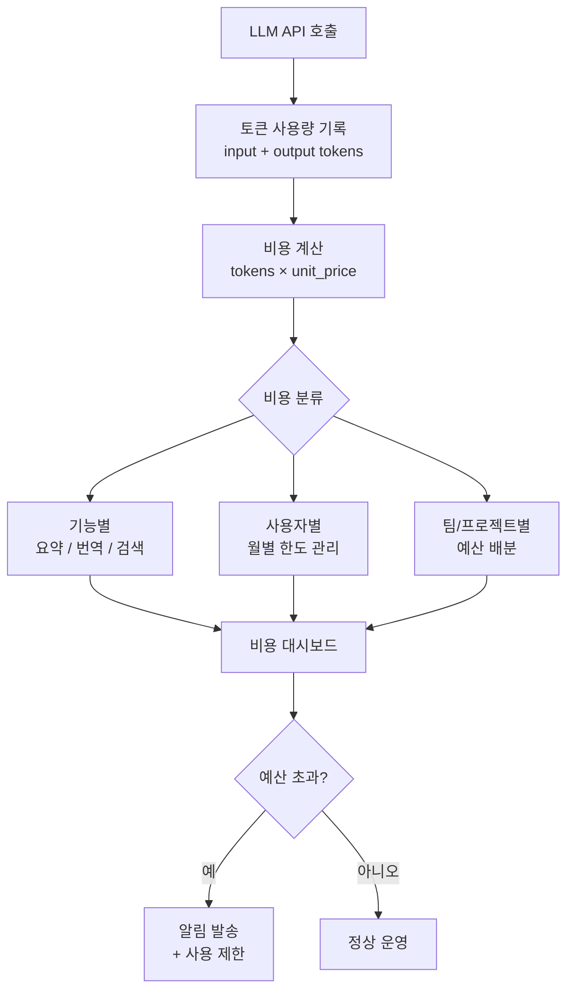
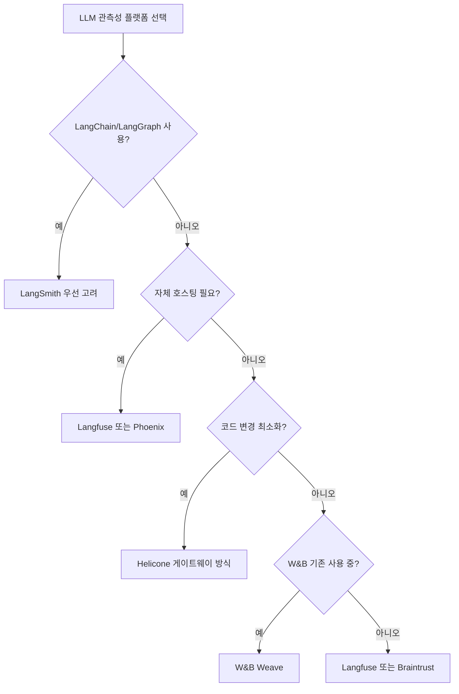
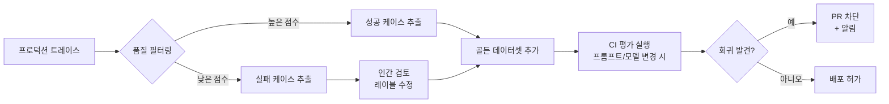

# LLM 관측성 (LLM Observability)

LLM 관측성(LLM Observability)은 프로덕션에서 LLM(Large Language Model) 기반 시스템이 어떻게 동작하는지 이해하고, 문제를 진단하고, 성능을 측정하기 위한 도구와 방법론 전체를 가리킨다. 전통적인 소프트웨어 관측성(로그, 메트릭, 트레이스의 세 기둥)을 LLM의 고유한 특성(자연어 입출력, 비결정적 행동, 토큰 기반 비용, 체인/에이전트 구조)에 맞게 확장한 개념이다.

> "You can't improve what you can't measure."
>
> LLM 시스템에서 이 원칙은 특히 중요하다. 응답이 "좋은지 나쁜지"를 자동으로 측정하는 것 자체가 어렵고, 실패가 조용하게(silently) 발생하기 때문이다.

## 전통 소프트웨어 관측성과의 차이

| 차원 | 전통 소프트웨어 | LLM 시스템 |
|------|--------------|-----------|
| 성공/실패 기준 | HTTP 상태 코드, 예외 | 응답 품질 (정성적) |
| 지연 시간 | 밀리초 단위 | 초~분 단위 (스트리밍 포함) |
| 비용 | CPU/메모리 | 토큰 수 × 단가 |
| 디버그 단위 | 함수 호출, 쿼리 | 프롬프트, 완성(completion), 체인 |
| 회귀 감지 | 단위 테스트, 통합 테스트 | LLM-as-Judge, 인간 평가 |
| 버전 관리 | 코드 버전 | 코드 + 프롬프트 + 모델 버전 |

## 핵심 추적 항목

### 1. 토큰 사용량 추적

LLM 비용은 토큰 수에 직접 비례하므로 토큰 추적은 비용 관리의 기초다.

```python
import logging
from dataclasses import dataclass, field
from datetime import datetime

logger = logging.getLogger(__name__)

@dataclass
class LLMCallRecord:
    model: str
    input_tokens: int
    output_tokens: int
    latency_ms: float
    timestamp: datetime = field(default_factory=datetime.now)
    prompt_id: str = ""
    user_id: str = ""
    cached: bool = False

    @property
    def total_tokens(self) -> int:
        return self.input_tokens + self.output_tokens

    @property
    def estimated_cost_usd(self) -> float:
        # 예시 단가 (모델마다 다름, 공식 문서 확인 필요)
        pricing = {
            "claude-3-5-sonnet": {"input": 3.0 / 1_000_000, "output": 15.0 / 1_000_000},
            "gpt-4o": {"input": 2.5 / 1_000_000, "output": 10.0 / 1_000_000},
        }
        if self.model not in pricing:
            return 0.0
        p = pricing[self.model]
        return self.input_tokens * p["input"] + self.output_tokens * p["output"]

    def log(self) -> None:
        logger.info(
            "LLM 호출 기록: model=%s tokens=%d+%d latency=%.0fms cost=$%.5f cached=%s",
            self.model,
            self.input_tokens,
            self.output_tokens,
            self.latency_ms,
            self.estimated_cost_usd,
            self.cached,
        )
```

### 2. 지연 시간 추적

LLM 응답 지연은 여러 요소로 구성된다:

- **첫 토큰까지 시간(TTFT, Time to First Token)**: 스트리밍 UX 체감 품질에 직결
- **토큰간 지연(inter-token latency)**: 스트리밍 중 응답 속도
- **전체 완성 시간**: 비스트리밍 시 전체 대기 시간

```python
import time
from contextlib import contextmanager
from typing import Generator

@contextmanager
def trace_llm_latency(call_name: str) -> Generator[dict, None, None]:
    metrics: dict = {"ttft_ms": None, "total_ms": None}
    start = time.perf_counter()
    try:
        yield metrics
    finally:
        metrics["total_ms"] = (time.perf_counter() - start) * 1000
        logger.info(
            "지연 추적: %s ttft=%.0fms total=%.0fms",
            call_name,
            metrics.get("ttft_ms") or 0,
            metrics["total_ms"],
        )
```

### 3. 비용 관리

팀 단위, 기능 단위, 사용자 단위 비용 추적이 필요하다.



비용 최적화 전략:
- **캐싱**: 동일하거나 유사한 프롬프트에 대한 응답 캐시 (Anthropic Prompt Caching, Redis 등)
- **모델 라우팅**: 간단한 태스크는 저렴한 모델로 자동 라우팅
- **프롬프트 압축**: 긴 시스템 프롬프트를 압축해 입력 토큰 절감

## 주요 LLM 관측성 플랫폼

### LangSmith (LangChain)

LangChain / LangGraph 생태계와 긴밀히 통합된 관측성 플랫폼. 체인(chain)과 에이전트의 단계별 트레이스를 시각화하고, 트레이스에서 직접 평가 데이터셋을 생성할 수 있다.

핵심 기능:
- LangGraph 에이전트의 노드별 입출력 추적
- 트레이스 → 데이터셋 → 평가 파이프라인 일관성
- 프롬프트 버전 관리 허브(Hub)

```python
from langsmith import traceable

@traceable(name="document_qa")
def answer_question(question: str, context: str) -> str:
    # 이 함수의 입출력이 자동으로 LangSmith에 기록됨
    ...
```

### Langfuse

완전 오픈소스(MIT 라이선스)로 자체 호스팅이 가능한 LLM 관측성 플랫폼. 비용 효율이 중요한 팀에 적합하다.

핵심 기능:
- SDK 프리미티브: trace, span, generation, event
- 자체 호스팅: Docker Compose로 5분 내 셋업
- LLM-as-Judge 기반 자동 평가
- 프롬프트 관리 (버전, A/B 테스트)

```python
from langfuse import Langfuse
from langfuse.decorators import observe, langfuse_context

langfuse = Langfuse()

@observe()
def process_user_query(query: str) -> str:
    langfuse_context.update_current_observation(
        input=query,
        metadata={"user_tier": "premium"},
    )
    result = call_llm(query)
    langfuse_context.update_current_observation(
        output=result,
        usage={"input": 150, "output": 80},
    )
    return result
```

### Helicone

AI 게이트웨이(gateway) 방식으로 동작하는 관측성 플랫폼. 모든 LLM API 호출을 Helicone 프록시를 통해 라우팅하면 별도 코드 변경 없이 관측성을 확보한다.

```python
import anthropic

# 기존 코드에서 base_url만 변경하면 자동 추적
client = anthropic.Anthropic(
    base_url="https://anthropic.helicone.ai",
    default_headers={"Helicone-Auth": f"Bearer {helicone_api_key}"},
)
```

### Arize Phoenix

오픈소스 LLM 트레이싱 + 평가 플랫폼. OpenTelemetry GenAI 시맨틱 컨벤션을 기반으로 한다. [[agent-observability]]에서 에이전트 추적에도 사용된다.

### 플랫폼 선택 가이드



## 평가 자동화 (Automated Evaluation)

LLM 응답 품질을 자동으로 평가하는 것은 [[ai-evaluation]]의 핵심 과제다.

### LLM-as-Judge 패턴

평가자 LLM이 대상 LLM의 응답을 채점하는 방식. 인간 평가보다 빠르고 저렴하지만 평가자 LLM의 편향을 주의해야 한다.

```python
import anthropic

client = anthropic.Anthropic()

def evaluate_response(
    question: str,
    expected_answer: str,
    actual_answer: str,
) -> dict:
    """LLM-as-Judge 평가: 정확성, 완전성, 간결성 기준으로 채점."""
    prompt = f"""다음 질문에 대한 AI 응답을 평가하세요.

질문: {question}
기대 답변: {expected_answer}
실제 답변: {actual_answer}

다음 기준으로 1-5점을 부여하세요:
- 정확성(accuracy): 사실적으로 올바른가?
- 완전성(completeness): 질문에 완전히 답했는가?
- 간결성(conciseness): 불필요한 내용 없이 간결한가?

JSON 형식으로만 응답하세요:
{{"accuracy": 점수, "completeness": 점수, "conciseness": 점수, "reasoning": "이유"}}"""

    response = client.messages.create(
        model="claude-3-5-sonnet-20241022",
        max_tokens=256,
        messages=[{"role": "user", "content": prompt}],
    )
    import json
    return json.loads(response.content[0].text)
```

### 골든 데이터셋(Golden Dataset) 관리

프로덕션 트레이스에서 대표적인 케이스를 추출해 황금 테스트 세트를 구성하고, CI/CD 파이프라인에서 회귀를 자동으로 감지한다.



## OpenTelemetry GenAI 시맨틱 컨벤션

플랫폼에 종속되지 않는 표준 트레이스 형식. 주요 스팬 속성:

```python
# OpenTelemetry GenAI 시맨틱 컨벤션 주요 속성 (2025 초안 기준)
SEMCONV = {
    "gen_ai.system": "anthropic",          # 모델 제공자
    "gen_ai.request.model": "claude-3-5-sonnet-20241022",
    "gen_ai.request.max_tokens": 1024,
    "gen_ai.request.temperature": 0.7,
    "gen_ai.usage.input_tokens": 150,
    "gen_ai.usage.output_tokens": 80,
    "gen_ai.operation.name": "chat",
    "gen_ai.response.finish_reasons": ["end_turn"],
}
```

이 표준 덕분에 Langfuse, Phoenix, LangSmith 등 플랫폼을 교체해도 계측(instrumentation) 코드를 재사용할 수 있다.

## 관측성 구현 체크리스트

프로덕션 LLM 시스템에서 최소한 갖춰야 할 관측성 항목:

```
기본 (Day 1):
- [ ] 모든 LLM 호출의 입출력 토큰 기록
- [ ] 응답 지연 시간(총 시간, TTFT) 기록
- [ ] 오류율 및 오류 유형 추적
- [ ] 일별 비용 집계 대시보드

성장기 (Day 30):
- [ ] 프롬프트 버전 관리 연동
- [ ] 최소 50개 골든 데이터셋 구성
- [ ] LLM-as-Judge 자동 채점 파이프라인
- [ ] 비용 이상 알림 (전주 대비 50% 증가 시)

성숙기 (Day 90):
- [ ] CI/CD 평가 게이트 (프롬프트/모델 변경 시 자동 회귀 검사)
- [ ] 사용자 피드백과 자동 평가 점수 상관관계 분석
- [ ] 기능별/사용자 그룹별 비용 분석
- [ ] 환각(hallucination) 감지 자동화
```

## 관련 문서

- [[langsmith]] - LangSmith 엔티티 페이지 (LangChain 관측성 플랫폼)
- [[ai-evaluation]] - LLM 평가 방법론 (벤치마크, 레드팀, LLM-as-Judge)
- [[ml-monitoring]] - 전통 ML 모니터링과의 관계 및 드리프트 감지
- [[agent-observability]] - 에이전트 시스템에서의 확장된 관측성
- [[model-cards]] - 관측성 데이터를 모델 카드에 통합하는 방법
