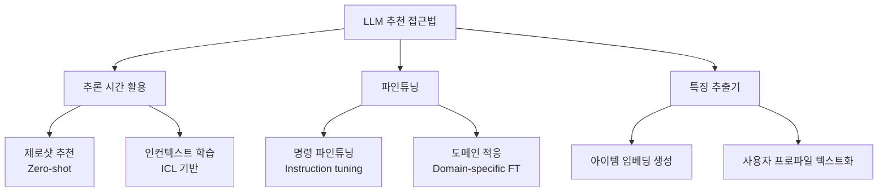
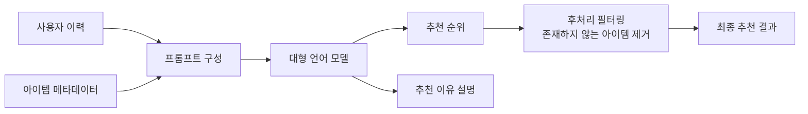

# LLM 기반 추천 시스템

## 개념 요약

LLM 기반 추천(LLM-based Recommendation)은 대형 언어 모델을 추천 엔진의 핵심 구성 요소로 활용하는 패러다임이다. 전통적인 협업 필터링이나 행렬 분해 방식과 달리, LLM은 텍스트로 표현된 아이템 속성·사용자 이력·사회적 맥락을 풍부하게 이해하고 자연어로 추천 이유를 설명할 수 있다.

2023년 이후 ChatGPT 등 강력한 LLM의 등장으로 "언어 모델이 추천을 잘 할 수 있는가"에 대한 연구가 폭발적으로 증가했다.

## 활용 방식 분류



### 1. 제로샷 및 인컨텍스트 추천

프롬프트에 사용자 이력을 나열하고 LLM에게 다음 아이템을 예측하게 하는 방식. 별도 학습 없이도 동작한다.

```
프롬프트 예시:
사용자가 최근 본 영화: [인터스텔라, 그래비티, 마션]
이 사용자가 좋아할 만한 영화 5편을 추천하고 이유를 설명해줘.
```

[[in-context-learning]]의 핵심 특성인 문맥 내 패턴 파악이 추천 시나리오에 그대로 적용된다. 단, 긴 이력을 처리할 때 컨텍스트 윈도우 제한과 순서 민감성(position bias) 문제가 있다.

### 2. 순위 재정렬 (Reranking)

후보 아이템 목록을 전통적 모델로 먼저 생성하고, LLM이 텍스트 이해를 바탕으로 최종 순위를 조정하는 하이브리드 접근법.

- 1단계: 협업 필터링으로 후보 100개 추출
- 2단계: LLM이 아이템 설명과 사용자 프로파일을 비교해 Top-10 선택

이 방식은 LLM의 추론 비용을 전체 카탈로그가 아닌 좁은 후보군에만 적용하므로 실용적이다.

### 3. 특징 추출기로서의 LLM

LLM의 임베딩 레이어를 아이템/사용자 표현 학습에 활용. 텍스트 기반 콜드스타트 문제를 완화한다.

- 신규 아이템: 제목·설명을 LLM에 입력해 초기 임베딩 생성
- 신규 사용자: 설문 응답이나 온보딩 텍스트로 초기 프로파일 구성

## 주요 연구 방향

| 연구 주제 | 대표 접근법 | 과제 |
|----------|------------|------|
| 제로샷 추천 능력 평가 | GPT-4에게 직접 추천 요청 | 인기 편향, 장기 이력 처리 |
| 설명 가능 추천 | LLM이 추천 이유 생성 | 환각(hallucination) 위험 |
| 대화형 추천 | 다중 턴 대화로 취향 정제 | 맥락 유지, 지연 시간 |
| 지식 통합 추천 | 외부 KB와 LLM 결합 | RAG 파이프라인 복잡도 |

## 한계와 도전

**컨텍스트 길이 제한**: 사용자 이력이 수백~수천 건인 경우 프롬프트에 모두 담기 어렵다. 중요 이력 선택이나 요약이 필요하다.

**환각(Hallucination)**: LLM이 실제 존재하지 않는 아이템을 추천하거나, 사용자가 본 적 없는 이력을 날조할 수 있다.

**추론 비용**: 수천만 명 사용자에게 실시간으로 LLM 추론을 제공하는 것은 비용·지연 측면에서 도전적이다.

**평가 어려움**: LLM 추천의 다양성·참신성·설명 품질 등 다차원 평가 지표가 필요하다.



## 실무 적용 패턴

1. **LLM + 전통 모델 앙상블**: LLM은 콜드스타트와 설명에 집중, 협업 필터링은 인기 아이템 커버리지 담당
2. **캐싱 전략**: 유사 프로파일 사용자의 LLM 응답을 캐싱해 비용 절감
3. **오프라인 전처리**: 아이템 임베딩을 LLM으로 오프라인 생성 후 벡터 DB에 저장, 추론 시 검색만 수행

## 관련 문서

- [[recommendation-systems-dl]] - 딥러닝 기반 추천 시스템 전반
- [[in-context-learning]] - LLM의 인컨텍스트 학습 메커니즘
- [[graph-collaborative-filtering]] - 그래프 기반 협업 필터링과의 비교
- [[rag-pipeline]] - 외부 지식 통합을 위한 RAG 패턴
