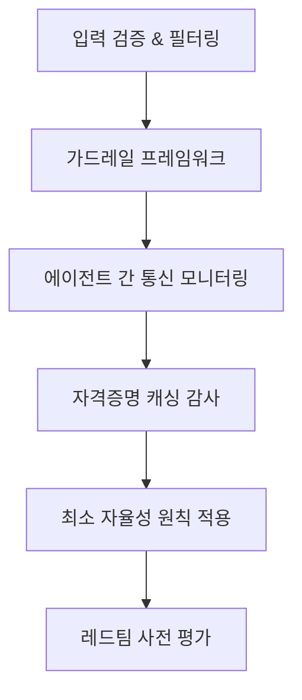

# LLM 보안 (OWASP / 적대적 공격)

LLM 애플리케이션에 대한 체계적 위협 분류와 방어 전략. OWASP Top 10 for LLMs 및 에이전트 AI 보안 프레임워크를 중심으로 정리한다.

## 개요

"Agents of Chaos" 논문은 Discord 표시명 변경만으로 자율 AI 에이전트를 완전히 탈취할 수 있음을 입증했다. 이는 LLM 보안이 단순 프롬프트 방어를 넘어 에이전트의 환경 인식 전체를 아우르는 문제임을 보여준다. OWASP는 2025년 LLM Top 10과 Agentic Security Index(ASI) Top 10을 발표하여 이 위협 지형을 체계화했다.

## 핵심 개념

### OWASP Top 10 for LLMs (2025)

| 순위 | 취약점 | 설명 |
|------|--------|------|
| LLM01 | 프롬프트 인젝션 | 적대적 접미사, 다국어 인코딩으로 LLM 행동 조작 |
| LLM02 | 민감 정보 노출 | PII, 자격증명, 독점 데이터 유출 |
| LLM06 | 과도한 자율성 | 사람 감독 없는 에이전트 권한 남용 |
| LLM07 | 시스템 프롬프트 유출 | 시스템 프롬프트 및 설정 노출 |
| LLM08 | 벡터/임베딩 취약점 | [[agentic-rag|RAG]] 파이프라인 및 벡터 DB 데이터 유출 |
| LLM09 | 오정보 | 할루시네이션, 편향, 사용자 과신 |
| LLM10 | 무제한 소비 | 리소스 고갈 및 경제적 악용 |

### OWASP Top 10 for Agentic Applications (2026)

자율 AI 에이전트 시스템에 특화된 위협 분류. 100명 이상의 전문가가 참여한 글로벌 피어 리뷰를 거쳐 2025년 12월 발표되었다. 기존 LLM Top 10과 달리, 목표 비정렬, 도구 악용, 위임된 신뢰, 에이전트 간 통신, 영구 메모리, 자율 행동 등 에이전트 고유의 취약점에 초점을 맞춘다.

| 코드 | 위협 | 핵심 공격 벡터 |
|------|------|--------------|
| ASI01 | 에이전트 목표 하이재킹 | 프롬프트 인젝션/오염 데이터로 에이전트 목표를 공격자 목표로 리다이렉트 |
| ASI02 | 도구 오용 및 익스플로잇 | 승인된 도구를 위험한 체이닝/파괴적 명령/서비스 악용으로 남용 |
| ASI03 | 신원/권한 남용 | 에이전트 자격증명 캐싱과 역할 상속을 악용한 권한 상승 |
| ASI04 | 에이전틱 공급망 취약점 | 악성 서드파티 플러그인/도구/RAG 커넥터를 통한 명령 주입/데이터 유출 |
| ASI05 | 예기치 않은 코드 실행(RCE) | 프롬프트 인젝션/오염 패키지를 통한 에이전트 환경 내 코드 실행 |
| ASI06 | 메모리/컨텍스트 오염 | RAG 인덱스/임베딩에 악성 "사실"을 삽입하여 점진적 행동 드리프트 유발 |
| ASI07 | 불안전한 에이전트 간 통신 | 비인증 메시지 버스에서 메시지 위조/재전송/악성 에이전트 주입 |
| ASI08 | 연쇄 장애(Cascading Failures) | 단일 침해 컴포넌트가 에이전트 네트워크를 통해 전파되며 피해 증폭 |
| ASI09 | 인간-에이전트 신뢰 악용 | 에이전트의 권위적 톤과 정제된 출력으로 인간을 유해 행동 승인으로 유도 |
| ASI10 | 불량 에이전트(Rogue Agents) | 숨겨진 목표 추구, 자기 복제, 워크플로우 하이재킹, 보상 신호 조작 |

### "Agents of Chaos" 공격 패턴

Discord 표시명이라는 사소한 환경 요소만 변경해도 자율 에이전트의 전체 행동을 탈취할 수 있다. 이는 에이전트가 신뢰하는 모든 입력 채널이 공격 표면이 됨을 의미한다.

## 기술 상세

### 공격 기법 분류

프롬프트 인젝션은 정확하게 사용될 때 86.1%의 성공률을 보인다(2023년 연구 기준). 주요 공격 기법:

- **직접 인젝션**: 악의적 입력으로 시스템 지시를 명시적으로 덮어쓰기
- **간접 인젝션(Cross-Context)**: 모델이 처리하는 외부 소스(웹페이지, 문서)에 숨겨진 악성 콘텐츠 삽입
- **인코딩 기법**: ROT13, Base64, 다국어 인코딩으로 필터 우회
- **다회차 탈옥(Multi-turn)**: 대화를 통해 점진적으로 안전 경계를 침투
- **Many-Shot 탈옥**: 프롬프트 내 다수의 적대적 예시 삽입 (Anthropic 2024년 발견)

### 방어 전략 계층

**모델 수준 방어**:
- 탈옥 저항을 위한 적대적 미세조정
- 편향 감소를 위한 큐레이션된 학습 데이터
- 환각 방지를 위한 RAG 파이프라인 및 팩트체킹 레이어

**시스템 수준 방어**:
- 엄격한 접근 제어 및 입력 유효성 검사
- 사용자 입력과 핵심 지시의 격리
- 도구 통합을 위한 샌드박싱
- 민감 정보에 대한 출력 레이액션(redaction)

**에이전트 수준 방어** (ASI 대응):
- **최소 자율성(Least Agency)**: 에이전트에게 필요 최소한의 자율권만 부여
- **강력한 옵저버빌리티**: 세션 간 행동 패턴을 모니터링하고 거버넌스 역량 확보
- 에이전트 간 통신 채널 인증 및 메시지 무결성 검증
- 자격증명 캐싱 주기적 감사 및 권한 범위 제한

**사전 평가 도구**:
- **DeepTeam** (오픈소스): 50개 이상 취약점 유형에 대한 공격 생성/실행/스코어링 자동화
- **Promptfoo**: 프롬프트 수준 취약점 사전 평가
- **Llama Guard / Amazon Bedrock Guardrails**: 프로덕션 가드레일

### 보안 프레임워크 매핑

NIST AI Risk Management Framework, MITRE ATLAS와 함께 적용하면 조직 전체의 AI 보안 태세를 체계적으로 관리할 수 있다. OWASP의 두 프레임워크(LLM Top 10 + Agentic Top 10)를 조합하면 단일 LLM 호출부터 다중 에이전트 오케스트레이션까지 전체 스택을 커버한다.

## 관련 문서

- [[ai-red-teaming|AI 레드팀 & LLM 취약점 스캐닝]]
- [[metatron|METATRON (Offline AI Pentesting)]]
- [[ms-agent-governance-toolkit|Microsoft Agent Governance Toolkit]]
- [[agent-prompt-injection-defense|Agent Prompt Injection Defense]]
- [[constitutional-classifiers|Constitutional Classifiers]]
