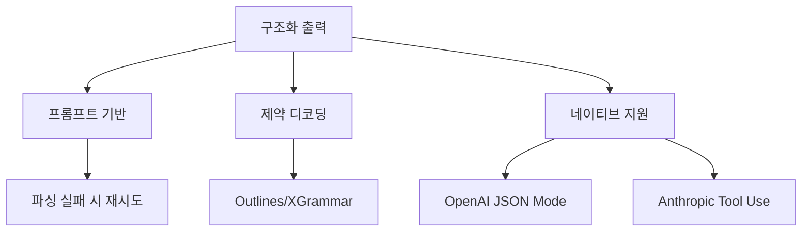

# LLM 구조화 출력

LLM 출력을 JSON, XML, Pydantic 모델 등 **타입 안전한 구조**로 파싱하고 검증하는 기법. 에이전트의 도구 호출, API 응답, 데이터 추출 등 프로그래밍 가능한 출력이 필요한 모든 곳에 필수.

## 접근법 분류



## 구현 레이어

| 레이어 | 도구 | 방식 |
|--------|------|------|
| **프롬프트+재시도** | [[instructor|Instructor]], Marvin | 스키마를 프롬프트에 포함, 실패 시 재시도 |
| **제약 디코딩** | [[outlines|Outlines]], XGrammar, [[guidance|Guidance]] | 로짓 마스킹으로 문법 강제 |
| **네이티브 API** | OpenAI `response_format`, Anthropic tool_use | 서버 측 구조화 |
| **DSL** | [[baml|BAML]] | 스키마 전용 언어로 정의 |

## Instructor 패턴 (가장 범용)

```python
import instructor
from pydantic import BaseModel

class User(BaseModel):
    name: str
    age: int

client = instructor.from_openai(openai.OpenAI())
user = client.chat.completions.create(
    model="gpt-4",
    response_model=User,
    messages=[{"role": "user", "content": "John is 30"}]
)
# User(name='John', age=30) -- 타입 보장
```

## 제약 디코딩 vs 재시도

- **제약 디코딩**: 100% 스키마 준수 보장, 로컬 모델에 적합
- **재시도**: API 모델에 적합, 1-3회 재시도로 99%+ 성공률

## 관련 문서

- [[structured-output]] -- 구조화 출력 기초
- [[outlines]] -- Outlines 제약 디코딩
- [[constrained-decoding]] -- 구조적 출력 제약 디코딩
- [[instructor]] -- Instructor 라이브러리
- [[baml]] -- BAML DSL
