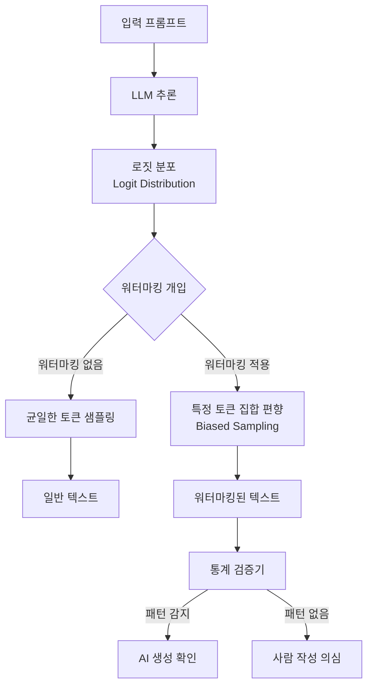

# LLM 워터마킹 (LLM Watermarking)

AI 생성 텍스트에 **통계적으로 검출 가능한 패턴을 삽입**하여 출처를 추적하거나 AI 생성 여부를 식별하는 기술. 이미지 워터마킹을 자연어에 적용한 개념으로, 딥페이크 텍스트, 허위 정보, 학술 부정직 방지, 저작권 보호 등 다양한 문제에 대한 잠재적 해결책으로 주목받는다.

## 핵심 원리

LLM 워터마킹은 텍스트 생성 과정의 **토큰 샘플링 단계**에 개입한다.

일반 사람이 읽을 때는 워터마킹된 텍스트와 그렇지 않은 텍스트의 차이를 인식할 수 없어야 한다(인지적 투명성).

## 주요 기법

### 토큰 편향 워터마킹 (Kirchenbauer et al., 2023)
Maryland 대학의 연구로, 가장 많이 인용된 기법이다.

1. 각 토큰 생성 시, 이전 토큰의 해시를 기반으로 어휘를 두 집합으로 분할
   - 초록 목록(greenlist): 워터마킹된 토큰
   - 빨간 목록(redlist): 일반 토큰
2. 초록 목록 토큰의 로짓을 $\delta$ 만큼 증가시켜 샘플링 확률을 높임
3. 검증 시: 텍스트에서 초록 목록 토큰의 비율이 통계적 기대치를 초과하면 AI 생성으로 판정

$$z = \frac{|s \cap G| - |s| \cdot \gamma}{\sqrt{|s| \cdot \gamma \cdot (1 - \gamma)}}$$

- $|s|$: 텍스트 길이, $\gamma$: 초록 목록 비율 기대값, $z$: 검출 통계량

### 분포 기반 워터마킹
샘플링 분포 자체를 변형하여 특정 통계적 서명을 삽입. 모델 가중치 변경 없이 디코딩 단계에서만 개입.

### 의미론적 워터마킹 (Semantic Watermarking)
단어 선택이 아닌 **의미적 수준**에서 패턴을 삽입. 동의어 대체나 문장 구조 변형에도 견고하도록 설계.

## [[memorization-in-llms]]과의 교차점

워터마킹은 LLM의 [[memorization-in-llms|암기 현상]]을 역이용하거나 보완하는 데 사용된다:

- **데이터 출처 추적**: 훈련 데이터에 워터마크를 삽입하면, 모델이 해당 데이터를 암기했을 때 출력에서 워터마크가 재현됨
- **저작권 분쟁**: [[ai-copyright-litigation]] 소송에서 모델이 특정 저작물을 학습했다는 증거로 활용 가능
- **데이터 오염 탐지**: 학습 데이터에 특정 패턴을 심어 무단 학습 여부 추적

## 제한과 공격

```mermaid
flowchart LR
    A[워터마킹된 텍스트] --> B{공격 유형}
    B --> C[패러프레이징 공격\nParaphrase Attack]
    B --> D[복사-붙여넣기 공격\n일부 원본 삽입]
    B --> E[번역 후 역번역]
    B --> F[LLM 재작성 요청]

    C & D & E & F --> G{워터마크 유지?}
    G -->|취약한 기법| H[워터마크 손실]
    G -->|견고한 기법| I[워터마크 유지]

    H --> J[탐지 실패]
```

**로버스트니스 vs. 텍스트 품질 트레이드오프**: 워터마킹 신호를 강하게 삽입할수록 텍스트 품질이 저하되고 사람이 알아챌 수 있다. 반대로 약하게 삽입하면 공격에 취약해진다.

**통계적 거짓 양성**: 긴 텍스트에서 우연히 초록 목록 토큰이 많이 등장할 경우 잘못 탐지될 수 있다.

**지식 없는 사용자 공격**: 워터마킹 알고리즘이 공개되면 공격자가 의도적으로 이를 제거하는 도구를 만들 수 있다.

## [[ai-copyright-litigation]] 맥락에서의 역할

2024-2026년 진행 중인 AI 저작권 소송들에서 워터마킹은 두 가지 방향으로 논의된다:

1. **저작권자 보호**: 창작물에 워터마크를 삽입하여 AI 학습 사용 여부 추적
2. **책임 귀속**: AI 생성 콘텐츠 식별을 통해 저작권 위반 텍스트 규명

그러나 현재 기술로는 완벽한 추적이 불가능하므로 법적 증거로의 활용은 제한적이다.

## 정책 동향

- **미국 행정명령(2023)**: 주요 AI 기업에 워터마킹 도구 개발 권고
- **EU AI Act**: 합성 콘텐츠 레이블링 의무 논의 중
- **C2PA 표준**: Content Credentials를 통한 메타데이터 기반 출처 추적 (워터마킹과 보완적)

## 텍스트 워터마킹 vs. 이미지 워터마킹

| 구분 | 텍스트 워터마킹 | 이미지 워터마킹 |
|------|--------------|---------------|
| 도메인 | 이산적(discrete) 토큰 | 연속적 픽셀값 |
| 삽입 방식 | 샘플링 편향 또는 텍스트 수정 | LSB 조작, 주파수 도메인 |
| 견고성 | 패러프레이징에 취약 | 압축/리사이즈에 취약 |
| 지각 투명성 | 텍스트 품질 약간 저하 | 육안으로 거의 불가 |
| 성숙도 | 연구 단계 | 상용 기술 성숙 |

## 관련 문서

- [[memorization-in-llms]] - LLM 암기와 데이터 출처 추적의 관계
- [[ai-copyright-litigation]] - 저작권 분쟁에서 워터마킹의 역할
- [[machine-unlearning]] - 워터마킹된 데이터 삭제 요청 처리
- [[ai-safety-alignment-2026]] - AI 콘텐츠 규제 정책 맥락
