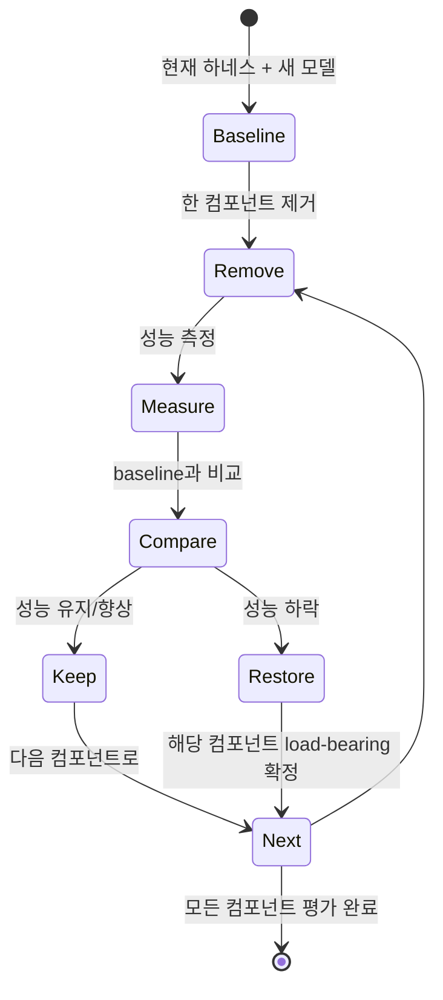

# Load-Bearing Harness (하네스 load-bearing 테스트)

## 정의

**Load-Bearing Harness**는 [[harness-engineering|하네스 엔지니어링]]의 메타 원칙이다: **하네스의 어떤 컴포넌트가 정말로 성능을 떠받치고 있는지는 오직 그것을 제거해봐야 알 수 있다**. 그리고 그 답은 모델 버전이 바뀔 때마다 달라진다.

핵심 문장:

> "Every component in a harness encodes an assumption about what the model can't do on its own."

하네스의 **모든 컴포넌트는 "모델이 혼자서는 못한다"는 가정의 물질화**다. 모델이 개선되어 그 가정이 더 이상 맞지 않으면, 그 컴포넌트는 불필요한 마찰이 된다.

## 원칙: "Find the Simplest Solution Possible"

이 아이디어는 Anthropic의 "Building Effective Agents" 포스트의 원칙을 계승한다:

> "find the simplest solution possible, and only increase complexity when needed"

그러나 **역방향도 참**이다: 이미 복잡해진 하네스를 **모델 업그레이드 이후에 단순화**할 때도 같은 원칙이 적용된다. 복잡도는 "필요할 때 증가"뿐 아니라 "불필요해지면 감소"도 해야 한다.

## 단순화 전략: One Component at a Time

### 급진적 단순화의 함정

저자의 초기 접근은 Opus 4.6 릴리스 직후 **여러 컴포넌트를 한꺼번에 제거**하는 것이었다. 결과: 성능 replicate 실패. 무엇이 원인인지 알 수 없었다.

### 방법론: 한 번에 한 컴포넌트

프로세스:

1. **Baseline 측정** — 현재 하네스 + 새 모델의 성능 기준선 잡기
2. **한 컴포넌트 제거** — sprint 구조, evaluator, planner 등 하나만 빼보기
3. **같은 태스크로 측정** — 가능하면 같은 프롬프트, 같은 metric
4. **비교**:
   - 성능 유지/향상 → 해당 컴포넌트는 **더 이상 load-bearing 아님** → 영구 제거
   - 성능 하락 → **여전히 load-bearing** → 복원
5. **다음 컴포넌트로 반복**

이 방식의 장점: **무엇이 필요한지, 무엇이 관성인지를 구체적으로 파악**할 수 있다.

## Capability Boundary로서의 하네스

하네스 컴포넌트는 **"모델 capability 경계"의 물질적 표현**이다. 예시:

| 컴포넌트 | 제거되는 capability 가정 |
|---|---|
| Evaluator | "모델이 자기 작업을 정직하게 평가 못한다" |
| Planner | "모델이 짧은 프롬프트를 온전한 스펙으로 확장 못한다" |
| Sprint 구조 | "모델이 큰 태스크를 native하게 decompose 못한다" |
| Context reset | "모델이 긴 컨텍스트에서 coherence를 유지 못한다" ([[context-anxiety]]) |
| Few-shot 예시 | "모델이 제로샷으로 원하는 스타일을 내지 못한다" |

모델이 그 capability를 획득하면, 해당 컴포넌트는 load-bearing에서 벗어난다.

## Anthropic 실전 사례: Opus 4.5 → 4.6

저자는 3-[[coding-agent|agent]] 하네스를 Opus 4.5 기준으로 구축했다. Opus 4.6 릴리스 후 하나씩 제거:

### Sprint 구조 — 제거됨

- **4.5 기준**: Generator가 큰 feature를 한 번에 처리 못함 → sprint 필요
- **4.6 기준**: "sustains agentic tasks for longer" → sprint 없이 coherent 유지
- 결과: 2시간 이상 연속 구현이 가능해 sprint 구조가 불필요

### Planner — 유지됨

- 4.6에서도 planner 없이는 generator가 **under-scope** 했다
- "given the raw prompt, it would start building without first speccing its work, and end up creating a less feature-rich application"
- Planner는 여전히 load-bearing

### Evaluator — 부분 유지

- Per-sprint 채점 → **단일 end-of-run 패스**로 이동
- Opus 4.5에서는 매 sprint 마다 evaluator의 체크가 필수였음
- Opus 4.6에서는 "tasks that used to need the evaluator's check to be implemented coherently were now often within what the generator handled well on its own"
- 그러나 end-of-run evaluator는 여전히 가치 있음 (놓친 엣지 케이스 포착)

**핵심 원칙**:

> "The evaluator is not a fixed yes-or-no decision. It is worth the cost when the task sits beyond what the current model does reliably solo."

## 경계는 사라지지 않고 이동한다

모델이 좋아졌다고 해서 하네스 엔지니어링의 중요성이 줄지는 않는다. 오히려 **경계가 밖으로 이동**하면서 **새로운 불가능한 태스크**가 드러나고, 그것을 다루기 위한 **새로운 하네스 조합**이 필요해진다:

> "As models improve, the space of interesting harness combinations doesn't shrink. Instead, it moves, and the interesting work for AI engineers is to keep finding the next novel combination."

즉, load-bearing test는 **"하네스를 줄이는 게 목표"** 가 아니라 **"하네스를 올바른 자리에 유지하는 게 목표"** 다. 줄어든 여유분은 다시 더 야심 찬 태스크를 공략하는 데 재투자된다.

## 실무 Cadence

저자가 제시한 엔지니어링 cadence:

1. **타겟 모델로 현실 문제 실험**
2. **실행 트레이스 읽기**
3. **원하는 결과 달성 위한 performance 튜닝**
4. **복잡한 태스크를 specialized agent 역할로 decompose**
5. **새 모델 릴리스와 함께 하네스 디자인 재검토** → "stripping away pieces that are no longer load-bearing to performance"

5번이 load-bearing test의 의례화(ritualization)다. 모든 모델 업그레이드는 하네스의 load-bearing 재검증 기회다.

## 관련 문서

- [[harness-engineering]] — load-bearing test는 하네스 엔지니어링의 메타 원칙
- [[generator-evaluator-architecture]] — evaluator의 load-bearing 여부는 모델 capability에 달려 있음
- [[sprint-contracts]] — sprint 자체도 load-bearing test의 대상
- [[context-anxiety]] — reset 메커니즘의 load-bearing 여부도 모델 버전에 따라 변동
- [[anthropic-harness-design]] — Opus 4.5 → 4.6 load-bearing 재평가 실전 사례
- [[relocating-rigor]] — 엄밀함의 이동 원칙과 호응 (사라지지 않고 이동)
- [[evolution-of-agentic-patterns]] — 3 에라 패러다임 전환 관점
