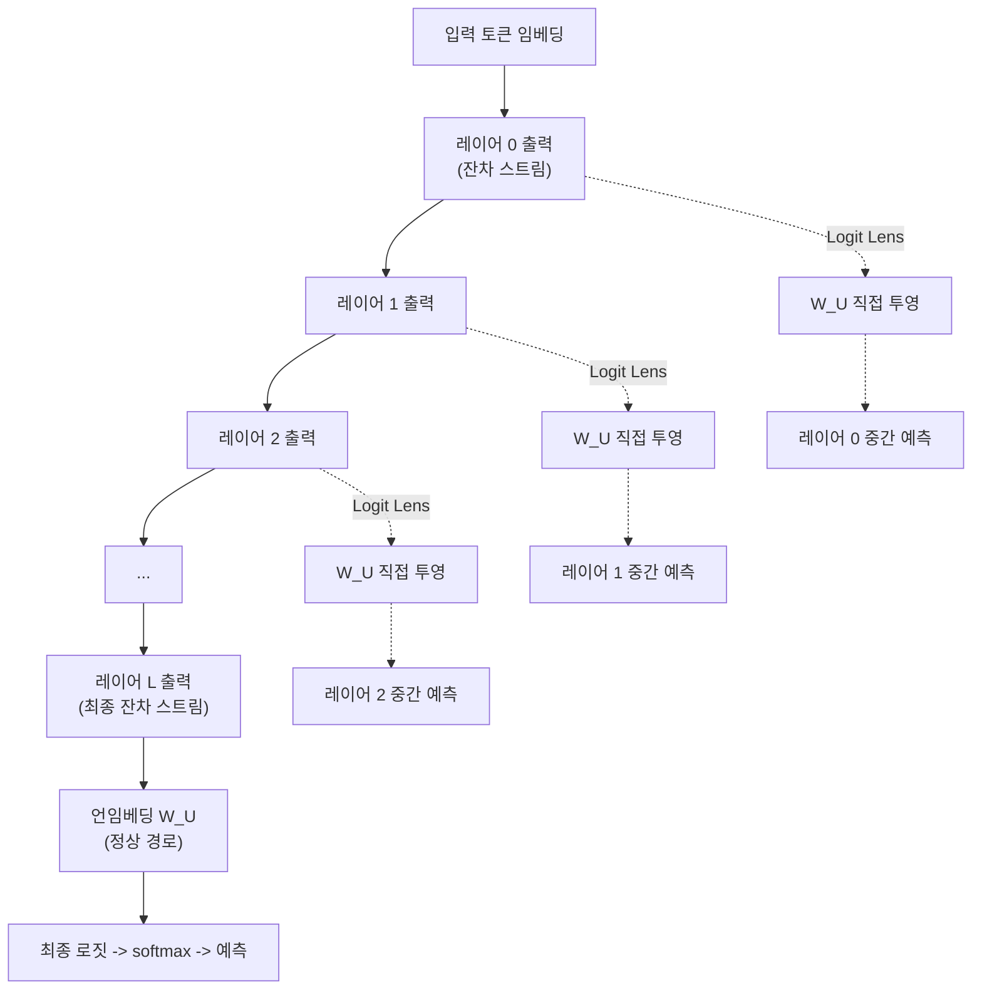
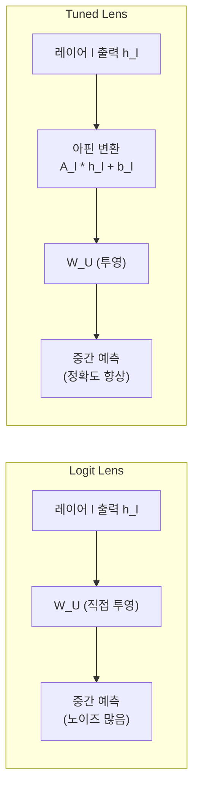
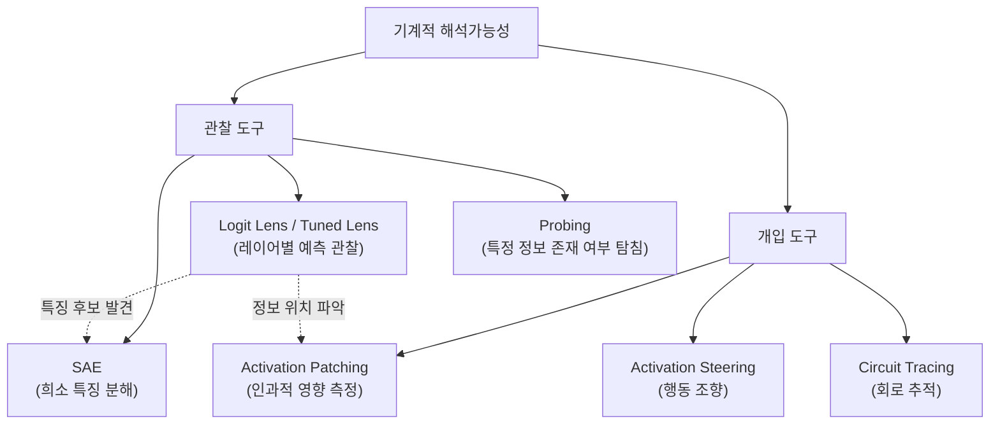

# Logit Lens와 Tuned Lens (중간 레이어 예측 관찰)

## 정의

**Logit Lens**는 nostalgebraist(2020)가 소개한 해석가능성 기법으로, 트랜스포머의 **각 레이어에서 잔차 스트림(residual stream)을 최종 언임베딩(unembedding) 행렬에 투영**하여 "중간 예측"을 관찰하는 방법이다. 모델이 최종 출력을 결정하기까지 **각 레이어에서 어떤 토큰을 예측하고 있는지** 들여다볼 수 있다.

**Tuned Lens**는 Belrose et al. (2023)이 "Eliciting Latent Predictions from Transformers with the Tuned Lens"에서 제안한 개선 버전으로, 각 레이어에 **학습된 아핀 변환(affine probe)**을 추가하여 중간 예측의 정확도를 크게 개선했다.

## 핵심 원리: 잔차 스트림 투영

트랜스포머 모델에서 각 레이어의 출력은 **잔차 스트림(residual stream)**을 통해 누적된다. 최종 레이어의 잔차 스트림은 언임베딩 행렬 $W_U$에 의해 어휘 전체에 대한 로짓(logit)으로 변환된다.



위 다이어그램은 Logit Lens의 작동 원리를 보여준다. 정상적으로는 최종 레이어에서만 언임베딩을 적용하지만, Logit Lens는 **모든 중간 레이어**에서 동일한 언임베딩을 적용하여 각 시점의 "예측 상태"를 관찰한다.

Logit Lens의 수학적 표현은 간단하다:

$$\text{logits}_l = h_l \cdot W_U$$

여기서 $h_l$은 레이어 $l$의 잔차 스트림 벡터이고, $W_U$는 최종 언임베딩 행렬이다.

## Logit Lens의 발견

nostalgebraist가 GPT-2에 Logit Lens를 적용했을 때, 다음과 같은 패턴을 관찰했다:

### 점진적 정제 (Iterative Refinement)

- **초기 레이어(0-3)**: 예측이 거의 무작위. 입력 토큰의 위치/구문 정보만 존재
- **중간 레이어(4-8)**: 대략적인 의미 범주가 형성. "동물" 관련 단어들이 상위에 등장
- **후반 레이어(9-12)**: 최종 답에 가까운 토큰이 상위로 부상. 문맥에 맞는 구체적 단어 선택

이는 트랜스포머가 정보를 **점진적으로 정제(refine)**하는 방식으로 처리한다는 강력한 증거다. 각 레이어가 "약간 더 나은 예측"을 만들어 잔차 스트림에 누적한다.

### 레이어별 정보 형성 패턴

| 레이어 구간 | Logit Lens 관찰 | 해석 |
|-----------|----------------|------|
| 초기 (0-20%) | 입력 토큰 반복 또는 무작위 | 토큰 임베딩 + 위치 정보 처리 |
| 중간 전반 (20-50%) | 의미적으로 관련된 토큰 등장 | 주제/맥락 파악 |
| 중간 후반 (50-80%) | 후보 답변 좁혀짐 | 구체적 정보 결합 |
| 최종 (80-100%) | 최종 예측과 일치 | 출력 결정 |

## Tuned Lens: 정확도 개선

### Logit Lens의 한계

Logit Lens는 중간 레이어의 잔차 스트림을 **최종 레이어용 언임베딩에 직접 투영**한다. 그러나 중간 레이어의 표현 공간과 최종 레이어의 표현 공간은 동일하지 않다. 이 불일치로 인해:

- 초기 레이어에서의 예측이 지나치게 부정확
- 중간 레이어의 실제 정보량을 과소평가할 가능성
- 모델마다 투영 품질이 크게 다름

### Tuned Lens의 해결책

Belrose et al. (2023)은 각 레이어에 **학습된 아핀 변환(affine transformation)**을 추가했다:

$$\text{logits}_l = (A_l \cdot h_l + b_l) \cdot W_U$$

여기서 $A_l$과 $b_l$은 레이어 $l$ 전용으로 학습된 파라미터다. 이 probe는 소량의 데이터로 빠르게 학습되며, 모델의 가중치는 고정한 상태에서 probe만 훈련한다.



이 다이어그램은 Logit Lens와 Tuned Lens의 구조 차이를 보여준다. Tuned Lens는 레이어별 아핀 변환을 추가하여 투영 정확도를 개선한다.

### 실험 결과

Tuned Lens는 Logit Lens 대비:
- 초기 레이어에서의 예측 정확도가 **대폭 향상** (특히 레이어 0-3)
- 모델 규모에 관계없이 일관된 개선
- GPT-2, GPT-Neo, Pythia 등 다양한 아키텍처에서 검증

## 해석가능성 연구에서의 위치

Logit Lens/Tuned Lens는 [[mechanistic-interpretability-2026|기계적 해석가능성]] 연구의 기초 도구에 해당한다. 모델 내부를 관찰하는 다른 기법들과의 관계는 다음과 같다:



위 다이어그램은 해석가능성 도구 간의 관계를 보여준다. Logit Lens는 관찰 도구로, 발견한 정보를 [[circuit-tracing|회로 추적]]이나 [[activation-patching|활성화 패칭]] 같은 개입 도구로 후속 검증할 수 있다.

## 실용적 활용 사례

### 1. 환각 디버깅

모델이 사실과 다른 출력을 생성할 때, Logit Lens로 **어느 레이어에서 잘못된 정보가 형성되는지** 추적할 수 있다. 초기 레이어에서 이미 잘못된 후보가 등장하면 지식 저장 자체의 문제이고, 후반 레이어에서 갑자기 바뀌면 문맥 처리 과정의 오류일 가능성이 높다.

### 2. 지식 국소화 (Knowledge Localization)

특정 사실적 지식(예: "파리는 프랑스의 수도")이 모델의 어느 레이어에 저장되어 있는지 파악한다. Logit Lens로 "프랑스의 수도는 ___" 프롬프트에서 "파리"가 상위 예측으로 등장하는 최초 레이어를 식별하면, 해당 레이어 근처에 관련 지식이 인코딩되어 있다고 추론할 수 있다.

### 3. 안전성 분석

모델이 유해한 출력을 생성하기 전에, 중간 레이어에서 유해 토큰이 이미 상위에 등장하는지 모니터링한다. 안전 학습(safety training)이 실제로 내부 표현을 변경했는지, 아니면 최종 레이어에서만 억제하는지를 구분할 수 있다.

## 코드 개요

```python
# Logit Lens 기본 구현 (의사 코드)
def logit_lens(model, input_ids, layer_idx):
    """특정 레이어에서의 중간 예측을 반환"""
    # 1. 해당 레이어까지 순전파
    hidden_state = model.forward_to_layer(input_ids, layer_idx)

    # 2. 최종 언임베딩 행렬로 직접 투영
    logits = hidden_state @ model.lm_head.weight.T

    # 3. softmax로 확률 변환
    probs = torch.softmax(logits, dim=-1)

    # 4. 상위 k개 토큰 반환
    top_k_probs, top_k_ids = probs.topk(k=10)
    return model.tokenizer.decode(top_k_ids)
```

## 관련 문서

- [[circuit-tracing]] -- 레이어 간 연산 경로를 추적하는 심층 분석 도구
- [[mechanistic-interpretability-2026]] -- Logit Lens가 속한 해석가능성 분야의 전체 맥락
- [[transformer-architecture]] -- Logit Lens가 분석하는 트랜스포머 아키텍처의 구조
- [[representation-engineering]] -- 잔차 스트림을 활용한 행동 조향 기법
- [[activation-patching]] -- Logit Lens로 발견한 정보를 인과적으로 검증하는 도구
