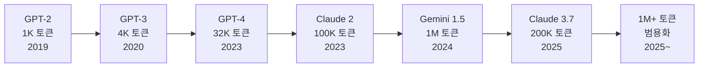
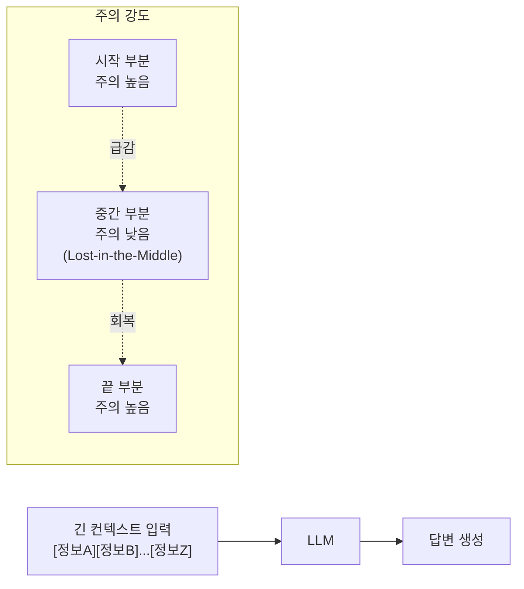
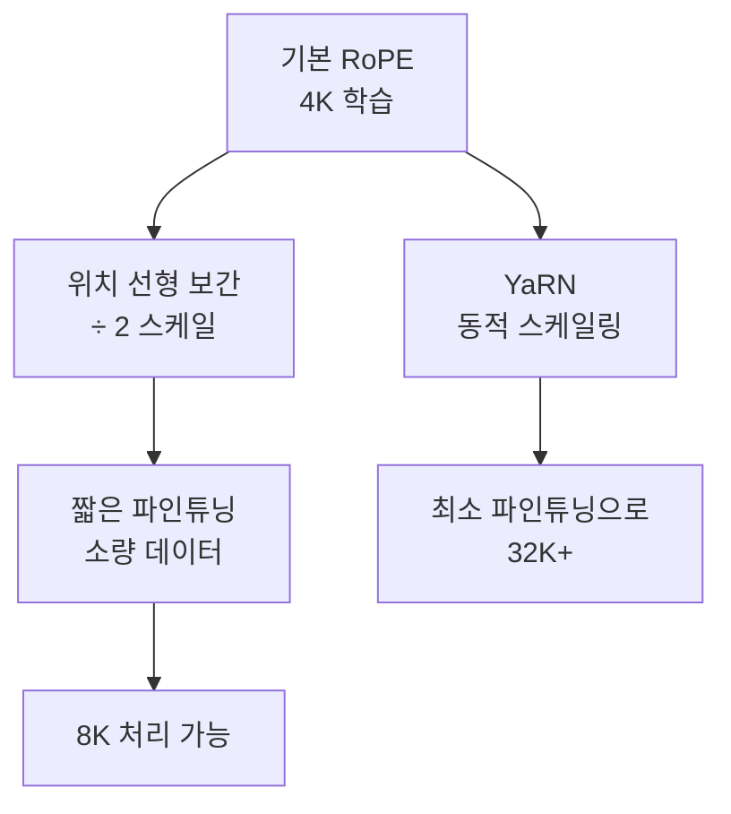
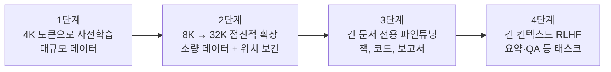
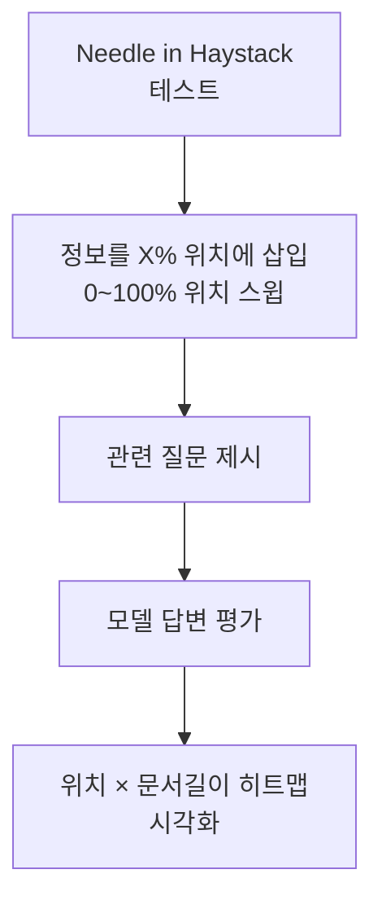

# 긴 컨텍스트 (Long Context)

긴 컨텍스트(long context)는 언어 모델이 수천~수백만 토큰에 달하는 긴 입력을 처리할 수 있는 능력을 가리킨다. 학습과 추론 모두에서 특수한 기법이 필요하며, 모델이 긴 맥락을 *실제로* 활용하는지는 길이를 늘리는 것과 별개의 문제다.

## 컨텍스트 길이 진화



컨텍스트 길이는 지수적으로 증가해왔다. 초기 Transformer 모델의 한계인 512~1K 토큰에서, 2024년에는 1M 토큰 모델이 등장했다. 이 증가는 단순히 메모리를 키운 것이 아니라 위치 인코딩, KV 캐시 최적화, 학습 기법의 혁신이 맞물린 결과다.

---

## 핵심 문제: 긴 중간 정보 망각 (Lost-in-the-Middle)

컨텍스트가 길어진다고 모델이 모든 정보를 균등하게 활용하지는 않는다. Liu et al. (2023)의 연구에서 밝혀진 **"lost-in-the-middle"** 현상이 대표적이다.



- 모델이 프롬프트의 시작과 끝 부분에 더 집중하는 U자형 주의 패턴이 나타남
- 중요한 정보가 컨텍스트 중간에 있으면 무시될 가능성이 높음
- RAG 파이프라인에서 검색 결과 순서 배치가 중요한 이유

**실무 대응책**:
- 핵심 지시사항은 프롬프트 앞과 끝에 중복 배치
- RAG에서 가장 관련 높은 청크를 첫 번째나 마지막에 배치
- 컨텍스트를 요약·압축해서 중간 부분 정보 손실 최소화

---

## 위치 인코딩 기법

컨텍스트 길이 확장의 핵심은 **위치 인코딩(positional encoding)** 이 긴 시퀀스에도 일반화되는가의 문제다.

### 절대 위치 인코딩 (Sinusoidal / Learned)

초기 Transformer에서 사용. 각 위치에 고정된 벡터를 더한다.

- **단점**: 학습에서 본 최대 길이를 넘으면 일반화 불가. 2K로 학습하면 4K에서 성능 급락

### RoPE (Rotary Position Embedding)

Su et al. (2021) 제안. 절대 위치 대신 **상대 위치 정보를 회전 행렬로 인코딩**한다.

$f(q, m) = R_m \cdot q$

- LLaMA, GPT-NeoX, PaLM 등 대부분 현대 모델이 채택
- 학습 길이 외삽(extrapolation)이 기본 RoPE로는 여전히 어려움
- **YaRN, LongRoPE, RoPE 스케일링**으로 학습 없이 길이 확장 가능

#### RoPE 보간 (Interpolation)

학습 길이 $L_{train}$을 확장 목표 $L_{target}$으로 선형 보간:

$\text{position}' = \text{position} \times \frac{L_{train}}{L_{target}}$

소량의 파인튜닝과 결합하면 2~4배 길이 확장이 가능하다.



### ALiBi (Attention with Linear Biases)

Press et al. (2022). 위치 인코딩을 벡터로 추가하는 대신, **Attention score에 위치 거리에 비례한 음수 바이어스**를 뺀다.

$\text{attention\_score}(i, j) = q_i \cdot k_j - m \cdot |i - j|$

- 학습 길이 외삽에 자연스럽게 강한 성질
- 긴 거리의 토큰일수록 패널티가 커져 국소 맥락 중심으로 동작
- BLOOM, MPT 모델에서 사용

### 슬라이딩 윈도우 어텐션 (Sliding Window Attention)

전체 시퀀스에 완전한 주의를 적용하는 대신, **각 토큰에서 고정 크기 윈도우 내 토큰들만 참조**한다.

- $O(n \cdot w)$ 복잡도 (w = 윈도우 크기)
- Longformer, Mistral의 그룹 쿼리 어텐션과 결합
- 전체 맥락 활용 불가능 → 글로벌 토큰(CLS 등)으로 보완하는 경우 많음

---

## 긴 컨텍스트 학습 기법

모델을 처음부터 긴 컨텍스트로 학습하는 것은 비용이 크다. 단계적 확장이 일반적이다.



**학습 데이터 구성**:
- 짧은 텍스트 위주 데이터는 긴 컨텍스트 학습에 부적합
- 책, 코드 레포, 긴 논문, 법률 문서 등 자연적으로 긴 텍스트 필요
- 긴 컨텍스트와 짧은 컨텍스트를 **혼합**해야 짧은 입력 성능 유지

상세한 학습 기법은 [[long-context-training]] 참조.

---

## KV 캐시와 메모리 비용

긴 컨텍스트의 실질적 병목은 KV 캐시(Key-Value Cache) 메모리다.

각 레이어의 K, V 텐서를 저장해야 하므로:

$$\text{KV Cache} = 2 \times n_{layers} \times n_{heads} \times d_{head} \times T \times \text{dtype\_bytes}$$

- $T$ = 시퀀스 길이
- 70B 모델 기준 100K 토큰 = ~80GB KV 캐시 → 단일 요청이 GPU 여러 장 필요

**최적화 기법**:

| 기법 | 설명 | 메모리 절감 |
|------|------|-----------|
| 다중 쿼리 어텐션(MQA) | K/V를 모든 헤드가 공유 | ~8x |
| 그룹 쿼리 어텐션(GQA) | K/V를 그룹 단위로 공유 | 2~8x |
| 양자화 KV 캐시 | FP8/INT8로 저장 | 2x |
| StreamingLLM | 최근 + 첫 어텐션 싱크 토큰만 유지 | N 고정 |
| 분산 KV 캐시 | 여러 GPU/노드에 분산 | 확장성 |

---

## 1M 토큰 시대의 도전

Gemini 1.5 Pro는 1M 토큰(약 750K 단어, 책 1권)을 처리할 수 있다고 발표했다. 그러나 컨텍스트 길이와 실제 활용 능력 사이에는 여전히 큰 차이가 있다.

### "Needle in a Haystack" 테스트

긴 텍스트(건초더미)에 특정 정보(바늘)를 숨기고 모델이 찾을 수 있는지 평가한다. 대부분 모델에서 컨텍스트 길이가 길수록, 바늘 위치가 중간일수록 정확도가 떨어진다.



관련 연구: [[long-context-scaling]], [[positional-bias-llm]], [[llm-long-context-faithfulness]]

### 실무에서 긴 컨텍스트가 유용한 시나리오

| 시나리오 | 컨텍스트 필요량 | 주의사항 |
|---------|--------------|---------|
| 코드 레포 전체 QA | 50K~200K | 파일 구조 + 코드 내용 |
| 법률 문서 분석 | 100K+ | 중간 정보 손실 주의 |
| 장문 소설 일관성 검사 | 200K+ | 전체를 한 번에 처리 |
| 반복 대화 히스토리 | 50K+ | 요약 vs 전체 트레이드오프 |
| 멀티문서 합성 | 조건부 | RAG도 병행 고려 |

---

## 긴 컨텍스트 vs RAG

긴 컨텍스트 모델이 발전함에 따라 "RAG가 불필요해지는가?"라는 논의가 있다. 현재 시점에서의 비교:

| 항목 | 긴 컨텍스트 | RAG |
|------|-----------|-----|
| 구현 복잡도 | 낮음 (모델만 사용) | 높음 (검색 파이프라인) |
| 비용 | 토큰당 비용 높음 | 검색 인프라 비용 |
| 최신 정보 | 업데이트 안 됨 | 검색 시점에 최신 정보 |
| 정확성 | Lost-in-middle 위험 | 검색 품질에 의존 |
| 스케일 | 수백만 토큰 한계 | 수십억 문서 가능 |

실무에서는 두 접근을 결합하는 경우가 늘고 있다: 검색으로 관련 청크를 추려 긴 컨텍스트에 넣는 "RAG + long context" 패턴.

---

## 실무 코드 예시

### 긴 컨텍스트 요약 - 청크 계층 전략

```python
from anthropic import Anthropic

client = Anthropic()

def hierarchical_summarize(text: str, chunk_size: int = 50000) -> str:
    """
    긴 텍스트를 계층적으로 요약.
    1단계: 청크별 요약
    2단계: 요약들을 다시 요약
    """
    # 청크 분할 (단어 기준 대략적 분할)
    words = text.split()
    chunks = []
    for i in range(0, len(words), chunk_size):
        chunk = " ".join(words[i:i + chunk_size])
        chunks.append(chunk)

    # 1단계: 각 청크 요약
    chunk_summaries = []
    for idx, chunk in enumerate(chunks):
        response = client.messages.create(
            model="claude-3-5-sonnet-20241022",
            max_tokens=1024,
            messages=[{
                "role": "user",
                "content": f"다음 텍스트의 핵심 내용을 3-5문장으로 요약하세요:\n\n{chunk}"
            }]
        )
        summary = response.content[0].text
        chunk_summaries.append(f"[섹션 {idx+1}] {summary}")

    # 2단계: 요약들의 최종 요약
    combined = "\n\n".join(chunk_summaries)
    final_response = client.messages.create(
        model="claude-3-5-sonnet-20241022",
        max_tokens=2048,
        messages=[{
            "role": "user",
            "content": f"다음은 긴 문서의 섹션별 요약입니다. 전체 문서를 종합적으로 요약하세요:\n\n{combined}"
        }]
    )
    return final_response.content[0].text
```

### Needle-in-Haystack 테스트 구현

```python
import random

def needle_in_haystack_test(
    haystack: str,
    needle: str,
    question: str,
    needle_position: float = 0.5,
) -> tuple[str, bool]:
    """
    긴 텍스트에서 특정 정보 찾기 테스트.

    Args:
        haystack: 긴 배경 텍스트
        needle: 삽입할 핵심 정보
        question: 모델에게 물을 질문
        needle_position: 0.0(시작) ~ 1.0(끝) 삽입 위치
    Returns:
        (모델 답변, 성공 여부 [사람이 판단])
    """
    words = haystack.split()
    insert_idx = int(len(words) * needle_position)
    needle_words = needle.split()

    modified_words = words[:insert_idx] + needle_words + words[insert_idx:]
    full_text = " ".join(modified_words)

    response = client.messages.create(
        model="claude-3-5-sonnet-20241022",
        max_tokens=512,
        messages=[{
            "role": "user",
            "content": f"다음 텍스트를 읽고 질문에 답하세요.\n\n{full_text}\n\n질문: {question}"
        }]
    )
    return response.content[0].text, True  # 성공 여부는 사람이 판단
```

---

## 위치 인코딩 방법 비교

| 방법 | 모델 예시 | 외삽 능력 | 메모리 오버헤드 |
|------|---------|---------|--------------|
| 절대 사인파(Sinusoidal) | 원본 Transformer | 낮음 | 없음 |
| 학습된 절대 위치 | BERT, GPT-2 | 낮음 (학습 길이 고정) | 소 |
| RoPE | LLaMA, Mistral | 보간 필요 | 없음 |
| ALiBi | BLOOM, MPT | 자연스러운 외삽 | 없음 |
| YaRN | LLaMA 확장 | RoPE 기반 개선 | 없음 |
| T5 상대 위치 | T5, Flan | 중간 | 소 |

---

## 왜 중요한가

긴 컨텍스트는 AI가 할 수 있는 일의 범위를 근본적으로 바꾼다. 코드 레포 전체를 이해하고 리팩토링하거나, 수백 페이지 계약서를 검토하거나, 긴 연구 논문을 한 번에 처리하는 것이 가능해진다. 에이전트가 장기 작업을 수행할 때 대화 히스토리를 온전히 유지하는 것도 긴 컨텍스트가 있어야 가능하다.

동시에 "맥락이 길면 실제로 잘 쓰는가?"라는 충실성(faithfulness) 문제가 부상한다. [[llm-long-context-faithfulness]]는 이 문제를 체계적으로 다룬다.

---

## 관련 문서

- [[long-context-training]] - 긴 컨텍스트 학습 기법 상세
- [[long-context-scaling]] - 스케일링 법칙과 길이 확장
- [[positional-bias-llm]] - LLM의 위치 편향 연구
- [[llm-long-context-faithfulness]] - 긴 컨텍스트 정보 충실성
- [[attention-mechanism-overview]] - 어텐션 메커니즘 기초
- [[advanced-rag-patterns]] - RAG와 긴 컨텍스트 결합 패턴
