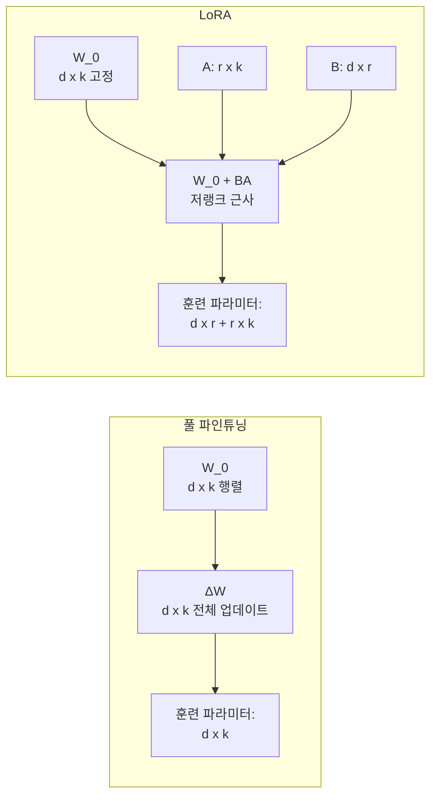
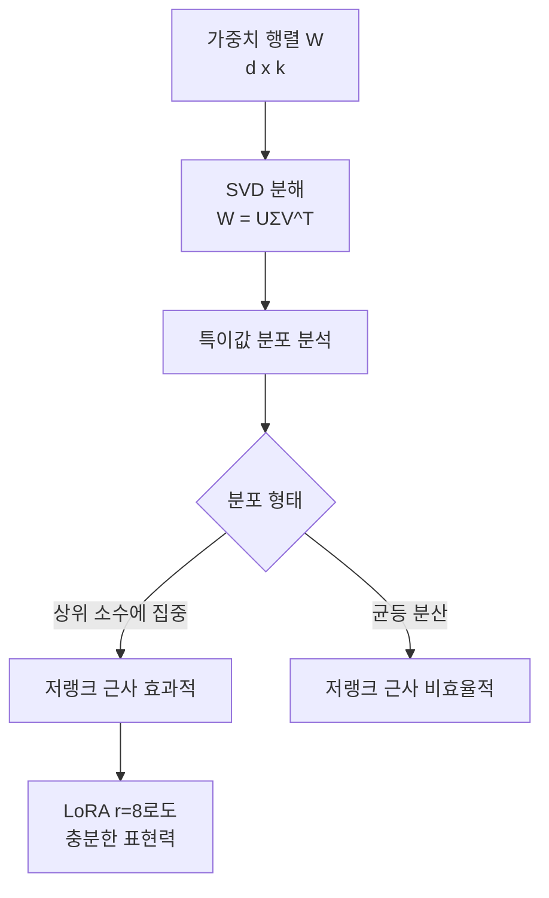
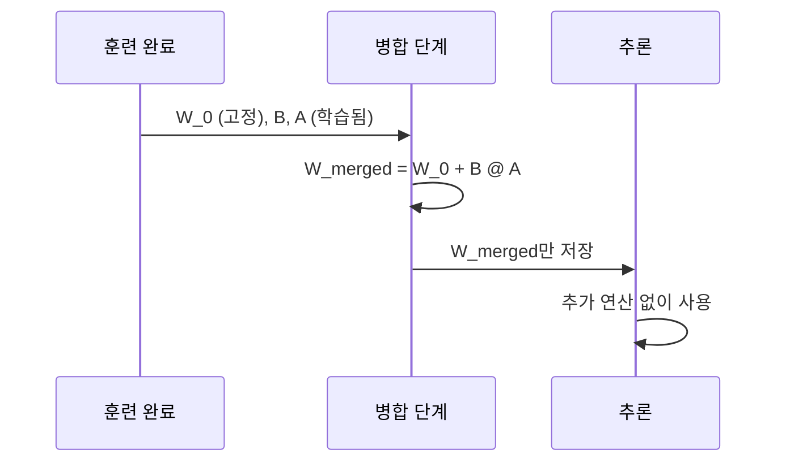

# LoRA 이론과 메커니즘

## 개요

LoRA(Low-Rank Adaptation)는 대형 언어 모델의 파인튜닝을 위한 파라미터 효율적 방법(PEFT)이다. 2021년 Microsoft 연구팀이 제안했으며, 전체 가중치를 업데이트하는 대신 **각 가중치 행렬에 저랭크 분해(low-rank decomposition) 행렬 쌍을 추가**하는 방식이다. 이를 통해 훈련 가능한 파라미터 수를 수천 배 줄이면서도 풀 파인튜닝에 근접한 성능을 달성한다.

## 왜 저랭크 근사가 효과적인가

LoRA의 핵심 이론적 근거는 **고유 차원(intrinsic dimensionality)** 개념이다. 2020년 Aghajanyan 등이 발견한 바에 따르면, 언어 모델을 특정 태스크에 적응시키는 데 필요한 실질적 파라미터 차원은 모델 전체 파라미터 수보다 훨씬 낮다.

수식:

$$h = W_0 x + \Delta W x = W_0 x + BA x$$

여기서:
- $W_0 \in \mathbb{R}^{d \times k}$: 사전학습된 가중치 (고정)
- $B \in \mathbb{R}^{d \times r}$, $A \in \mathbb{R}^{r \times k}$: 학습 가능한 저랭크 행렬
- $r \ll \min(d, k)$: 랭크 (일반적으로 4~64)

초기화 시 B는 0으로, A는 가우시안 분포로 초기화하여 훈련 시작 시 $\Delta W = 0$임을 보장한다.

## 저랭크가 작동하는 이유: 스펙트럼 분석

사전학습된 가중치의 특이값 분해(SVD)를 분석하면, 대부분의 정보는 소수의 큰 특이값에 집중된다. 즉, 가중치 행렬이 이미 암묵적으로 저랭크 구조를 가지고 있다.

태스크 적응을 위한 가중치 변화 $\Delta W$ 역시 동일한 패턴을 따른다는 것이 실험적으로 검증됐다. 즉, 태스크에 필요한 변화도 저차원 부분 공간에서 일어난다.

## 랭크(r) 선택 가이드

랭크 r은 LoRA의 가장 중요한 하이퍼파라미터다. 랭크가 높을수록 표현력이 높아지지만 훈련 파라미터 수와 계산량이 증가한다.

| 랭크 r | 사용 상황 | 특징 |
|--------|-----------|------|
| 1~4 | 단순 태스크 적응 | 최소 파라미터, 과적합 위험 낮음 |
| 8~16 | 일반적인 파인튜닝 | 가장 흔히 사용되는 범위 |
| 32~64 | 복잡한 태스크, 도메인 전환 | 표현력 높음, 비용 증가 |
| 128+ | 거의 풀 파인튜닝 수준 필요 시 | LoRA 이점 감소 |

실무에서는 r=8 또는 r=16부터 시작하고, 성능이 부족하면 증가시키는 전략이 일반적이다.

### 랭크와 스케일링 인자 α

LoRA는 $\alpha/r$로 업데이트를 스케일링한다:

$$h = W_0 x + \frac{\alpha}{r} BA x$$

$\alpha$를 r과 동일하게 설정하면 스케일링이 1.0이다. 관례적으로 $\alpha = 2r$ 또는 $\alpha = r$로 설정한다. 이 스케일링은 랭크를 변경할 때 학습률 재조정 없이도 일관된 업데이트 크기를 유지하기 위해 도입됐다.

## 어떤 가중치에 LoRA를 적용할 것인가

트랜스포머에서 LoRA를 적용할 수 있는 선형 레이어의 종류:

- 어텐션: $W_Q, W_K, W_V, W_O$
- FFN: $W_{up}, W_{down}, W_{gate}$

원본 논문에서는 $W_Q$와 $W_V$에만 적용했지만, 이후 연구들은 모든 선형 레이어에 적용하는 것이 성능상 유리하다는 것을 보였다. [[peft-adapter-survey]]에서 다양한 적용 전략을 비교한다.

## 추론 시 병합

LoRA의 큰 장점은 추론(inference) 시 추가 지연 없이 사용 가능하다는 것이다. 추론 전에 $W_{merged} = W_0 + BA$를 계산하여 원래 가중치에 통합하면 추가 연산이 전혀 없다.

단, 서로 다른 LoRA 어댑터를 동적으로 전환하는 경우(예: 멀티테넌트 서빙)에는 병합 없이 별도 어댑터를 유지하고 그때그때 적용하는 방식을 사용한다.

## 비교: LoRA vs. 풀 파인튜닝

| 항목 | 풀 파인튜닝 | LoRA (r=8) |
|------|------------|------------|
| 학습 파라미터 비율 | 100% | ~0.1~1% |
| GPU 메모리 (옵티마이저 포함) | 매우 높음 | 크게 감소 |
| 태스크 전환 비용 | 전체 모델 교체 | 어댑터 교체만 |
| 최종 성능 | 기준선 | 거의 동등~약간 낮음 |
| 과적합 위험 | 높음 (소량 데이터) | 낮음 |
| 파인튜닝 후 저장 용량 | 전체 모델 | 어댑터만 (수 MB) |

## QLoRA와의 관계

QLoRA는 LoRA와 양자화(quantization)를 결합한 방법이다. 기본 모델을 4비트로 양자화하고 그 위에 LoRA 어댑터를 학습한다. 이를 통해 65B 파라미터 모델도 단일 48GB GPU에서 파인튜닝이 가능해진다. [[lora-qlora-finetuning]]에서 상세 구현을 다룬다.

## 관련 문서

- [[lora-paper]] - Hu et al. (2021) 원본 논문 요약
- [[lora-qlora-finetuning]] - QLoRA 및 실무 파인튜닝 가이드
- [[peft-adapter-survey]] - LoRA vs. 다른 PEFT 방법 비교
