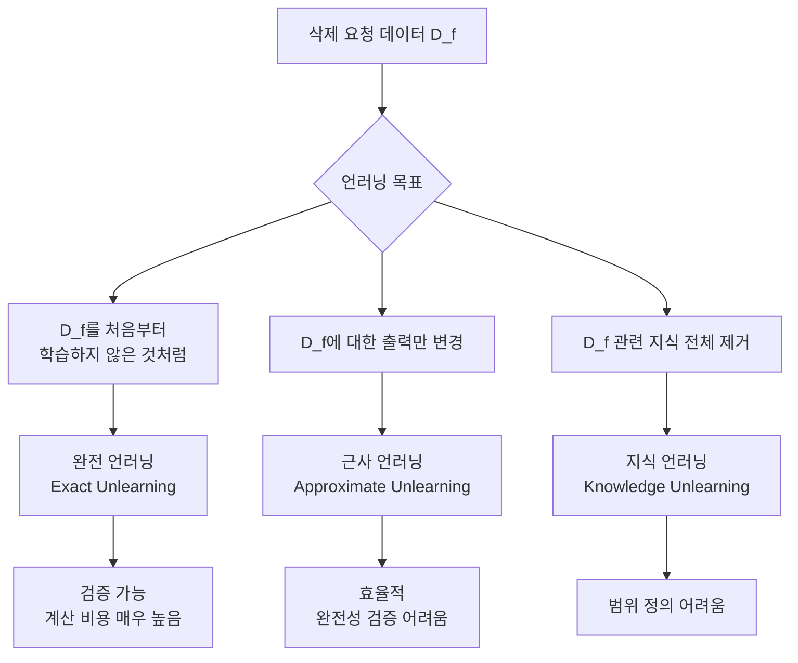
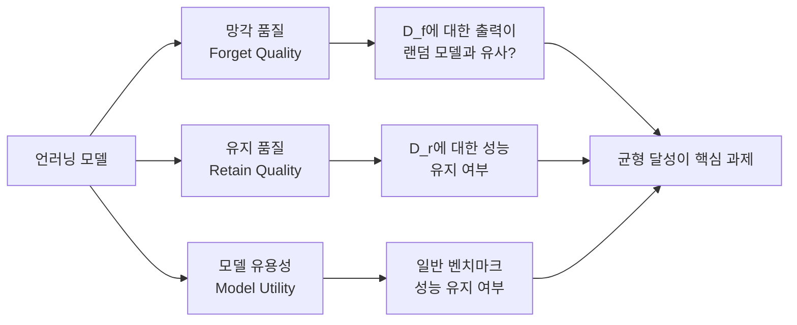

# 머신 언러닝 (Machine Unlearning)

이미 훈련된 모델에서 **특정 데이터나 지식을 선택적으로 제거**하는 기술. "잊을 권리(Right to be Forgotten)"와 GDPR 등 개인정보 규정 준수, 저작권 침해 데이터 제거, 유해 콘텐츠 삭제 등 다양한 목적으로 연구되고 있다. 재훈련(retraining)의 대안이다.

## 왜 필요한가

LLM은 훈련 데이터의 내용을 [[memorization-in-llms|암기]]한다. 다음 상황에서 특정 정보를 모델에서 제거해야 할 수 있다:

- **GDPR/개인정보**: 데이터 삭제 요청을 받았으나 모델이 해당 정보를 암기
- **저작권**: 무단 저작물로 훈련된 모델에서 저작 내용 제거
- **유해 콘텐츠**: 바이오해저드, 아동 착취물 등 위험 정보 제거
- **사실 오류**: 잘못된 정보나 오래된 사실 수정

완전 재훈련은 이론적으로 완벽하지만 대규모 모델에서는 현실적으로 불가능하다. GPT-4급 모델의 재훈련 비용은 수천만 달러에 달한다.

## 핵심 도전: 무엇을 "잊는다"는 것인가

## 주요 기법

### 경사 상승(Gradient Ascent)
잊어야 할 데이터(forget set)에 대해 손실을 최소화하는 대신 **최대화**한다. 해당 데이터를 틀리도록 의도적으로 학습.

- 장점: 구현 단순
- 단점: 모델 전반의 성능 저하, 과도한 망각(catastrophic forgetting)

### 잊기 + 유지 균형(Forget-Retain Balance)
잊어야 할 데이터에는 경사 상승, 유지해야 할 데이터(retain set)에는 경사 하강을 동시에 적용.

$$\mathcal{L}_{unlearn} = -\mathcal{L}(M, D_f) + \mathcal{L}(M, D_r)$$

### 모델 편집 기반 접근
[[model-editing]] 기법(ROME, MEMIT 등)을 활용하여 특정 사실 연상(fact association)을 직접 수정.

### Activation Steering / Representation Engineering
특정 개념에 대한 내부 표현 방향을 조작하여 관련 생성을 억제.

### 무작위화(Randomization)
잊어야 할 입력에 대해 무작위 출력을 생성하도록 학습. 정보 누출을 방지하나 유용성도 손실.

## 평가: 언러닝의 성공을 어떻게 측정하나

**멤버십 추론 공격(Membership Inference Attack)**: 언러닝 후 공격자가 삭제된 데이터가 훈련에 사용됐는지 여전히 추론할 수 있는지 테스트.

**암기 프로빙**: 삭제된 정보를 직접 쿼리하여 출력에 등장하는지 확인.

## GDPR과 법적 맥락

EU GDPR 제17조 "삭제권(Right to Erasure)"은 데이터 주체가 자신의 데이터 삭제를 요청할 수 있다고 규정한다. LLM에 이를 적용할 때:

- 학습 데이터의 어떤 부분이 "개인 데이터"인지 식별의 어려움
- 훈련 후 데이터가 모델 가중치에 분산 저장되어 명확한 삭제 불가
- 모델 출력이 원본 데이터를 재현하는 정도가 "처리"에 해당하는지 법적 불확실성

현재(2026) 규제 당국은 완전 재훈련 또는 검증 가능한 근사 언러닝 중 어느 것이 규정을 충족하는지 명확한 가이드라인을 제시하지 못하고 있다.

## [[model-editing]]과의 관계

머신 언러닝과 [[model-editing]]은 목적이 다르다:

| 구분 | 머신 언러닝 | 모델 편집 |
|------|-----------|----------|
| 목적 | 특정 데이터/지식 제거 | 특정 사실 수정/갱신 |
| 대상 | 개인정보, 저작권, 위험 정보 | 오래된 사실, 잘못된 정보 |
| 결과 | 관련 출력 제거 또는 무작위화 | 새로운 올바른 정보로 대체 |
| 측정 기준 | 완전한 망각 + 일반 성능 유지 | 편집 정확성 + 일반화 |

두 기법이 함께 사용되기도 한다: 먼저 언러닝으로 오래된 정보를 제거한 후 모델 편집으로 새 정보를 삽입.

## 한계와 미래 과제

- **완전성 검증 불가**: 근사 언러닝이 완벽히 잊었는지 증명 어려움
- **역전 가능성**: 일부 언러닝은 미세조정으로 다시 "기억"을 복원할 수 있음
- **범위 문제**: 연관된 지식을 어디까지 제거해야 하는지 불명확
- **스케일**: 수천억 파라미터 모델에서의 효율적 언러닝은 여전히 미해결

## 관련 문서

- [[memorization-in-llms]] - LLM이 훈련 데이터를 암기하는 메커니즘
- [[model-editing]] - 재훈련 없이 특정 사실을 수정하는 기법
- [[ai-copyright-litigation]] - 저작권 데이터 학습 관련 법적 이슈
- [[llm-watermarking]] - 모델 출력 추적을 통한 데이터 사용 검증
