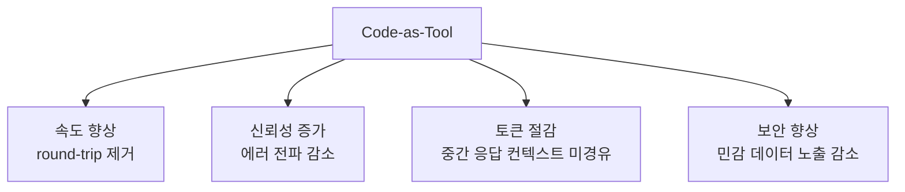

# Code Execution with MCP

Anthropic이 2025년 11월 발표한 "Code execution with MCP: Building more efficient agents" 글의 핵심 제안. **MCP 도구 메타데이터를 컨텍스트로 전달하는 대신, TypeScript 함수로 디스크에 저장하고 LLM이 코드를 작성해 호출하는 패턴**이다.

## MCP의 두 가지 핵심 문제

### 1. Context Token Overhead
> "Tool descriptions take up a lot of valuable real estate in the agent context even before you start using them."

MCP는 모든 도구 메타데이터를 세션 시작 시 로드 → 컨텍스트 윈도우 대량 점유.

### 2. Chaining Inefficiency
여러 MCP 도구를 연결하려면 응답을 LLM 컨텍스트로 통과시켜야 함:
- 추가 토큰 소비
- 에러 전파 가능성


## 제안: MCP Tools as Code Functions

도구 메타데이터를 컨텍스트로 전달하는 대신, **TypeScript 파일로 디스크에 저장**. 도구는 on-demand로 발견되어 **0 토큰 소비**.

### 함수 구조 예시
```typescript
interface GetDocumentInput {
  documentId: string;
}
interface GetDocumentResponse {
  content: string;
}
export async function getDocument(input: GetDocumentInput): 
Promise<GetDocumentResponse> {
  return callMCPTool<GetDocumentResponse>
  ('google_drive__get_document', input);
}
```

### Agent-Generated Code Chaining
에이전트가 코드를 생성해서 도구를 wire:

```typescript
const transcript = (await gdrive.getDocument({ 
  documentId: 'abc123' })).content;
await salesforce.updateRecord({
  objectType: 'SalesMeeting',
  recordId: '00Q5f000001abcXYZ',
  data: { Notes: transcript }
});
```

## 핵심 이점



> "This avoids round-tripping the response from the gdrive call through the model"

## Simon Willison의 평가

> "A sensible way to take advantage of the strengths of coding agents and address some of the major drawbacks of MCP as it is usually implemented today."

## 한계

Anthropic이 **구현 코드를 제공하지 않음** — 제안은 개념적 단계에 머무름. 실제 구현은 각 에이전트 하네스가 채택해야 함.

## Simon의 일관된 입장

Simon은 이전부터:
- MCP 사용을 줄이고 **CLI 도구 + Playwright Python 라이브러리** 선호
- Skills + MCP-as-code = Anthropic 측 에이전트 도구 사용 패러다임의 진화

## Skills와의 연결

[[agent-skills|Skills]] + Code-as-MCP는 같은 방향성을 공유한다:

| 패턴 | 핵심 원리 |
|---|---|
| Skills | metadata만 로드 + 필요 시 full content + 실행 스크립트 |
| Code-as-MCP | 도구 정의를 코드로 + 에이전트가 코드 작성해 wiring |

둘 다 **lazy loading + 코드 우선** 철학을 공유한다.

## 관련 문서

- [[mcp-protocol]] — MCP 표준 자체
- [[agent-skills]] — Skills 표준
- [[claude-skills-vs-mcp]] — Skills vs MCP 비교 (Simon 평가)
- [[tool-design-for-agents]] — Anthropic 도구 설계 가이드
- [[claude-code]] — Claude Code (이 패턴의 잠재 채택자)
