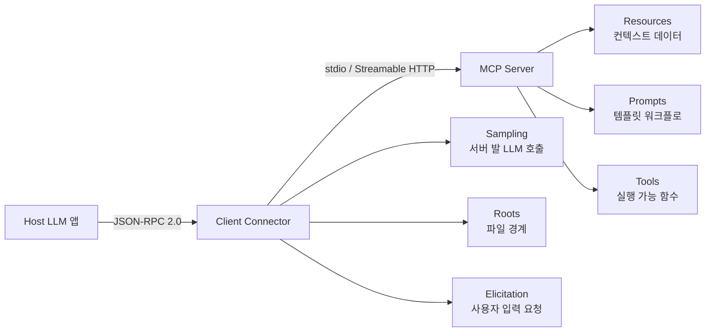

# MCP (Model Context Protocol)

MCP는 LLM 호스트(Claude Desktop, IDE, agent runner 등)와 외부 데이터·도구·워크플로 사이를 표준화하는 **오픈 프로토콜**이다. JSON-RPC 2.0 메시지 포맷 + 3-tier 아키텍처(Host/Client/Server) + capability negotiation을 핵심으로 한다. Anthropic이 2024년 11월 오픈소스로 공개했고, 현재 OpenAI·Google·Microsoft·다수 IDE가 채택해 "AI의 USB-C"로 불린다.

이 페이지는 MCP 관련 위키 문서들의 **통합 허브(catalog)** 다. 각 하위 주제는 별도 페이지에서 깊이 다룬다.

## 1. 왜 MCP가 필요한가

각 LLM 애플리케이션마다 외부 시스템과의 통합을 매번 재구현하는 N×M 문제가 있었다. MCP는 Language Server Protocol(LSP)에서 영감을 받아, 한 번 구현한 MCP 서버를 다양한 클라이언트에서 재사용할 수 있게 한다.

> "MCP takes some inspiration from the Language Server Protocol, which standardizes how to add support for programming languages across a whole ecosystem of development tools."
> — modelcontextprotocol.io/specification/2025-06-18

## 2. 3-tier 아키텍처

- **Host**: connection을 시작하는 LLM 애플리케이션
- **Client**: Host 내부의 connector (Server당 하나의 1:1 연결)
- **Server**: 컨텍스트와 capability를 노출하는 외부 서비스

## 3. 핵심 기능 (Capabilities)

**Server가 Client에 제공**:

| 기능 | 설명 |
|------|------|
| Resources | 사용자/모델이 사용할 컨텍스트 데이터 (파일, DB row 등) |
| Prompts | 사용자가 트리거할 수 있는 템플릿 메시지·워크플로 |
| Tools | AI 모델이 실행할 함수 |

**Client가 Server에 제공**:

| 기능 | 설명 |
|------|------|
| Sampling | Server가 Host의 LLM에 재귀적으로 추론 요청 |
| Roots | Server가 작업 가능한 URI/파일시스템 경계 조회 |
| Elicitation | Server가 사용자에게 추가 정보 요청 |

## 4. 4대 보안 원칙

MCP 명세는 임의 코드 실행과 데이터 접근을 다루므로, 모든 구현체가 따라야 할 4가지 원칙을 정한다.

1. **User Consent and Control** — 사용자는 모든 데이터 접근·작업에 명시적으로 동의해야 한다
2. **Data Privacy** — Host는 사용자 데이터를 Server에 노출하기 전 명시적 동의를 얻어야 한다
3. **Tool Safety** — Tool은 임의 코드 실행으로 간주, 호출 전 사용자 승인 필수
4. **LLM Sampling Controls** — Sampling 요청은 사용자가 명시적으로 승인해야 하며, Server는 prompt 가시성을 제한받는다

자세한 내용은 [[mcp-security-model]]·[[mcp-rce-vulnerability-2026]]·[[claude-code-mcp-security-reckoning]] 참조.

## 5. 위키 카탈로그

### 명세·라이프사이클·전송 계층

- [[mcp-specification-deep-dive]] — 2025-06-18 명세 종합 분석
- [[mcp-protocol-deep-dive]] — JSON-RPC + Streamable HTTP transport 심층
- [[mcp-transport-protocols]] — stdio·HTTP·SSE 비교
- [[mcp-lifecycle-capability-negotiation]] — 초기화 핸드셰이크와 capability 협상
- [[mcp-specification-2025-11-25]] — 차기 명세 변경점 추적

### 인증·권한

- [[mcp-oauth-authorization]] — OAuth 2.1 기반 인증 흐름
- [[mcp-authorization-oauth]] — 인증 헤더와 Resource Server 통합
- [[mcp-authorization-draft]] — draft 변경 사항 추적

### 보안 모델

- [[mcp-security-model]] — 위협 모델과 mitigation
- [[mcp-rce-vulnerability-2026]] — 2026 RCE 취약점 사례
- [[claude-code-mcp-security-reckoning]] — Claude Code의 MCP 보안 정책 변화

### 서버 개발

- [[mcp-server-development-guide]] — TypeScript/Python SDK로 서버 만들기
- [[mcp-tools-protocol]] — Tools capability 상세
- [[mcp-code-execution]] — 코드 실행 도구 패턴

### 클라이언트와 비교

- [[mcp-clients-comparison]] — Claude Desktop·Continue·Zed 등 클라이언트 비교
- [[claude-skills-vs-mcp]] — Claude Skills와 MCP의 책임 분리

### 도구·통합 사례

- [[playwright-mcp]] — 브라우저 자동화 MCP 서버
- [[mastra-mcp-overview]] — Mastra 프레임워크의 MCP 통합
- [[pydantic-ai-mcp-overview]] — Pydantic AI의 MCP 호환
- [[vercel-ai-sdk-mcp-tools]] — Vercel AI SDK MCP 어댑터

### 로드맵·메타

- [[the-2026-mcp-roadmap]] — 2026 로드맵
- [[mcp-roadmap-development]] — 개발 우선순위 트래킹
- [[model-context-protocol-mcp]] — MCP 일반 entity 페이지
- [[mcp-server-cards]] — 서버 카탈로그
- [[mcp-architecture]] — 아키텍처 도해
- [[what-is-mcp]] — 입문 요약
- [[mcp]] — 짧은 요약

## 6. 실무 관점 — 어떻게 쓰는가

- **에이전트 도구 통합**: 코드베이스 검색·DB 쿼리·외부 API 호출을 MCP 서버로 캡슐화하면 Claude/IDE/커스텀 에이전트가 동일하게 사용
- **권한 분리**: Tool Safety 원칙에 따라 호출 전 사용자 승인 단계를 UI에서 노출
- **Sampling 활용**: 서버가 호스트의 LLM을 사용하므로 서버는 자체 LLM 키 관리 불필요 — 단, prompt 가시성 제약을 명심
- **Transport 선택**: 로컬 도구는 stdio, 원격 서비스는 Streamable HTTP. Legacy SSE는 deprecated 흐름

## 관련 문서

- [[anthropic-multi-agent-research-system]]
- [[claude-code]]
- [[langchain-mcp-adapter]]
- [[agent-tool-protocols]]
- [[function-calling]]
