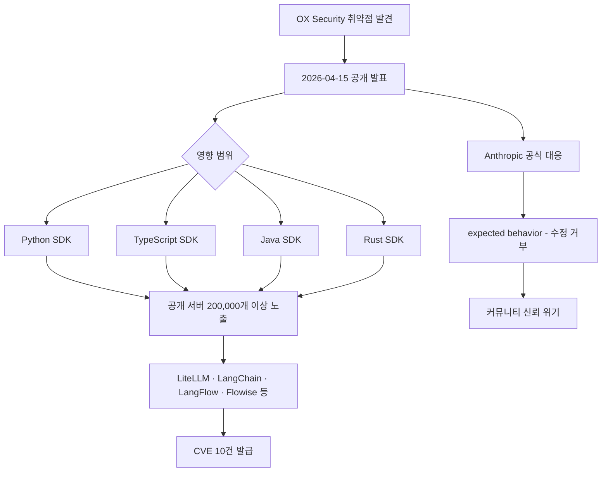

# 2026 MCP RCE 취약점 사례: STDIO 전송 설계 결함

2026년 4월 15일, OX Security가 Anthropic MCP(Model Context Protocol) 공식 SDK의 STDIO 전송 인터페이스에서 원격 코드 실행(RCE, Remote Code Execution) 취약점을 공개했다. 공개 MCP 서버 200,000개 이상과 누적 다운로드 1억 5천만 건에 영향을 미쳤으며, Anthropic의 "예상된 동작(expected behavior)"이라는 대응이 커뮤니티에서 큰 논란을 일으켰다.

## 사건 개요

위 다이어그램은 취약점 공개부터 파급 경로와 Anthropic 대응까지의 흐름을 나타낸다.

## 기술적 원인

### STDIO 전송 인터페이스 기본값 결함
[[mcp]]의 STDIO(표준 입출력) 전송 방식은 MCP 서버-클라이언트 간 가장 기본적인 통신 방식이다. OX Security가 발견한 결함은 이 인터페이스의 기본 설정이 임의 OS 명령 실행을 허용한다는 점이다.

공격 벡터는 다음과 같다:
1. 악의적 MCP 서버가 클라이언트에게 특수 구성된 도구 응답을 전달
2. 클라이언트의 STDIO 핸들러가 응답 내 OS 명령 패턴을 필터링 없이 실행
3. 공격자가 클라이언트 호스트 시스템에서 임의 명령 실행 가능

### 영향받는 환경
MCP SDK를 사용하는 모든 공식 지원 언어가 영향을 받는다:

| 언어 | SDK | 영향 |
|------|-----|------|
| Python | `mcp` PyPI 패키지 | 해당 |
| TypeScript | `@modelcontextprotocol/sdk` | 해당 |
| Java | `io.modelcontextprotocol:sdk` | 해당 |
| Rust | `mcp-rs` | 해당 |

## 파급 범위

### 규모
- 노출된 공개 MCP 서버: 200,000개 이상
- SDK 누적 다운로드: 1억 5천만 건
- 발급된 CVE(Common Vulnerabilities and Exposures): 10건

### 영향받은 프로젝트
LiteLLM, LangChain, LangFlow, Flowise 등 LLM 에코시스템의 주요 프로젝트 다수에서 CVE가 발급됐다. 이 프로젝트들은 모두 MCP SDK를 의존성으로 사용하고 있었다.

## Anthropic의 대응

Anthropic은 이 취약점을 "프로토콜 설계상 예상된 동작(expected behavior)"으로 규정하고 프로토콜 아키텍처 자체의 수정을 거부했다.

> "The STDIO transport behavior is expected and by design. Developers using MCP should be aware of the trust model and deploy appropriate sandboxing." - Anthropic 공식 입장 (The Register 보도 인용)

이 대응은 커뮤니티에서 다음과 같은 비판을 받았다:
- **신뢰 모델 불명확**: 기본값이 안전하지 않은 상태에서 "개발자가 주의해야 한다"는 책임 전가
- **200,000 서버 방치**: 이미 배포된 취약한 서버에 대한 사후 조치 부재
- **공급망 리스크 과소평가**: 인기 프레임워크들이 이 취약점을 상속

## Claude Code 에코시스템 영향

[[mcp-rce-vulnerability-2026]] 공개와 같은 주에 [[claude-code]] v2.1.116~117 업데이트에서 샌드박스 하드닝(sandbox hardening)이 출시됐다. 커뮤니티는 이를 MCP 취약점 대응의 실질적 조치로 해석했지만, Anthropic은 두 사안의 연관성을 공식 확인하지 않았다.

Claude Code에서 MCP 서버를 실행할 때는 이제 격리된 샌드박스 환경을 기본으로 사용하도록 권고된다.

## [[ai-agent-security]] 관점에서의 시사점

이 사건은 [[ai-agent-security]] 전반에 중요한 교훈을 남긴다:

### 1. 공급망 신뢰 문제
MCP 생태계가 빠르게 성장하면서 공급망 전체의 보안이 SDK 설계 결정에 종속됐다. 단일 신뢰 지점(single point of trust)의 위험성이 드러났다.

### 2. 기본값이 안전해야 한다
보안 원칙 "secure by default"의 위반 사례다. STDIO 전송의 기본값이 안전하지 않아 대부분의 개발자가 위험에 노출됐다.

### 3. 프로토콜 설계 결정의 외부 효과
Anthropic의 "프로토콜 아키텍처 수정 거부"는 MCP를 사용하는 200,000개 서버 운영자에게 직접적인 보안 부담을 전가한다.

### 4. 에이전트 신뢰 모델 재정의 필요성
[[mcp]] 아키텍처에서 서버-클라이언트 간 신뢰 관계를 더 명확히 정의하고, 클라이언트가 서버를 얼마나 신뢰할지를 세밀하게 제어할 수 있는 메커니즘이 필요하다.

## 사건 타임라인

| 날짜 | 사건 |
|------|------|
| 2026-04-15 | OX Security 취약점 공개 발표 |
| 2026-04-15 | The Hacker News 보도 |
| 2026-04-16 | The Register 보도 + Anthropic "expected behavior" 발표 |
| 2026-04-16~17 | LiteLLM, LangChain 등 CVE 발급 |
| 2026-04-22~23 | Claude Code v2.1.116~117 샌드박스 하드닝 출시 |
| 2026-04-23 | Claude Weekly "MCP 첫 번째 보안 위기" 규정 |

## 향후 과제

현재 취약점에 대한 임시 대응책:
1. **MCP 서버 출처 검증**: 신뢰할 수 없는 소스의 MCP 서버 사용 자제
2. **샌드박스 실행**: Docker, VM 등 격리 환경에서 MCP 서버 실행
3. **권한 최소화(least privilege)**: MCP 클라이언트에 최소 필요 권한만 부여
4. **도구 응답 검증**: 클라이언트 측에서 서버 응답의 OS 명령 패턴 필터링

장기적으로는 MCP 프로토콜 자체의 보안 모델 강화가 필요하며, [[mcp-authorization]] 작업이 이 방향에서 진행 중이다.

## 관련 문서

- [[mcp]]
- [[ai-agent-security]]
- [[claude-code]]
- [[mcp-authorization]]
- [[indirect-prompt-injection]]
- [[llm-agent-security]]
