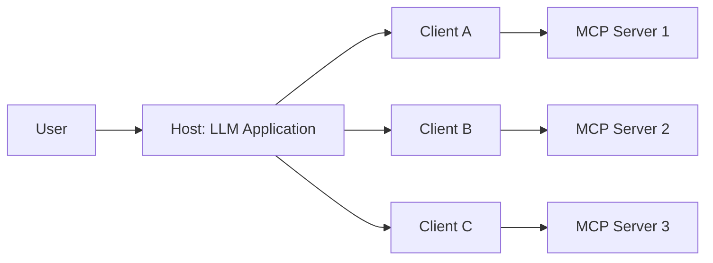

# MCP Specification Deep Dive (2025-06-18)

Model Context Protocol(MCP)의 2025-06-18 공식 스펙을 딥다이브 관점에서 정리한다. 메시지 포맷, 3-역할 아키텍처, 클라이언트/서버 capability, 보안 4대 원칙을 수치 단위로 본다.

## 메타 정보

- 공식 spec 버전: **2025-06-18** (이전: 2025-03-26, 2024-11-05)
- 메시지 포맷: **JSON-RPC 2.0**, UTF-8 인코딩 필수
- 정의 스키마: TypeScript schema (`schema/2025-06-18/schema.ts` in modelcontextprotocol/specification 레포)
- 영감: LSP(Language Server Protocol) — "표준화된 LSP가 IDE 생태계를 확장한 것처럼, MCP는 AI 애플리케이션 생태계를 확장한다."

## 3-Role 아키텍처: Host / Client / Server

| 역할 | 의미 | 예시 |
|---|---|---|
| Host | LLM 애플리케이션 본체 (연결을 시작) | Claude Desktop, Claude Code, Cursor |
| Client | Host 안에서 단일 MCP 서버와 1:1 연결을 담당하는 커넥터 | Host 내부 SDK 인스턴스 |
| Server | 컨텍스트/도구를 제공하는 외부 프로세스 또는 HTTP 엔드포인트 | weather-mcp, github-mcp 등 |

핵심 약속: Host는 다수의 Client를 운영, **Client ↔ Server는 1:1**.

## Server → Client Feature

| Feature | 설명 | 한국어 요약 |
|---|---|---|
| Resources | URI로 식별되는 정적/동적 컨텍스트 | 파일 내용, DB row 등 모델/사용자가 읽는 데이터 |
| Prompts | 사용자가 호출할 수 있는 템플릿 메시지 | 미리 정의된 prompt slash command |
| Tools | 모델이 호출 가능한 함수 | 모델이 실행하는 액션 |

## Client → Server Feature

| Feature | 설명 |
|---|---|
| Sampling | 서버가 클라이언트의 LLM에 질의 (재귀적 LLM 호출) |
| Roots | 서버가 작업할 수 있는 파일시스템 경계 조회 |
| Elicitation | 서버가 사용자에게 추가 정보 요청 (2025-06-18 신규) |

`elicitation`은 2025-06-18 spec에서 새로 추가된 양방향 channel이다.

## Capability Negotiation 표

| Category | Capability | 설명 |
|---|---|---|
| Client | `roots` | 파일시스템 root 제공 가능 |
| Client | `sampling` | LLM 샘플링 요청 처리 |
| Client | `elicitation` | 사용자 정보 요청 처리 |
| Client | `experimental` | 비표준 실험 기능 |
| Server | `prompts` | prompt 템플릿 제공 |
| Server | `resources` | 읽을 수 있는 리소스 제공 |
| Server | `tools` | 호출 가능한 tool 제공 |
| Server | `logging` | 구조화된 로그 발생 |
| Server | `completions` | 인자 자동완성 |
| Server | `experimental` | 비표준 실험 기능 |

서브 capability:
- `listChanged`: 목록 변경 알림 (prompts/resources/tools)
- `subscribe`: 개별 항목 변경 구독 (resources only)

> Both parties MUST: respect the negotiated protocol version, only use capabilities that were successfully negotiated.

## 보안 & 신뢰 4대 원칙 (Spec 직접 발췌)

### 1. User Consent and Control
모든 데이터 접근/작업에 명시적 동의 필수. 사용자는 무엇이 공유되고 어떤 액션이 일어나는지 통제 가능해야 함.

### 2. Data Privacy
Host는 사용자 데이터를 서버에 노출하기 전 명시적 동의를 받아야 함. 동의 없이 리소스 데이터를 외부로 전송 금지.

### 3. Tool Safety
> Tools represent arbitrary code execution and must be treated with appropriate caution.
> In particular, descriptions of tool behavior such as annotations should be considered untrusted, unless obtained from a trusted server.

도구 어노테이션은 신뢰되지 않는 서버에서는 untrusted. 모든 도구 호출 전 사용자 동의 필요.

### 4. LLM Sampling Controls
모든 sampling 요청은 사용자 명시적 승인. 사용자는 sampling 발생 여부, 실제 prompt, 서버가 받는 결과 모두 통제.

## 추가 유틸리티

- Configuration
- Progress tracking
- Cancellation (`CancelledNotification`)
- Error reporting (JSON-RPC error 객체)
- Logging

## 핵심 인사이트

1. **JSON-RPC 2.0 + UTF-8**: 단순한 메시지 포맷, 어떤 transport도 위에 얹을 수 있음
2. **Bidirectional capability**: 서버만 능력 제공이 아니라 클라이언트도 sampling/roots/elicitation 제공
3. **Capability는 사전 협상**: 미선언 = 미지원으로 간주
4. **Tool annotation은 untrusted**: 신뢰 없는 서버의 메타데이터는 무시
5. **HITL이 4대 원칙의 핵심**: consent / privacy / tool safety / sampling control 모두 인간 승인을 전제

## 관련 문서

- [[mcp-transport-protocols]] — stdio + Streamable HTTP transport 상세
- [[mcp-lifecycle-capability-negotiation]] — initialize → operation → shutdown
- [[mcp-tools-protocol]] — tools/list, tools/call 메시지
- [[mcp-oauth-authorization]] — OAuth 2.1 + RFC 8707 + DCR 인증 흐름
- [[mcp-security-model]] — 6대 공격 벡터 + mitigation
- [[mcp-specification-2025-11-25]] — 다음 버전(2025-11-25) summary
- [[model-context-protocol-mcp]] — MCP 개요

## 참고

- 전체 spec: https://modelcontextprotocol.io/specification/2025-06-18
- TypeScript schema: https://github.com/modelcontextprotocol/specification/blob/main/schema/2025-06-18/schema.ts
- llms.txt 인덱스: https://modelcontextprotocol.io/llms.txt
