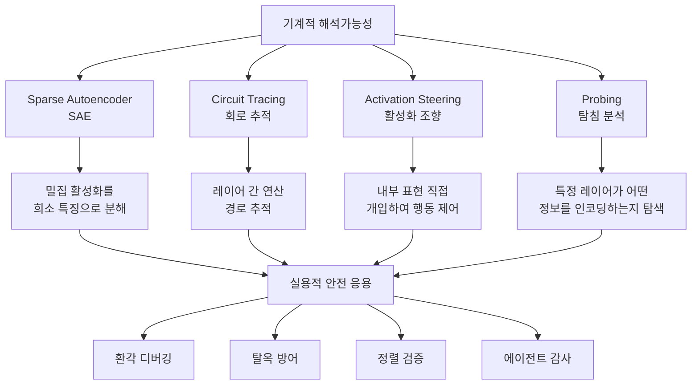

# Mechanistic Interpretability 2026 Breakthrough

기계적 해석가능성(Mechanistic Interpretability)이 MIT Technology Review 2026 10대 혁신 기술(Breakthrough Technology)로 선정되었다. 18개 조직에서 29명의 연구자가 참여한 합의 논문을 통해, 이 분야가 실험실 수준의 연구에서 실용적 AI 안전 도구로 전환되고 있음이 공식적으로 인정되었다.

## 왜 지금 중요한가

2024-2025년 Anthropic의 [[circuit-tracing|Circuit Tracing]], Google DeepMind의 [[gemma-scope-2|Gemma Scope 2]], OpenAI의 내부 해석 연구 등이 빠르게 발전하면서, 기계적 해석가능성은 학술적 호기심에서 모델 안전성을 검증하는 핵심 인프라로 도약했다. MIT Tech Review의 선정은 이 전환이 업계 전반에서 인정받았음을 의미한다.

## 핵심 개념

### 기계적 해석가능성이란

신경망의 내부 연산을 역공학(reverse engineering)하여, 모델이 특정 출력을 생성하는 구체적인 메커니즘을 이해하는 연구 분야다. "왜 이 모델이 이렇게 대답했는가?"에 대해, 통계적 상관관계가 아닌 인과적(causal) 설명을 추구한다.

### 핵심 기술 스택

## 2026년 돌파의 구체적 근거

### 규모의 전환

| 시기 | 해석 대상 규모 | 대표 연구 |
|------|---------------|-----------|
| 2023 | 수백 개 뉴런 | Anthropic Toy Models |
| 2024 | 수백만 개 특징 | Scaling Monosemanticity (Claude 3 Sonnet) |
| 2025 | 전체 모델 패밀리 | [[gemma-scope-2|Gemma Scope 2]] (270M-27B) |
| 2026 | 상용 모델 안전 감사 | 다중 조직 합의 프레임워크 |

### 18개 조직 합의 논문

29명의 연구자가 참여한 합의 논문은 기계적 해석가능성의 현재 상태, 실용적 응용 가능성, 그리고 남은 과제를 종합적으로 정리했다. 이는 개별 연구소의 주장이 아닌, 분야 전체의 공식적 입장 표명이라는 점에서 의미가 크다.

### 주요 참여 조직

- Anthropic (Circuit Tracing, SAE 연구 선도)
- Google DeepMind (Gemma Scope, Transformer Circuits)
- OpenAI (내부 해석 연구)
- 주요 대학 연구실 다수
- 독립 안전 연구 조직

## 실용적 응용 영역

### AI 안전 검증

- **환각 디버깅**: 모델이 사실과 다른 출력을 생성하는 내부 경로를 추적하여 원인 식별
- **탈옥 방어**: 안전 가드레일을 우회하는 입력이 내부적으로 어떻게 처리되는지 분석
- **[[safety-alignment-depth-paper|정렬 깊이]] 측정**: 안전 학습이 모델 내부를 얼마나 깊이 변경했는지 평가
- **[[cot-monitorability|CoT 충실도]]**: 명시된 추론과 실제 내부 연산의 일치 여부 검증

### 모델 개발 지원

- **코드 생성 품질 분석**: 올바른 프로그램과 잘못된 프로그램을 생성할 때 활성화 패턴 차이 식별
- **지식 표현 이해**: 모델이 사실적 정보를 어떤 구조로 저장하는지 파악
- **실패 모드 예측**: 배포 전 잠재적 문제 영역을 내부 표현 분석으로 식별

### 에이전트 시스템 감사

- AI 에이전트의 의사결정 경로를 특징 수준에서 추적
- 에이전트가 예기치 않은 행동을 보일 때 내부 원인 진단
- 다단계 추론에서 각 단계의 내부 표현이 일관적인지 검증

## 남은 과제

- **스케일링**: 수천억 파라미터 모델에 대한 완전한 해석은 여전히 연산적으로 비실용적
- **중첩(Superposition)**: 뉴런이 여러 개념을 동시에 인코딩하는 현상의 완전한 해결
- **인과성 검증**: 관찰된 특징이 실제로 행동의 원인인지, 상관관계에 불과한지 구분
- **자동화**: 수동 분석에서 자동화된 안전 감사 파이프라인으로의 전환
- **교차 모델 일반화**: 한 모델에서 발견한 패턴이 다른 아키텍처에서도 유효한지

## 대표 레퍼런스

- [Mechanistic Interpretability -- MIT Technology Review 2026 Breakthrough](https://www.technologyreview.com/2026/01/12/1130003/mechanistic-interpretability-ai-research-models-2026-breakthrough-technologies/)
- [Mechanistic Interpretability Workshop](https://mechinterpworkshop.com/)
- [Mechanistic Interpretability of Code Correctness -- arXiv](https://arxiv.org/pdf/2510.02917)

## 관련 페이지

- [[emotion-concepts-claude-sonnet|Claude Sonnet 4.5의 감정 개념과 기능적 인과성]] -- 171개 감정 벡터가 행동에 인과적 영향을 줌을 실험으로 증명한 Anthropic 연구
- [[circuit-tracing|Circuit Tracing & Attribution Graphs]]
- [[gemma-scope-2|Gemma Scope 2]]
- [[representation-engineering|Representation Engineering & Activation Steering]]
- [[safety-alignment-depth-paper|Safety Alignment Depth (ICLR 2025)]]
- [[cot-monitorability|CoT Monitorability]]
- [[ai-safety-alignment-2026|AI 안전성 정렬 2026]]
