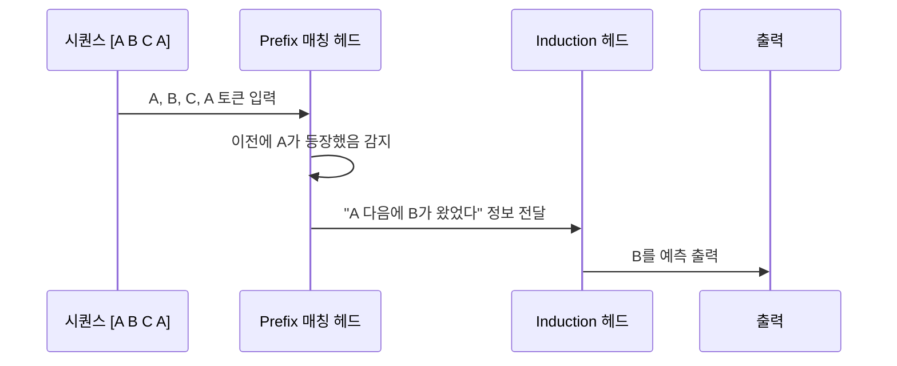
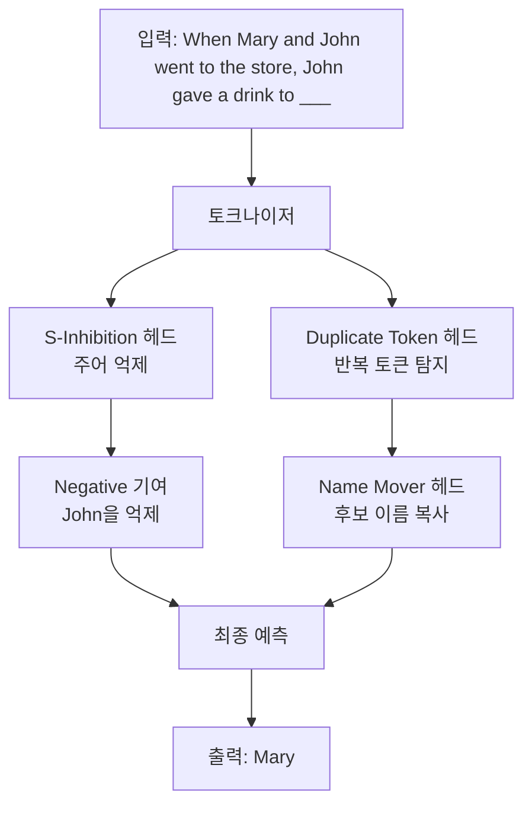
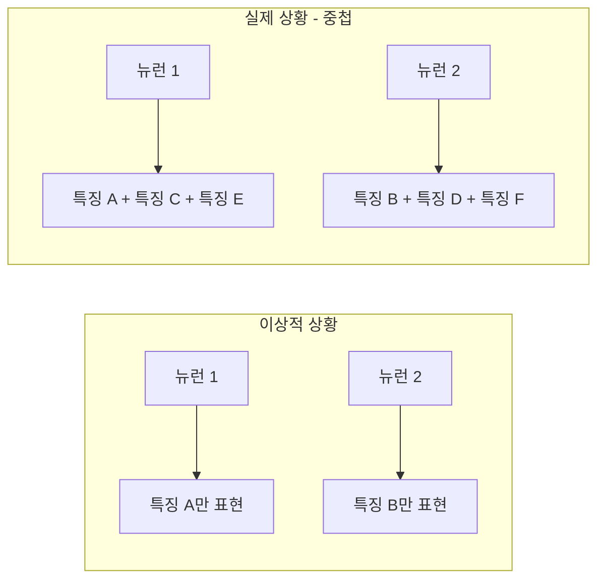

# 기계론적 해석 회로 분석

## 개요

기계론적 해석 가능성(Mechanistic Interpretability, 이하 Mech Interp)은 신경망 내부에서 특정 기능이 어떻게 구현되는지 역공학(reverse engineer)하는 연구 분야다. 단순히 "이 입력에서 저 출력이 나온다"를 넘어, **어떤 경로로, 어떤 내부 연산을 통해 그 출력이 만들어지는가**를 밝히는 것이 목표다.

회로(circuit) 개념은 Mech Interp의 핵심이다. 회로는 특정 과제를 수행하기 위해 협력하는 어텐션 헤드와 MLP 레이어의 서브그래프를 말한다. 이 회로를 식별하면 모델의 특정 행동을 예측하고 제어할 수 있는 기반을 얻는다.

## 귀납 헤드 (Induction Heads)

귀납 헤드는 Mech Interp에서 가장 잘 연구된 회로 중 하나다. 이 회로는 **컨텍스트 내 패턴 반복**을 담당한다.



귀납 헤드는 두 어텐션 헤드의 조합으로 구성된다:

1. **Prefix 매칭 헤드**: 현재 토큰과 동일한 토큰이 이전에 등장했는지 탐지
2. **Induction 헤드**: Prefix 매칭 정보를 받아 그 다음에 무엇이 왔는지 예측

흥미로운 점은 이 회로가 단순 n-그램 암기를 넘어서는 **추상적 패턴 매칭**도 수행한다는 것이다. 동일한 토큰이 아닌, 동일한 역할의 구조를 매칭하는 일반화도 관찰된다.

## IOI 회로 (Indirect Object Identification)

IOI 회로는 "John gave Mary a gift. She was happy"와 같은 문장에서 **간접 목적어를 식별하는 회로**다. Anthropic 연구팀이 GPT-2 small에서 완전히 분리하여 분석한 첫 번째 복잡한 회로다.



IOI 회로는 총 26개의 어텐션 헤드로 구성된다:

| 헤드 유형 | 역할 | 수 |
|-----------|------|---|
| Name Mover | 정답 이름을 출력 위치로 복사 | 3개 |
| S-Inhibition | 주어와 같은 이름 억제 | 6개 |
| Duplicate Token | 반복 등장 토큰 탐지 | 2개 |
| Induction | 패턴 반복 보조 | 2개 |
| Backup Name Mover | Name Mover 보완 | 3개 |
| 기타 | 다양한 보조 역할 | 10개 |

## 중첩(Superposition) 현상

Mech Interp 연구에서 중요한 발견 중 하나는 **하나의 뉴런이 여러 특징(feature)을 동시에 표현**한다는 것이다. 이를 중첩(superposition)이라 한다.



중첩이 발생하는 이유는 모델 용량(뉴런 수) 대비 표현해야 할 특징 수가 훨씬 많기 때문이다. 모델은 Johnson-Lindenstrauss 보조정리에 따라 고차원 공간에서 거의 직교하는 방향으로 다수의 특징을 표현할 수 있다.

이 현상은 [[sparse-autoencoders-mech-interp]] 연구의 동기가 됐다. 희소 오토인코더를 사용하면 중첩된 표현을 분리하여 개별 특징을 식별할 수 있다.

## 회로 분석 방법론

### 활성화 패칭 (Activation Patching)

회로를 식별하는 주요 실험 방법이다. 특정 위치의 활성화를 다른 입력에서 계산된 값으로 교체하면서 최종 출력이 어떻게 변하는지 관찰한다.

```python
# 개념적 코드
def activation_patch(model, clean_input, corrupted_input, patch_layer, patch_position):
    # 클린 입력으로 활성화 계산
    _, clean_cache = model.run_with_cache(clean_input)
    
    # 오염된 입력 실행 중 특정 위치를 클린 활성화로 교체
    def patch_hook(value, hook):
        value[:, patch_position, :] = clean_cache[patch_layer][:, patch_position, :]
        return value
    
    patched_logits = model.run_with_hooks(corrupted_input, fwd_hooks=[(patch_layer, patch_hook)])
    return patched_logits
```

### 직접 로짓 기여 (Direct Logit Attribution)

각 어텐션 헤드가 최종 출력 로짓에 직접 얼마나 기여하는지 분해하는 방법이다. 트랜스포머의 잔차 스트림(residual stream) 구조 덕분에 이 분해가 선형적으로 가능하다.

### 인과 매개 분석 (Causal Mediation Analysis)

A → B → C 경로에서 B를 제거했을 때 A가 C에 미치는 영향 변화를 측정하여 B의 인과적 역할을 정량화한다.

## 주요 발견들

[[mechanistic-interpretability-2026]]에 따르면 최근 몇 년간의 주요 발견은 다음과 같다:

- **도크린(Docstring) 회로**: 코딩 모델에서 함수 설명 생성을 담당하는 회로
- **수치 추론 회로**: 산술 연산을 처리하는 어텐션 패턴
- **사실 검색 회로**: 특정 사실(예: "에펠탑이 위치한 나라는?")을 MLP 레이어에서 검색하는 메커니즘
- **후기 레이어 억제**: 초기 레이어의 판단을 후기 레이어가 수정하는 패턴

## Mech Interp의 실용적 의의

단순한 학문적 호기심을 넘어, Mech Interp는 다음을 가능하게 한다:

- **신뢰성 향상**: 모델이 잘못된 회로를 사용할 때 탐지 가능
- **목표 편집**: 특정 사실이나 행동을 외과적으로 수정 (예: ROME, MEMIT)
- **정렬 연구**: 모델의 목표가 의도와 다를 때 내부에서 증거를 찾기

## 관련 문서
- [[model-editing-techniques]] -- 모델 편집 기법 (ROME/MEMIT)

- [[mechanistic-interpretability-2026]] - 최신 Mech Interp 연구 동향
- [[sparse-autoencoders-mech-interp]] - 중첩 문제 해결을 위한 희소 오토인코더
- [[superalignment-research]] - Mech Interp가 정렬 연구에 기여하는 방향
- [[alignment-faking]] - 회로 분석으로 탐지하려는 정렬 실패 패턴
