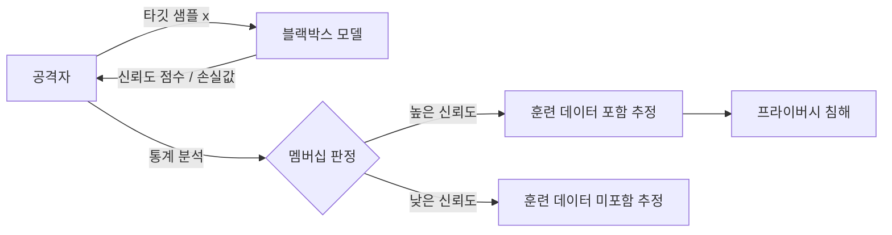

# 멤버십 추론 공격 (Membership Inference Attack)

멤버십 추론 공격(Membership Inference Attack, MIA)은 특정 데이터 샘플이 ML 모델의 **훈련 데이터셋에 포함되었는지 여부**를 외부에서 추론하는 프라이버시 공격 기법이다. 공격자는 모델의 출력(예측값, 신뢰도 점수 등)만을 활용하여 학습 데이터 구성원 여부를 판별하려 한다.

이 공격이 위험한 이유는 모델이 훈련 데이터를 어느 정도 "기억"하기 때문이다. 특히 민감한 의료 기록, 금융 데이터, 개인 식별 정보가 학습 데이터에 포함된 경우, 멤버십 추론만으로도 개인 정보 침해가 발생할 수 있다.

## 공격 동작 원리



일반적으로 모델은 훈련 데이터에 대해 더 높은 신뢰도 점수를 보이고, 손실(loss)이 더 낮다. 공격자는 이 차이를 이용한다.

### 공격 유형별 분류

| 공격 유형 | 접근 방식 | 정보 수준 |
|-----------|-----------|-----------|
| 블랙박스(Black-box) | 예측 API만 활용 | 신뢰도 점수 또는 레이블 |
| 화이트박스(White-box) | 모델 파라미터 접근 가능 | 그래디언트, 임베딩 등 |
| 레이블 전용 | 최종 예측 레이블만 가용 | 가장 제한적 |
| Shadow model | 유사 모델을 학습해 간접 추론 | 중간 수준 |

## 취약점의 원인

멤버십 추론에 취약한 근본 원인은 **과적합(overfitting)**과 [[memorization-in-llms|암기(memorization)]]다.

- **훈련-테스트 갭**: 모델이 훈련 샘플에만 과도하게 최적화되면, 훈련 데이터에 대한 손실이 테스트 데이터 대비 현저히 낮아짐
- **분포 내 기억**: LLM이 개인 정보, 저작권 텍스트 등을 그대로 암기하는 현상
- **임베딩 표현 차이**: 훈련 데이터 샘플이 내부 임베딩 공간에서 구분 가능한 위치에 투영됨

## LLM에서의 특수성

대규모 언어 모델에서 멤버십 추론은 단순 분류 모델보다 복잡하다.

### LLM 대상 공격 방법론

1. **Perplexity 기반 판정**: 훈련 데이터 샘플은 모델이 더 낮은 perplexity(혼란도)를 보임
2. **Likelihood ratio 테스트**: 타깃 모델과 참조 모델의 로그 확률 비율 비교
3. **Min-k% 방법**: 토큰별 확률 중 하위 k%를 활용하여 암기된 텍스트 판별

```python
# Perplexity 기반 멤버십 추론 개념 코드 (예시)
import torch

def compute_perplexity(model, tokenizer, text):
    inputs = tokenizer(text, return_tensors="pt")
    with torch.no_grad():
        outputs = model(**inputs, labels=inputs["input_ids"])
    return torch.exp(outputs.loss).item()

def membership_inference(model, tokenizer, sample, threshold=50.0):
    ppl = compute_perplexity(model, tokenizer, sample)
    return ppl < threshold  # True이면 훈련 데이터 포함 추정
```

### 실증 연구 결과

대규모 LLM 연구들은 다음을 보여준다.

- GPT-2, GPT-3 계열 모델은 훈련 데이터의 특정 시퀀스를 단어 단위로 재생성 가능
- 모델 크기가 커질수록 암기 능력도 증가
- 중복된 훈련 샘플은 더 강하게 암기됨

## 방어 기법

### 차등 프라이버시 (Differential Privacy)

[[differential-privacy|차등 프라이버시(DP)]]는 훈련 과정에서 노이즈를 추가하여 개별 샘플의 기여도를 수학적으로 제한한다.

- **DP-SGD**: 그래디언트 클리핑 + 가우시안 노이즈 추가
- 프라이버시 예산 $\varepsilon$이 작을수록 보호 강도 높음 (하지만 성능 저하)
- 실용적 trade-off: $\varepsilon \in [1, 10]$ 범위에서 운용

### 기타 방어 전략

| 방어 기법 | 원리 | 효과 |
|-----------|------|------|
| 차등 프라이버시 | 훈련 중 노이즈 주입 | 수학적 보장 |
| 데이터 중복 제거 | 훈련 셋 중복 샘플 제거 | 암기 감소 |
| 정규화 (L2, Dropout) | 과적합 방지 | 취약점 완화 |
| 출력 모호화 | 신뢰도 점수 반올림/클리핑 | 공격 신호 감소 |
| 훈련 데이터 필터링 | 민감 정보 사전 제거 | 근본 예방 |

## 평가 지표

MIA 공격 성능 평가에는 다음 지표가 사용된다.

- **AUC (Area Under ROC Curve)**: 0.5 = 무작위, 1.0 = 완벽한 공격
- **TPR at low FPR**: 낮은 오탐률에서의 진탐률 (실용적 의미 큰 지표)
- **멤버십 어드밴티지**: $Pr[\text{공격자 맞춤}] - 0.5$

## 실무적 시사점

- GDPR, HIPAA 등 규정은 개인 데이터 보호를 의무화하며, MIA는 컴플라이언스 리스크로 부상
- LLM을 상용 서비스에 배포할 때, 훈련 데이터 포함 여부 질의에 대한 법적 책임 고려 필요
- [[model-fingerprinting|모델 핑거프린팅]]과 결합 시 특정 학습 데이터 소스 특정 가능

## 관련 문서

- [[memorization-in-llms]] - LLM의 훈련 데이터 암기 현상
- [[differential-privacy]] - 수학적 프라이버시 보장 기법
- [[model-fingerprinting]] - 모델 응답 패턴으로 모델 식별
- [[ai-red-teaming-methodology]] - ML 시스템 보안 취약점 발굴 방법론
