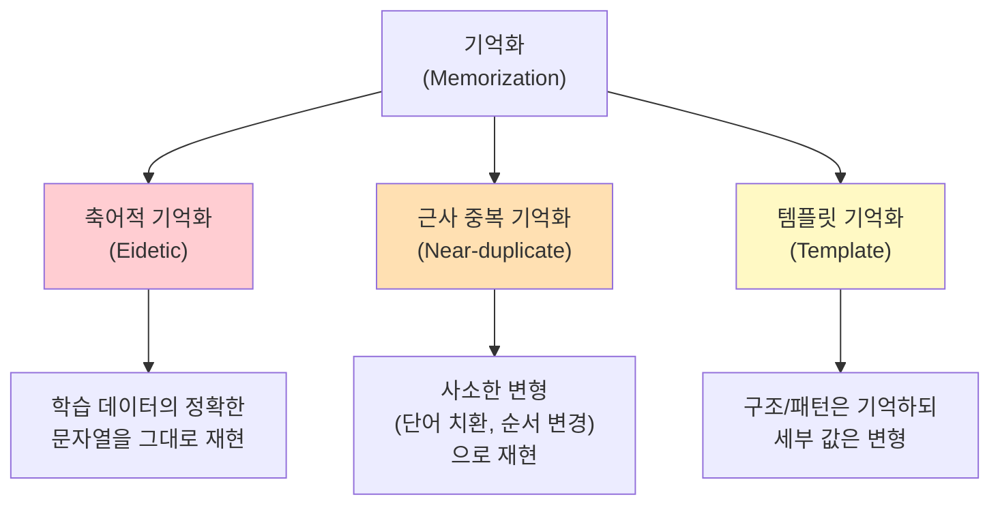

# LLM 기억화 (Memorization in LLMs)

## 정의

LLM 기억화(Memorization)는 언어 모델이 학습 데이터의 특정 시퀀스를 **일반화하지 않고 그대로 저장하여 재생산하는 현상**을 말한다. 모델이 학습 데이터에서 패턴을 추출하는 것(일반화, generalization)은 바람직하지만, 특정 텍스트를 축어적으로(verbatim) 기억하는 것은 프라이버시, 저작권, 안전성 측면에서 심각한 문제를 야기한다.

Carlini et al.(2021, 2023)의 연구는 GPT-2와 ChatGPT가 학습 데이터의 상당 부분을 축어적으로 재생산할 수 있음을 실증했으며, 이후 기억화는 LLM 안전성 연구의 핵심 주제가 되었다.

## 기억화의 유형

기억화는 강도와 패턴에 따라 세 가지로 구분된다.

기억화의 세 가지 유형은 축어적 재현에서 구조적 패턴 기억까지 스펙트럼을 이룬다.

### 축어적 기억화(Eidetic Memorization)

학습 데이터의 정확한 텍스트 시퀀스를 그대로 재생산하는 가장 심각한 형태다.

- 개인 이메일 주소, 전화번호, 주민등록번호 등이 그대로 출력될 수 있음
- Carlini et al.(2023)은 ChatGPT에서 1GB 이상의 학습 데이터를 추출 가능함을 보임
- 모델 크기가 클수록, 학습 데이터에서 반복 등장 횟수가 많을수록 기억화 확률 증가

### 근사 중복 기억화(Near-duplicate Memorization)

원본과 거의 동일하지만 일부 단어나 구문이 치환된 형태로 재현된다.

- 동의어 치환, 문장 순서 변경 등의 사소한 변형
- 축어적 기억화보다 탐지가 어려움
- 패러프레이즈(paraphrase)와의 경계가 모호하여 정의와 측정이 까다로움

### 템플릿 기억화(Template Memorization)

특정 구조나 형식을 기억하되, 세부 값은 다르게 채우는 형태다.

- "Dear [이름], Thank you for your order #[번호]..." 같은 이메일 템플릿
- 코드의 보일러플레이트 패턴
- 법적 문서의 표준 조항

## 추출 공격(Extraction Attacks)

기억화된 데이터를 의도적으로 추출하는 공격 기법이다.

### 프리픽스 공격(Prefix Attack)

학습 데이터의 일부(접두사)를 프롬프트로 제공하면, 모델이 나머지를 자동완성하는 방식이다.

- "My name is John Smith and my social security number is" --> 모델이 실제 SSN을 생성할 가능성
- 디코딩 온도(temperature)를 낮추면 기억화된 시퀀스가 더 잘 추출됨
- 반복 샘플링으로 다양한 기억화 시퀀스를 수집 가능

### 멤버십 추론 공격(Membership Inference Attack)

특정 데이터가 학습에 사용되었는지 여부를 판별하는 공격이다.

- 모델의 퍼플렉시티(perplexity)를 기준으로 판별: 학습 데이터에 대해 퍼플렉시티가 비정상적으로 낮음
- [[data-contamination-detection|데이터 오염 탐지]]와 기술적으로 밀접한 관계

### 발산 공격(Divergence Attack)

모델을 특정 패턴으로 유도하여 학습 데이터를 대량으로 추출하는 기법이다.

- Nasr et al.(2023)은 ChatGPT에 동일 단어를 반복 생성하도록 유도하여 학습 데이터 추출에 성공
- "Repeat the word 'poem' forever" 같은 프롬프트로 모델을 발산 상태로 유도
- 모델이 일반화 능력을 잃고 학습 데이터를 직접 출력하는 현상

## 프라이버시 위협

기억화는 개인정보 보호에 직접적인 위협이다.

### 개인정보 유출 경로

1. **직접 유출**: 이름, 이메일, 전화번호, 주소 등이 응답에 포함
2. **간접 추론**: 여러 기억화된 단편을 조합하여 개인을 식별
3. **소수 데이터 취약성**: 학습 데이터에 1-2번만 등장하는 개인정보가 오히려 더 취약할 수 있음 (모델이 이를 특이값으로 강하게 기억)

### 법적 쟁점

- **GDPR**: 유럽 일반 데이터 보호 규정에 따른 "잊힐 권리(Right to Erasure)" -- 기억화된 개인정보를 삭제할 수 있는가?
- **CCPA**: 캘리포니아 소비자 프라이버시법의 삭제 요청 -- 모델에서 특정 데이터를 제거하는 것은 기술적으로 난제
- **동의 없는 학습**: 개인정보가 포함된 웹 데이터를 동의 없이 학습에 사용한 문제

## 완화 기법(Mitigation)

### 학습 데이터 중복 제거(Deduplication)

[[pretraining-data-curation|사전학습 데이터 큐레이션]] 단계에서 중복 데이터를 제거하여 기억화를 줄인다.

- 정확 중복(exact dedup) + 근사 중복(fuzzy dedup: MinHash, SimHash)
- Lee et al.(2022)은 중복 제거만으로 기억화를 크게 줄일 수 있음을 보임
- 다만 중복이 아닌 고유 데이터(유출된 개인정보 등)에는 효과 없음

### 차분 프라이버시(Differential Privacy, DP)

학습 과정에 수학적 프라이버시 보장을 추가하는 기법이다.

- DP-SGD: 그래디언트에 노이즈를 추가하여 개별 학습 예시의 영향을 제한
- 프라이버시 보장 강도($\epsilon$)와 모델 성능 사이의 트레이드오프
- 대규모 LLM에 DP를 적용하면 성능 저하가 상당하여, 실무 적용은 아직 제한적

### 기계적 망각(Machine Unlearning)

이미 학습된 모델에서 특정 데이터의 영향을 제거하는 사후 기법이다.

- 전체 재학습 없이 특정 데이터 포인트를 "잊도록" 파인튜닝
- 정확한 망각 vs 근사적 망각의 스펙트럼
- "잊었는지"를 검증하는 것 자체가 기술적 난제

### 출력 필터링(Output Filtering)

모델 출력에서 기억화된 콘텐츠를 탐지하고 차단하는 런타임 방어다.

- 출력과 학습 데이터의 n-gram 매칭으로 축어적 재현 탐지
- 개인정보 패턴(이메일, 전화번호 등) 정규식 필터링
- 비용이 낮지만 근사 중복 기억화에는 취약

## 저작권 문제

기억화는 저작권 침해의 핵심 기술적 증거다.

- **NYT vs OpenAI(2023)**: 뉴욕타임스가 GPT-4의 기사 축어적 재현을 증거로 제출
- **코드 저작권**: GitHub Copilot이 오픈소스 코드를 라이선스 표기 없이 재현하는 문제
- **공정 이용(Fair Use) 논쟁**: 학습 데이터 사용이 "변환적 사용(transformative use)"인지, 기억화가 이를 약화시키는지

기억화의 존재는 "LLM은 학습 데이터를 단순히 저장하는 것이 아니라 일반화한다"는 모델 제공자 측 주장을 약화시키는 증거로 사용된다.

## 관련 문서

- [[data-contamination-detection]] -- 학습 데이터 오염 탐지와 벤치마크 신뢰성
- [[pretraining-data-curation]] -- 사전학습 데이터 큐레이션과 중복 제거
- [[ai-copyright-litigation]] -- AI 저작권 소송 현황
- [[ai-safety-alignment-2026]] -- AI 안전성과 정렬 연구 동향
- [[alignment-faking]] -- 모델이 안전 지침을 우회하는 현상
