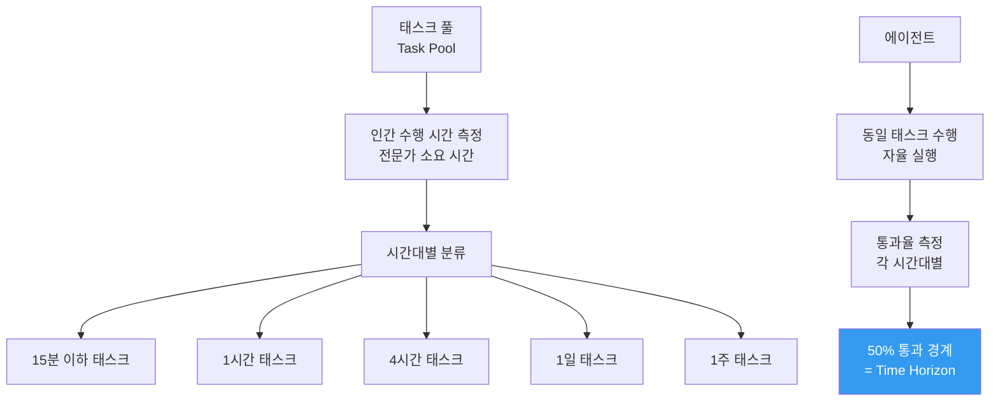

# METR Time Horizon Benchmark

프론티어 에이전트가 50% 확률로 완수 가능한 **인간 작업 소요 시간(time horizon)**을 측정하는 벤치마크. METR(Model Evaluation & Threat Research)가 개발하고 운영한다.

## 정의

**시간 지평(time horizon)**은 "인간 전문가가 수행할 때 X시간 걸리는 태스크를 에이전트가 50% 성공률로 완수할 수 있는가"로 정의된다. 단순 정확도 대신 태스크의 복잡도와 길이를 시간 단위로 정규화한 것이 핵심이다.

$$\text{Time Horizon} = \max T \text{ s.t. } P(\text{success} | \text{task requires } T \text{ hrs}) \geq 0.5$$

## 측정 체계

## 시간 배증 추세

Time Horizon 1.1 (2026년 1월 29일) 업데이트에서 확인된 가속화:

| 기간 | 배증 주기 (doublin time) |
|------|------------------------|
| 2023-2024 | ~250일 |
| 2024 중반 | 165일 |
| 2026년 1월 | 131일 |

즉, 에이전트가 수행 가능한 태스크의 복잡도가 약 4개월마다 2배씩 증가하고 있다.

## 도메인별 편차

"시간 지평은 도메인에 따라 크게 다르다"는 연구 결과 (2025년):

| 도메인 | 현재 수준 (2026년 초) | 특징 |
|--------|---------------------|------|
| 소프트웨어 개발 | 4-8시간 | 명확한 검증 기준 |
| 데이터 분석 | 2-4시간 | 구조화된 환경 |
| 웹 검색 및 조사 | 1-2시간 | 불확실성 높음 |
| 비즈니스 프로세스 | 30분-1시간 | 다양한 시스템 연동 |
| 과학적 연구 | 미성숙 | 검증 기준 불명확 |

## RSP와의 연계

[[responsible-scaling-policy-v3|Anthropic RSP v3]]은 Time Horizon을 ASL(AI Safety Level) 트리거 기준 중 하나로 활용한다:
- 에이전트가 1주 이상 시간 지평에 도달하면 ASL-4 평가 대상
- 이 기준이 "하드 일시중지" 트리거와 연결됨

## 벤치마크 설계 원칙

1. **생태학적 타당성**: 실제 업무 환경을 시뮬레이션하는 태스크 선정
2. **검증 자동화**: 사람이 결과를 검토하지 않고도 성공 여부를 자동 판정
3. **오염 방지**: 태스크를 지속적으로 갱신해 데이터 오염 방지
4. **재현 가능성**: 동일 에이전트를 다시 실행해도 유사한 결과

## 한계

- **소프트웨어 편향**: 자동 검증이 쉬운 코딩 태스크에 편중
- **상호작용 제외**: 사람과의 실시간 상호작용이 필요한 태스크 포함 어려움
- **문화/언어 편향**: 영어권 기준 태스크가 다수

## 대표 레퍼런스

- [Task-Completion Time Horizons of Frontier AI Models (METR)](https://metr.org/time-horizons/)
- [Time Horizon 1.1 (METR, Jan 29 2026)](https://metr.org/blog/2026-1-29-time-horizon-1-1/)
- [Measuring AI Ability to Complete Long Tasks (METR)](https://metr.org/blog/2025-03-19-measuring-ai-ability-to-complete-long-tasks/)
- [Measuring AI Ability to Complete Long Software Tasks (arXiv 2503.14499)](https://arxiv.org/abs/2503.14499)
- [How Does Time Horizon Vary Across Domains?](https://metr.org/blog/2025-07-14-how-does-time-horizon-vary-across-domains/)

## 관련 문서

- [[responsible-scaling-policy-v3|Responsible Scaling Policy v3]]
- [[cot-monitorability|Chain-of-Thought Monitorability]]
- [[agent-trajectory-evaluation|Agent Trajectory Evaluation]]
