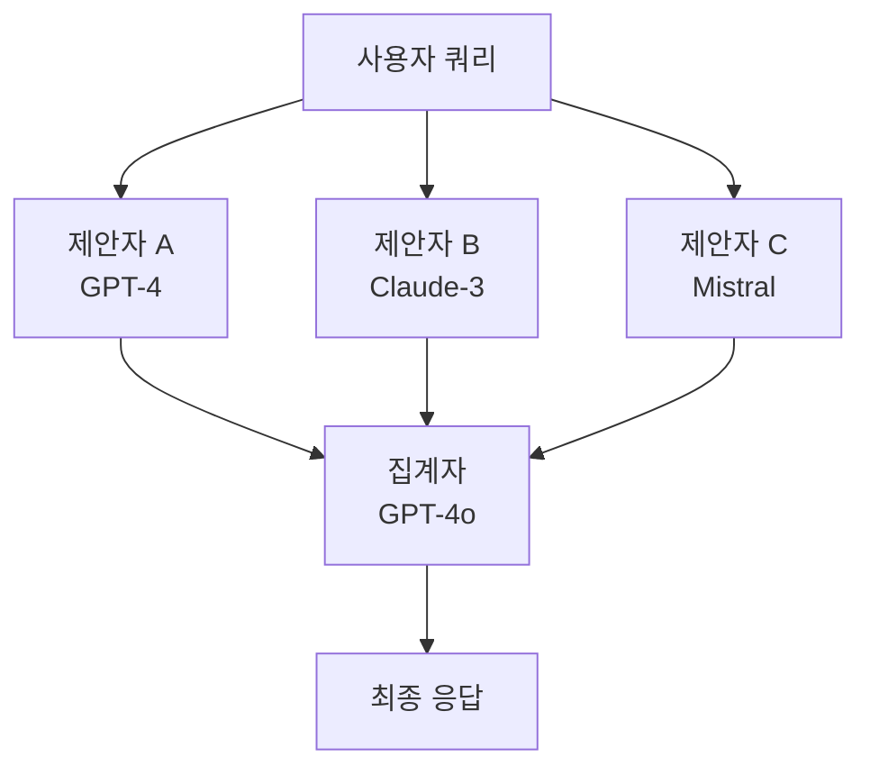
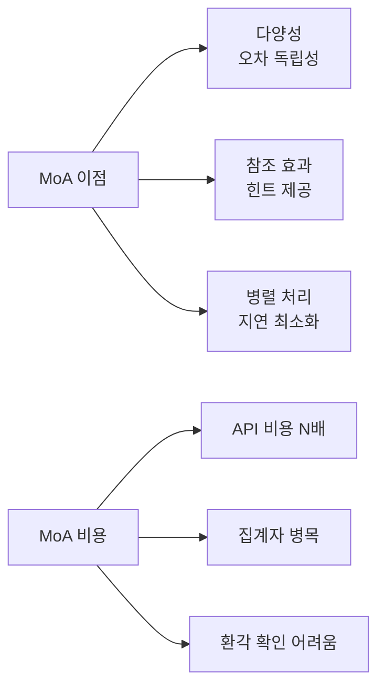

# MoA 이론 (Mixture of Agents Theory)

## 개념 요약

MoA(Mixture of Agents)는 이기종(heterogeneous) LLM 여러 개를 앙상블로 결합하여 단일 모델을 능가하는 출력을 생성하는 프레임워크다. Wang et al. (2024, "Mixture-of-Agents Enhances Large Language Model Capabilities")이 제안했으며, 집단지성(collective intelligence) 원리를 LLM에 적용한 것이다.

[[mixture-of-agents]] 엔티티 페이지가 구현 세부 사항을 다룬다면, 이 페이지는 MoA의 이론적 근거와 설계 원칙을 다룬다.

## 이론적 근거: 왜 이기종 앙상블이 효과적인가

### 보조성 (Complementarity)

다른 아키텍처, 학습 데이터, 파인튜닝 방식으로 만들어진 LLM들은 서로 다른 오류 패턴을 갖는다. 한 모델이 틀리는 곳에서 다른 모델이 맞출 가능성이 있다.

**동질 앙상블(homogeneous ensemble)** vs **이기종 앙상블(heterogeneous ensemble)**:

동질 앙상블(같은 모델 N개)은 오차 공분산이 높아 다양성(diversity) 효과가 제한적이다. 이기종 앙상블은 오차 독립성이 높아 이론적으로 더 큰 이득을 기대할 수 있다.

편향-분산 분해(Bias-Variance Decomposition) 관점에서:

$$\text{Error} = \text{Bias}^2 + \text{Variance} + \text{Noise}$$

앙상블은 분산을 감소시키며, 이기종 앙상블은 편향도 부분적으로 감소시킨다.

### 참조 모델 효과 (Reference Model Effect)

MoA에서 제안자(proposers)가 생성한 응답이 집계자(aggregator)에게 "참조"로 제공된다. 이 참조가 없을 때보다 집계자의 응답 품질이 향상되는 현상을 논문에서 실험적으로 확인했다.

즉, 약한 모델의 응답도 강한 모델의 집계에 "힌트"로 기여할 수 있다. 이는 [[multi-agent-debate]] (Chen et al., 2023)의 사회적 추론 현상과 일맥상통한다.

## MoA 아키텍처

다층(multi-layer) 구성도 가능하다. 1층 제안자 출력을 2층 집계자가 받아 다시 제안하고, 최종 집계자가 통합하는 방식.

## 설계 변수

### 1. 제안자 구성 (Proposer Configuration)

- **다양성 극대화**: 서로 다른 제공사(OpenAI, Anthropic, Mistral, Google)의 모델 혼합
- **비용 최적화**: 강한 집계자 + 저비용 제안자 조합
- **전문화**: 도메인별 특화 모델 포함 (코딩, 수학, 추론 등)

### 2. 집계 전략 (Aggregation Strategy)

| 전략 | 방법 | 적합 상황 |
|------|------|----------|
| 가장 좋은 것 선택 | 제안자 응답 중 선택 | 단순 필터링 |
| 합성 생성 | 모든 응답 통합해 새 응답 작성 | 복잡한 추론 |
| 투표 기반 | 다수결 또는 가중 투표 | 단답형 분류 |

MoA 원 논문에서는 LLM이 직접 합성하는 방식을 사용했다.

### 3. 제안자 수 (Number of Proposers)

제안자가 많을수록 다양성 이득이 있으나, 집계자의 컨텍스트 창이 한정적이므로 실용적 한계가 있다. 논문에서는 3-5개가 적절한 수로 실험됐다.

## 한계와 비판

**비용 증가**: N개 모델을 모두 호출하므로 API 비용이 N배. 시간 지연도 제안자 병렬 실행으로 일부 상쇄 가능하지만 집계 단계가 추가된다.

**환각 증폭 위험**: 여러 모델이 같은 잘못된 사실을 공유하면 집계자가 이를 더 확신하게 될 수 있다.

**집계자 병목**: 집계자 성능이 전체 시스템 상한. 약한 집계자는 좋은 제안을 낭비할 수 있다.

**평가 어려움**: MoA 효과가 모델 다양성 덕분인지, 더 긴 프롬프트(참조 포함) 덕분인지 구분하기 어렵다.

## 관련 연구와 비교

- **LLM 앙상블 vs MoA**: 전통 앙상블이 토큰 확률을 합산하는 반면, MoA는 자연어 응답 수준에서 합성
- **[[multi-agent-debate]]**: 모델들이 서로 논쟁하며 수렴하는 방식. MoA의 단방향 집계와 대비
- **MoE (Mixture of Experts)**: 단일 모델 내부의 라우팅. MoA는 완전한 별도 모델들의 앙상블

## 관련 문서

- [[mixture-of-agents]] - MoA 구현체 및 사례 허브
- [[multi-agent-debate]] - 에이전트 간 토론을 통한 품질 향상
- [[llm-ensembling]] - LLM 앙상블의 다양한 접근 방식
- [[agent-trees]] - 계층적 멀티에이전트 구조
