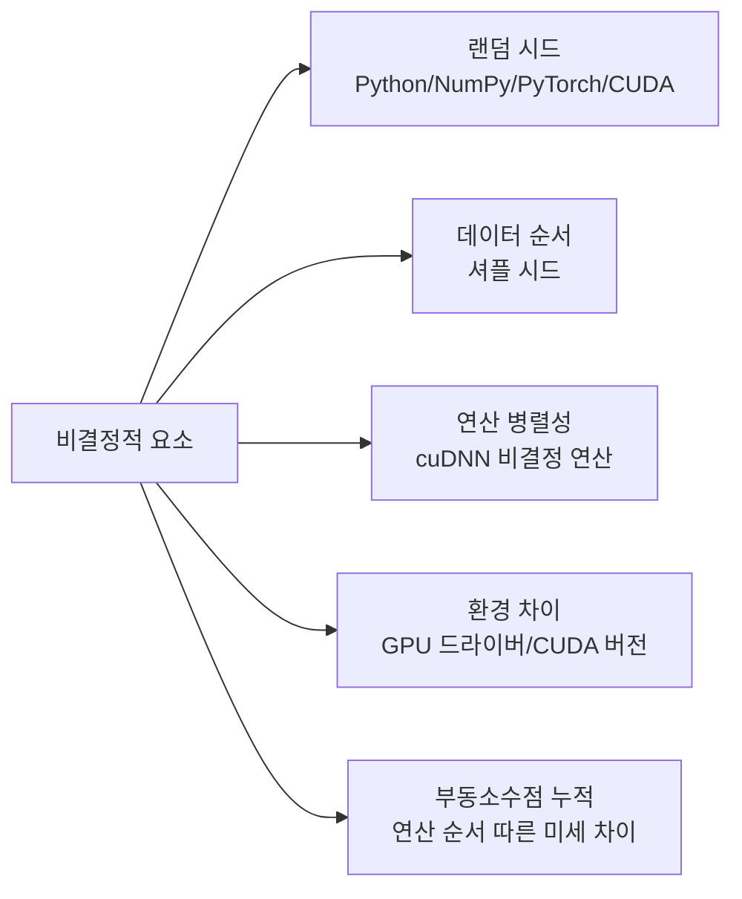

# ML 실험 설계

ML 실험 설계는 모델 개발에서 **신뢰할 수 있는 결론을 도출하기 위한 체계적 방법론**이다. 하이퍼파라미터 탐색, 재현성 확보, 시드 관리, ablation 연구 설계가 핵심 주제다. 잘못 설계된 실험은 "우연한 성공"을 "진짜 개선"처럼 보이게 만들어 연구와 제품 개발 모두에서 큰 비용을 초래한다.

## 실험 설계의 기본 원칙

```mermaid
flowchart TD
    Hypo[가설 명확화\n변수 A가 성능에 영향을 줄 것이다] --> Control[제어 변수 고정\n변경하는 것 외 모두 동일]
    Control --> Baseline[기준선 확립\n현재 최선의 설정으로 측정]
    Baseline --> Run[실험 실행\n시드/환경 고정]
    Run --> Stat[통계적 유의성 검증\n단일 실행 결과를 믿지 않기]
    Stat --> Record[결과 기록\n[[experiment-tracking]] 도구 활용]
```

**핵심 원칙**: 한 번에 하나의 변수만 변경한다. 여러 변수를 동시에 바꾸면 어느 변화가 성능에 기여했는지 알 수 없다.

## 하이퍼파라미터 탐색

### 탐색 전략 비교

| 전략 | 동작 방식 | 적합한 상황 |
|------|----------|------------|
| 그리드 서치 | 모든 조합 열거 | 변수 적고, 범위 좁을 때 |
| 랜덤 서치 | 공간에서 무작위 샘플링 | 중요 변수가 불분명할 때 |
| 베이지안 최적화 | 이전 결과로 다음 시도점 예측 | 평가 비용이 높을 때 |
| HyperBand / ASHA | 조기 종료로 나쁜 설정 빠르게 제거 | 빠른 탐색이 필요할 때 |
| Population-Based Training | 진화 알고리즘 기반 | 동적 스케줄 탐색 |

랜덤 서치는 그리드 서치 대비 동일한 예산에서 더 넓은 공간을 탐색하므로, 대부분의 실용적 상황에서 그리드 서치를 대체한다.

### 하이퍼파라미터 중요도

모든 하이퍼파라미터가 동등하게 중요하지 않다. 대규모 언어 모델 학습에서 일반적인 중요도 순서:

1. 학습률(learning rate) - 가장 민감
2. 배치 크기(batch size)
3. 웜업 스텝(warmup steps)
4. 가중치 감쇠(weight decay)
5. 드롭아웃(dropout) - 상대적으로 둔감

가장 중요한 변수에 탐색 예산을 집중 배분하는 것이 효율적이다.

## 재현성 확보

재현성(reproducibility)은 같은 코드와 데이터로 같은 결과를 얻을 수 있는 능력이다. ML에서 이를 방해하는 요소들:

### 비결정적 요소 목록



### 시드 관리 코드 패턴

```python
import random
import numpy as np
import torch

def set_seed(seed: int) -> None:
    """모든 랜덤 소스의 시드를 고정한다."""
    random.seed(seed)
    np.random.seed(seed)
    torch.manual_seed(seed)
    torch.cuda.manual_seed_all(seed)
    # cuDNN 결정적 모드 (속도 희생)
    torch.backends.cudnn.deterministic = True
    torch.backends.cudnn.benchmark = False
```

주의: `torch.backends.cudnn.deterministic = True`는 일부 연산의 성능을 저하시킨다. 재현성이 절대적으로 필요한 경우에만 사용하고, 학습 속도가 중요한 대규모 실험에서는 **여러 시드로 실험하고 결과를 평균/분산으로 보고**하는 전략이 더 현실적이다.

### 환경 스냅샷

```bash
# 실험 환경 기록 (requirements 방식)
pip freeze > requirements_exp_20260417.txt

# 또는 conda
conda env export > environment.yml
```

[[experiment-tracking]] 도구([[wandb]] 등)는 코드 커밋 해시, 환경 정보, 하이퍼파라미터를 자동으로 기록한다.

## Ablation 연구 설계

Ablation study는 시스템에서 컴포넌트를 하나씩 제거하거나 추가해 각 컴포넌트의 기여도를 측정한다.

### 올바른 ablation 설계

- **Full model → 구성 요소 제거** 순서로 진행 (더 신뢰할 수 있음)
- 각 ablation 변형은 최소 3회 이상 실행, 평균과 표준편차 보고
- 제거하는 컴포넌트가 서로 독립적인지 확인 (상호작용 효과 주의)

```
예시: Instruction Tuning 기여도 분석
Full: SFT + RLHF + Constitutional AI  → 89.2 ± 0.3
-CA:  SFT + RLHF                      → 86.7 ± 0.4  (CA 기여: +2.5)
-RLHF: SFT + CA                        → 83.1 ± 0.5  (RLHF 기여: +6.1)
-SFT:  RLHF + CA                       → 71.2 ± 0.8  (SFT 기여: +18.0)
```

## 통계적 검증

단일 실험 결과는 신뢰하기 어렵다. 특히 무작위 시드에 민감한 작업에서는:

- **여러 시드**로 반복 실험 (최소 3-5개 권장)
- **신뢰 구간** 또는 표준편차 보고 필수
- 차이가 작을 때 (1% 미만): t-test 또는 bootstrap 검정으로 유의성 확인
- **베이스라인과 같은 조건**에서 비교 (같은 에포크, 같은 데이터 샘플)

## 실험 로깅 모범 사례

[[wandb]]나 MLflow([[experiment-tracking]])로 다음을 기록한다:

- 모든 하이퍼파라미터 (자동 캡처 설정)
- 에포크별 학습/검증 손실 및 주요 메트릭
- 모델 체크포인트 (최소 최적 및 마지막)
- 시스템 메트릭 (GPU 사용률, 메모리)
- 코드 버전 (git commit hash)

## 관련 문서

- [[experiment-tracking]] - 실험 추적 도구 및 MLOps 패턴
- [[wandb]] - Weights & Biases 활용 가이드
- [[hyperparameter-search-llm]] - LLM 학습 하이퍼파라미터 탐색 특화
- [[benchmark-design-principles]] - 평가 벤치마크 설계 원칙
