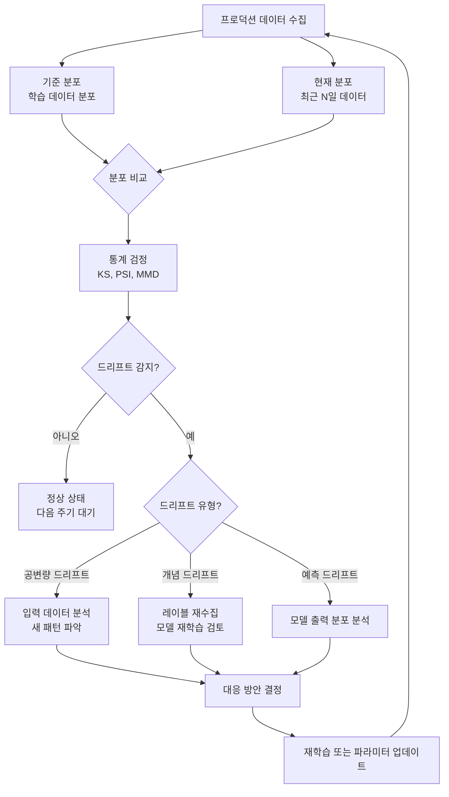
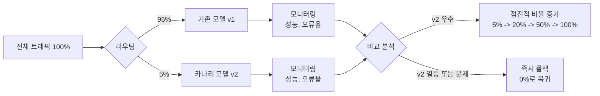
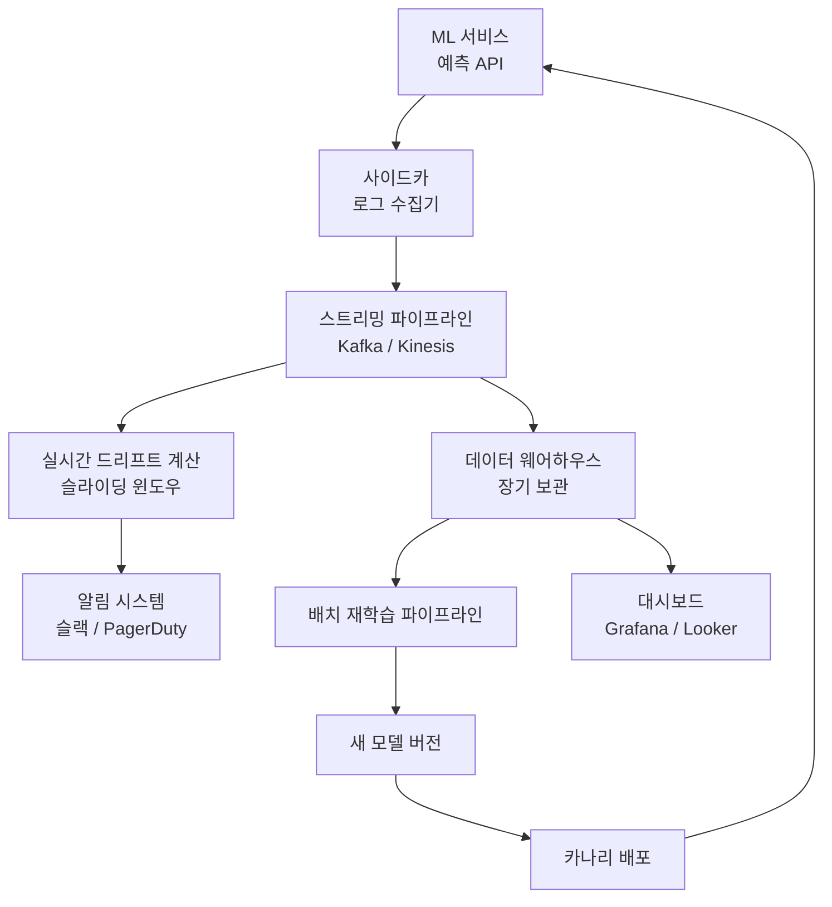

# ML 모니터링 (ML Monitoring)

ML 모니터링(ML Monitoring)은 프로덕션에 배포된 머신러닝 모델의 성능, 데이터 분포, 운영 상태를 지속적으로 관찰하고 이상 징후를 감지하는 시스템 전반을 가리킨다. 소프트웨어 모니터링이 오류율과 응답 시간을 추적하듯, ML 모니터링은 그에 더해 **데이터 드리프트**(data drift), **예측 품질 저하**, **공정성 변화**를 추적한다.

모델은 배포 시점에는 좋은 성능을 보여도, 실세계 데이터는 끊임없이 변화하기 때문에 시간이 지남에 따라 성능이 저하된다. 이를 **모델 부패(model decay)** 또는 **모델 드리프트(model drift)**라 한다. ML 모니터링은 이 부패를 조기에 감지하고 대응하기 위한 인프라다.

## 왜 ML 모니터링이 다른가

일반 소프트웨어와 달리 ML 시스템은 **데이터 의존성** 때문에 독특한 모니터링 과제를 가진다:

| 일반 소프트웨어 | ML 시스템 |
|--------------|---------|
| 코드가 고정되면 동작도 고정 | 코드가 고정돼도 데이터가 변하면 동작이 변함 |
| 오류는 명시적 예외로 나타남 | 오류는 점진적 품질 저하로 나타남 |
| 단위 테스트로 회귀 감지 가능 | 데이터 분포 변화는 단위 테스트로 감지 불가 |
| 배포 후 코드 변경 없으면 행동 예측 가능 | 같은 모델도 입력 분포 변화로 다르게 행동 |

## 핵심 모니터링 영역

### 1. 데이터 드리프트 (Data Drift)

모델이 처음 학습한 데이터의 분포와 현재 프로덕션 입력 데이터의 분포가 달라지는 현상.

**공변량 드리프트 (Covariate Drift)**
- 입력 특성(feature)의 분포가 변함
- 예: 사용자 연령대가 바뀌어 모델 입력 패턴이 달라짐
- 감지 방법: KL 발산, Population Stability Index (PSI), Kolmogorov-Smirnov 검정

**레이블 드리프트 (Label Drift / Concept Drift)**
- 입력-출력 관계 자체가 변함
- 예: "스팸"의 정의가 바뀌어 과거의 스팸 패턴이 더 이상 스팸이 아님
- 더 심각하고 감지가 어렵다

**예측 드리프트 (Prediction Drift)**
- 모델 출력 분포가 변함
- 입력 드리프트의 결과이거나 개념 드리프트의 선행 신호

```python
# PSI (Population Stability Index) 계산 예시
import numpy as np

def calculate_psi(expected: np.ndarray, actual: np.ndarray, buckets: int = 10) -> float:
    """
    PSI < 0.1: 안정적
    PSI 0.1-0.25: 약간의 변화
    PSI > 0.25: 유의미한 드리프트
    """
    expected_percents = np.histogram(expected, bins=buckets)[0] / len(expected)
    actual_percents = np.histogram(actual, bins=buckets)[0] / len(actual)

    # 0 방지
    expected_percents = np.where(expected_percents == 0, 0.0001, expected_percents)
    actual_percents = np.where(actual_percents == 0, 0.0001, actual_percents)

    psi = np.sum(
        (actual_percents - expected_percents) * np.log(actual_percents / expected_percents)
    )
    return psi
```

### 2. 성능 모니터링 (Performance Monitoring)

모델 예측의 품질이 저하되는지를 추적한다.

**레이블이 있는 경우 (온라인 평가)**
- 실제 레이블을 얻을 수 있을 때: 정확도, F1, AUC 등을 실시간으로 추적
- 예: 광고 클릭 예측 모델은 실제 클릭 여부(레이블)를 빠르게 수집 가능

**레이블이 없는 경우 (프록시 메트릭)**
- 레이블 수집에 시간이 걸리거나 불가능한 경우: 프록시(proxy) 지표 사용
- 예: 추천 모델에서 클릭률, 체류 시간, 반환율을 품질 대리 지표로 사용
- LLM에서는 사용자 피드백(thumbs up/down), 재질문 비율 등을 프록시로 사용

```python
import logging
from dataclasses import dataclass
from datetime import datetime

logger = logging.getLogger(__name__)

@dataclass
class PredictionRecord:
    input_hash: str
    prediction: float
    confidence: float
    timestamp: datetime
    ground_truth: float | None = None

class PerformanceMonitor:
    def __init__(self, baseline_accuracy: float, alert_threshold: float = 0.05):
        self.baseline_accuracy = baseline_accuracy
        self.alert_threshold = alert_threshold
        self.records: list[PredictionRecord] = []

    def log_prediction(self, record: PredictionRecord) -> None:
        self.records.append(record)
        self._check_degradation()

    def _check_degradation(self) -> None:
        labeled = [r for r in self.records[-100:] if r.ground_truth is not None]
        if len(labeled) < 30:
            return
        current_accuracy = sum(
            1 for r in labeled
            if abs(r.prediction - r.ground_truth) < 0.5
        ) / len(labeled)
        if (self.baseline_accuracy - current_accuracy) > self.alert_threshold:
            logger.warning(
                "성능 저하 감지: baseline=%.3f, current=%.3f",
                self.baseline_accuracy,
                current_accuracy,
            )
```

### 3. 운영 메트릭 (Operational Metrics)

순수 ML 품질과 별개로 시스템 관점의 건강 지표:

- **지연 시간(latency)**: p50, p95, p99 백분위수 추론 시간
- **처리량(throughput)**: 초당 요청 수(RPS)
- **오류율(error rate)**: HTTP 5xx, 타임아웃 비율
- **리소스 사용률**: GPU/CPU 사용률, 메모리, 비용

### 4. 공정성 모니터링 (Fairness Monitoring)

특정 인구 집단에 대한 성능이 다른 집단과 다르게 드리프트하는지 추적:

- 집단별 오류율 비교 (disaggregated evaluation)
- 예측 분포의 집단 간 격차 추이
- 기회 균등(equalized odds), 예측 동등성(predictive parity) 지표

## 드리프트 감지 방법



### 주요 통계 검정 방법

| 방법 | 적용 대상 | 장단점 |
|------|---------|-------|
| Kolmogorov-Smirnov (KS) | 연속형 변수 | 비모수, 해석 용이 / 고차원에 약함 |
| Population Stability Index (PSI) | 연속형/범주형 | 업계 표준, 임계치 해석 쉬움 |
| Maximum Mean Discrepancy (MMD) | 고차원 임베딩 | 강력하지만 계산 비용 높음 |
| Jensen-Shannon 발산 | 분포 비교 | 대칭적, 유계(bounded) |
| Chi-squared 검정 | 범주형 변수 | 표본 크기에 민감 |

## 카나리 배포와 A/B 테스트

### 카나리 배포 (Canary Deployment)

새 모델 버전을 소수의 트래픽(예: 5%)에만 먼저 노출하고, 기존 모델과 성능을 비교한 뒤 점진적으로 비율을 높이는 배포 전략.



카나리 배포의 핵심은 **빠른 롤백(rollback)** 능력이다. 새 모델에 문제가 있을 때 5% 트래픽을 즉시 0%로 줄여 피해를 최소화한다.

### A/B 테스트 (A/B Testing)

두 개 이상의 모델 버전을 동시에 운영하며 통계적으로 유의미한 성능 차이를 검증하는 방법. [[ab-testing]]에서 상세히 다루는 방법론을 ML 맥락에 적용한다.

ML A/B 테스트의 주의사항:
- **샘플 오염(contamination)**: 같은 사용자가 A와 B 모두 경험하면 안 됨 (사용자 단위 분할)
- **충분한 통계력(statistical power)**: 작은 성능 차이를 감지하려면 충분한 샘플 필요
- **멀티플 테스트 문제**: 여러 지표를 동시에 비교하면 우연히 유의미하게 보이는 것이 생김 (Bonferroni 보정 고려)
- **네트워크 효과**: 추천, 소셜 등 사용자 간 상호작용이 있는 시스템에서는 사용자 분할이 불완전

## 재학습 전략

드리프트 감지 후 재학습(retraining)을 언제, 어떻게 할지는 비용과 효과의 트레이드오프다.

### 재학습 트리거 유형

1. **일정 기반(scheduled)**: 주간/월간 등 정기적으로 재학습. 단순하지만 드리프트 타이밍과 불일치 가능
2. **드리프트 기반(drift-triggered)**: PSI 등 드리프트 지표가 임계치를 넘으면 재학습 시작
3. **성능 기반(performance-triggered)**: 실제 성능 지표가 임계치 아래로 내려가면 재학습
4. **지속적(continuous)**: 새 데이터가 쌓이면 자동으로 증분 재학습. 온라인 러닝(online learning) 기법 적용

### 학습 데이터 관리

```python
from datetime import datetime, timedelta
import pandas as pd

def get_retraining_data(
    historical_df: pd.DataFrame,
    window_days: int = 90,
    recent_weight: float = 2.0,
) -> pd.DataFrame:
    """
    최근 데이터에 더 높은 가중치를 부여하는 학습 데이터 준비.
    드리프트가 발생한 경우 최근 데이터가 더 관련성 높을 가능성이 있음.
    """
    cutoff = datetime.now() - timedelta(days=window_days)
    df = historical_df[historical_df['timestamp'] >= cutoff].copy()
    recent_cutoff = datetime.now() - timedelta(days=30)
    df['sample_weight'] = df['timestamp'].apply(
        lambda t: recent_weight if t >= recent_cutoff else 1.0
    )
    return df
```

## LLM 모니터링의 특수성

전통 ML 모니터링과 달리 LLM 모니터링은 [[llm-observability]]에서 더 상세히 다루지만, 핵심 차이점:

- **출력이 자연어**: 정확도 같은 단순 지표 적용 불가. LLM-as-Judge나 사람 평가 필요
- **토큰 비용**: 입력/출력 토큰 수가 직접 비용으로 연결. 비용 추적이 필수
- **프롬프트 드리프트**: 프롬프트 변경이 모델 변경만큼 성능에 영향. 프롬프트 버전 관리 필요
- **환각(hallucination)**: 자신 있게 틀린 정보를 생성하는 현상 모니터링 필요

## 모니터링 시스템 아키텍처



## 주요 ML 모니터링 도구

| 도구 | 유형 | 강점 |
|------|------|------|
| Evidently AI | 오픈소스 | 드리프트 보고서 자동 생성 |
| WhyLogs | 오픈소스 | 가벼운 데이터 프로파일링 |
| Arize Phoenix | 오픈소스 | LLM 트레이스 + 드리프트 통합 |
| Grafana + Prometheus | 오픈소스 | 운영 지표 + 커스텀 ML 지표 |
| Vertex AI Model Monitoring | 관리형 | GCP 통합, 드리프트 자동 알림 |
| SageMaker Model Monitor | 관리형 | AWS 통합, 스케줄 기반 모니터링 |

LLM 특화 관측성 플랫폼(LangSmith, Langfuse 등)은 [[llm-observability]]에서 다룬다.

## 관련 문서

- [[ai-anomaly-detection]] - 이상 감지 알고리즘과 ML 모니터링 연계
- [[llm-observability]] - LLM 특화 관측성 (토큰, 지연, 비용, 환각)
- [[ab-testing]] - A/B 테스트 방법론 상세
- [[agent-observability]] - 에이전트 시스템 관측성
- [[model-cards]] - 배포 전 모델 문서화
- [[responsible-scaling]] - 배포 후 역량 모니터링과 RSP 연계
