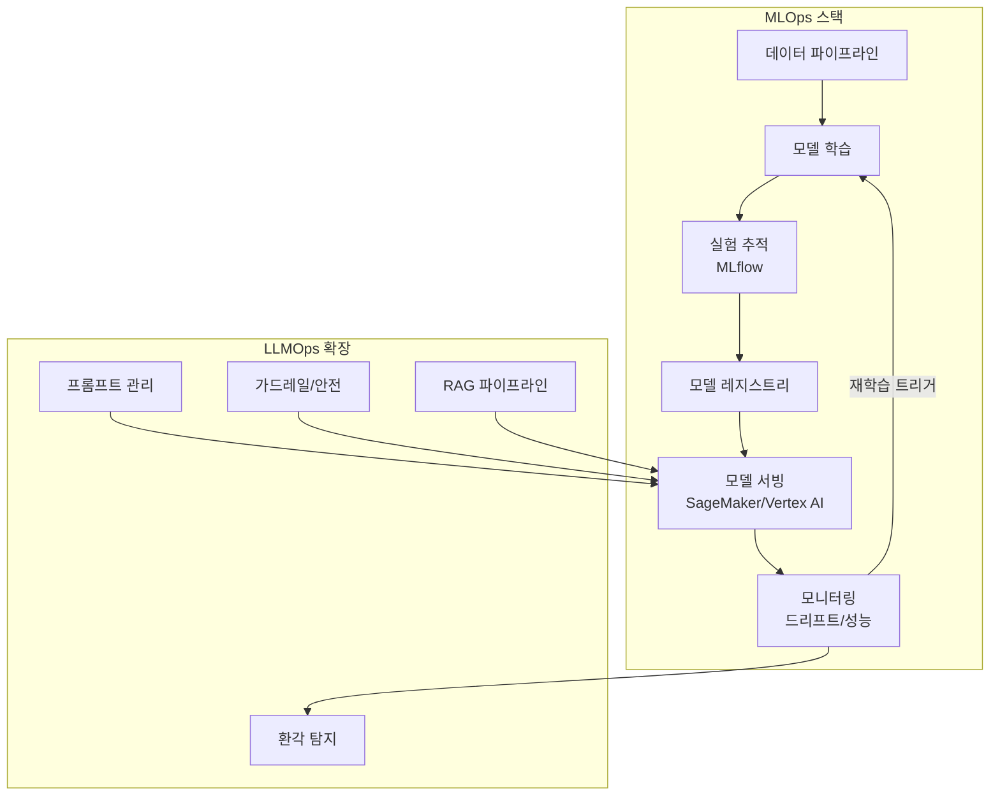

## 개요

2026년 AI 인프라 지출 구조가 학습(training)에서 추론(inference)으로 전환되면서, 추론 워크로드가 AI 인프라 지출의 55% 이상을 차지하게 되었다. AWS SageMaker, Google Cloud Vertex AI, Azure ML이 엔터프라이즈 플랫폼을 장악하고, MLflow가 실험 추적 및 모델 관리의 사실상 표준으로 자리잡았다. LLM 특유의 운영 과제(프롬프트 관리, 환각 모니터링, 가드레일)를 다루는 LLMOps가 MLOps의 확장 개념으로 정착 중이다.

## 핵심 개념

**MLOps**: 머신러닝 모델의 개발, 배포, 모니터링, 재학습 전 생명주기를 자동화하고 관리하는 운영 체계. DevOps 원칙을 ML 워크플로에 적용한 것이다.

**LLMOps**: LLM 고유의 운영 과제를 다루는 MLOps의 확장. 기존 MLOps가 단일 모델 배포를 다루는 반면, LLMOps는 "파운데이션 모델, 파인튜닝 어댑터, 검색 시스템, 가드레일, 라우팅 로직, 피드백 메커니즘"의 복합 오케스트레이션을 관리한다. 프롬프트 버전 관리, 컨텍스트 윈도우 최적화, 환각 탐지, 가드레일 설정, RAG 파이프라인 관리 등이 포함된다.

**지속적 추론(Continuous Inference)**: 일회성 배치 처리가 아닌, 실시간 요청에 지속적으로 응답하는 추론 패턴. 모델 서빙 최적화, 오토스케일링, 비용 관리가 핵심이다.

## 현황 (2026)

**플랫폼 표준화**:
- **AWS SageMaker**: 엔터프라이즈 ML 플랫폼 시장 점유율 선도, 엔드투엔드 파이프라인
- **Google Cloud Vertex AI**: AutoML + 커스텀 학습, Gemini 모델 통합
- **Azure ML**: 기업 IT 환경과의 통합성, OpenAI 모델 네이티브 지원
- **MLflow**: 실험 추적, 모델 레지스트리, 배포의 사실상 표준 오픈소스 도구

**인프라 트렌드**:
- 추론 워크로드가 AI 인프라 지출의 **55% 이상** 차지
- Docker/Kubernetes 기반 컨테이너 오케스트레이션이 배포 표준
- ONNX Runtime, TensorFlow Lite로 엣지 디바이스 최적화 확산
- CI/CD와 MLOps 워크플로의 통합으로 DevOps-MLOps 경계 소멸
- 하이브리드 클라우드 솔루션으로 슈퍼컴퓨터부터 IoT 디바이스까지 확장

**특수 도구 생태계**:
- Kubeflow: Kubernetes 네이티브 ML 파이프라인
- DVC(Data Version Control): ML 데이터 버전 관리
- Feast: 피처 스토어
- Weights & Biases: 실험 추적 및 시각화

**거버넌스와 규제 대응**:
- [[eu-ai-act-enforcement]]와 미국 행정명령에 따른 모델 투명성, 공정성 추적, 규제 보고 자동화 수요 증가
- 모델 편향 탐지, 드리프트 모니터링, 성능 저하 경보가 프로덕션 필수 요소로 정착

## LLMOps 고유 과제

### 프롬프트 엔지니어링의 소프트웨어 공학화

프롬프트는 "버전 관리, 테스트, A/B 실험, 지속적 최적화"를 요구한다. 조직들은 프롬프트 라이브러리를 코드 레포지토리와 동등한 엄격함으로 관리하며, 리뷰 프로세스와 회귀 테스트를 적용한다. "대규모 배포된 잘못 최적화된 프롬프트 하나가 하루 수천 달러의 비용을 발생"시킬 수 있다.

### 다계층 평가 프레임워크

| 평가 계층 | 방법 | 메트릭 |
|----------|------|--------|
| 자동화 메트릭 | RAG 품질 평가 | 컨텍스트 정밀도/재현율, 충실도 |
| [[llm-as-judge-calibration|LLM-as-judge]] | 대형 모델이 응답 평가 | 답변 관련성, 톤 적절성, 주장 뒷받침 |
| 인간 평가 파이프라인 | 지능적 샘플링 | 고영향 평가에 인간 노력 집중 |
| 지속적 프로덕션 평가 | 출력 샘플링 | 배포 전 테스트가 놓친 이슈 탐지 |

### 비용 최적화 기법

- **지능형 캐싱**: 정확 매칭 + 시맨틱 캐싱으로 중복 처리 제거
- **모델 라우팅**: 단순 쿼리는 저렴한 모델, 복잡한 태스크만 고급 모델로 전달
- **캐스케이드 전략**: 경제적 옵션 우선 시도, 품질 검사 실패 시에만 에스컬레이션
- **프롬프트 최적화**: 중복 제거 및 예시 압축으로 토큰 소비 최소화

### 안전 및 가드레일 아키텍처

심층 방어(Defense in Depth) 구조:

- **입력 가드레일**: 프롬프트 인젝션 및 유해 요청 탐지
- **출력 가드레일**: 전달 전 문제 응답 식별
- **환각 탐지**: 출처 자료 대비 주장 비교
- **행동 모니터링**: 비정상 패턴 탐지

"LLM 장애는 창의적이고 예측 불가능"하여, 전통 ML의 제한적이고 예측 가능한 에러와 본질적으로 다르다.

### CI/CD 파이프라인

- **계층형 테스트**: 모든 커밋에 빠른/저렴한 검사, PR에 중간 평가, 배포 전 종합 평가
- **설정을 코드로(Configuration as Code)**: 프롬프트, 모델 설정, 가드레일 규칙을 버전 관리 레포에서 관리
- **카나리 배포**: 소량 트래픽을 새 버전으로 라우팅, 품질/지연/에러율 저하 시 자동 롤백

## 전망/과제

**비용 구조 전환**: 추론 비용이 AI 지출의 과반을 차지하면서, 모델 양자화(quantization), 스페큘레이티브 디코딩, 배치 추론, 서버리스 추론 등 비용 절감 기술의 중요성이 급증하고 있다. 토큰 기반 가격 책정이 직접적인 비용-품질 트레이드오프를 만든다.

**LLMOps 성숙도**: 프롬프트 버전 관리, A/B 테스트, 환각 탐지, 비용 어트리뷰션 등 LLM 특화 운영 도구가 아직 초기 단계이며, 표준화된 모범 사례가 확립되지 않았다. LLM 시스템은 더 이상 단일 배포 아티팩트가 아닌 확률적 다컴포넌트 시스템이다.

**크로스 팀 협업**: 데이터 사이언티스트, ML 엔지니어, IT 운영팀 간의 협업 체계 구축이 성공적 MLOps 구현의 전제 조건이다. 조직 사일로가 기술적 성숙도보다 큰 장벽이 되는 경우가 빈번하다.

## 관련 문서

- [[enterprise-ai-adoption]] - 기업 AI 도입과 추론 비용 구조
- [[ai-regulation-us]] - AI 모델 투명성/감사 규제 요건
- [[eu-ai-act-enforcement]] - EU AI Act의 기술 문서화 의무
