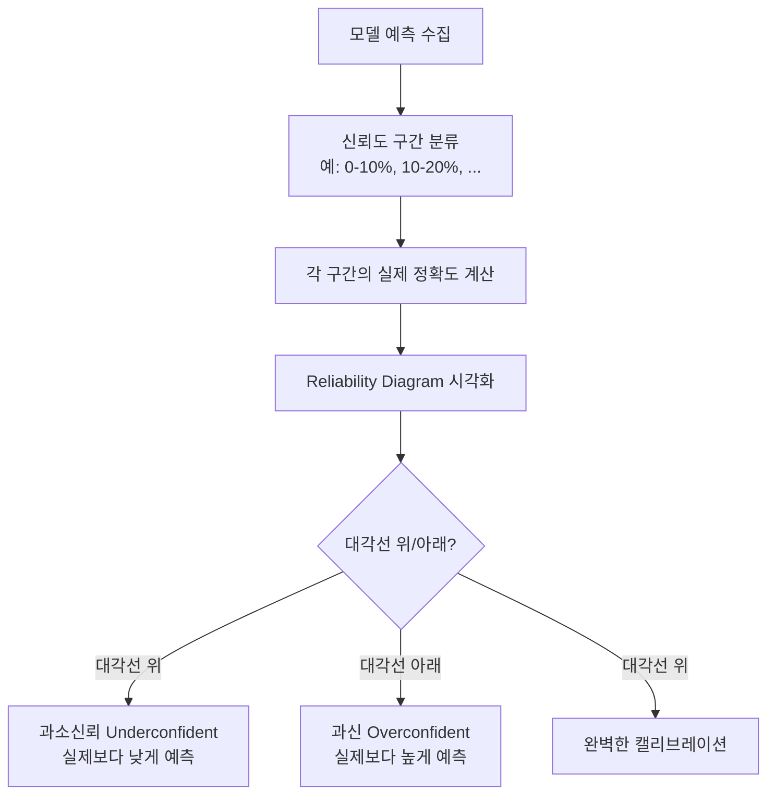

# 모델 캘리브레이션 (Model Calibration)

## 정의

캘리브레이션(calibration)은 모델이 출력하는 **예측 확률이 실제 정확도와 일치하는 정도**를 나타낸다. 완벽하게 캘리브레이션된 모델은 "70% 확신"이라고 말할 때 실제로 70번 중 70번 맞아야 한다.

형식적으로, 신뢰도(confidence) $c$에 대해 다음이 성립해야 한다:

$$P(\hat{Y} = Y \mid \hat{P} = c) = c, \quad \forall c \in [0, 1]$$

여기서 $\hat{P}$는 모델의 예측 확률, $\hat{Y}$는 예측 레이블, $Y$는 실제 레이블이다.

## 현대 LLM이 과신하는 이유

딥러닝 모델, 특히 LLM은 구조적으로 **과신(overconfident)** 경향이 있다.

- **Cross-entropy 손실 최소화**: 소프트맥스 분포를 극단적으로 만드는 방향으로 학습이 진행됨
- **모델 규모 증가**: 더 큰 모델일수록 훈련 데이터에 더 정확히 맞춰지며 과신 심화
- **RLHF 효과**: 인간 선호 학습 과정에서 단호한 답변이 보상을 더 많이 받는 경향
- **분포 이동(distribution shift)**: 훈련 도메인 밖에서 높은 확신을 유지하는 오류

## 캘리브레이션 측정

### Expected Calibration Error (ECE)

예측 확률을 N개 구간(bin)으로 나눠 각 구간의 평균 신뢰도와 정확도 차이를 측정한다.

$$\text{ECE} = \sum_{m=1}^{N} \frac{|B_m|}{n} \left| \text{acc}(B_m) - \text{conf}(B_m) \right|$$

ECE가 낮을수록 캘리브레이션이 우수하다. 일반적으로 0.05 이하를 양호로 본다.

### Reliability Diagram

Reliability Diagram에서 이상적인 경우는 모든 구간이 $y = x$ 대각선 위에 놓이는 것이다.

## 캘리브레이션 교정 기법

### Temperature Scaling

가장 단순하면서 실용적인 방법. 소프트맥스 입력에 스칼라 온도 $T$를 나눈다.

$$\hat{p}_i = \frac{\exp(z_i / T)}{\sum_j \exp(z_j / T)}$$

- $T > 1$: 분포를 평탄하게 만들어 과신 완화
- $T < 1$: 분포를 날카롭게 만들어 과소신뢰 완화
- 검증 세트에서 NLL(음의 로그우도)을 최소화하는 $T$를 찾음
- **장점**: 파라미터 1개로 단순, 모델 출력 순위 변경 없음
- **단점**: 클래스별/도메인별 캘리브레이션 오류 보정 불가

### Platt Scaling

소프트맥스 로짓에 로지스틱 회귀를 적용해 신뢰도를 교정한다.

$$p(y=1 \mid x) = \sigma(A \cdot f(x) + B)$$

Temperature Scaling의 일반화. 파라미터 2개(A, B)로 더 유연하나 과적합 위험이 있다.

### Histogram Binning / Isotonic Regression

비모수적(non-parametric) 방법으로, 신뢰도와 정확도의 단조 관계를 보정한다. 더 유연하지만 데이터가 많이 필요하다.

## LLM에서의 캘리브레이션 특수성

| 측면 | 설명 |
|------|------|
| 토큰 확률 vs 답변 정확도 | 각 토큰의 softmax 확률과 최종 답변의 정확도는 직접 연결되지 않음 |
| 다중 토큰 생성 | 확률의 곱으로 전체 시퀀스 확률이 기하급수적으로 낮아짐 |
| 언어화된 불확실성 | "확실하지 않지만..."처럼 말로 표현되는 불확실성 vs 수치 확률 |
| 자기평가 편향 | 모델이 자신의 답변을 평가할 때 과도하게 낙관적인 경향 |

LLM 캘리브레이션 연구에서는 주로 "모델이 틀렸다고 생각할 때 실제로도 틀렸는가"를 측정한다.

## 안전 시스템에서의 중요성

의료 진단, 법률 판단, 자동화 의사결정 등 고위험 시스템에서 캘리브레이션은 단순 성능 지표를 넘어 **신뢰성의 핵심**이 된다.

- 과신 모델: 오답을 확신하는 경우 → 사용자가 교정 기회를 잃음
- 과소신뢰 모델: 정답도 의심하는 경우 → 불필요한 인간 개입 비용 증가
- **RAG 파이프라인**: 검색-생성 통합 시 각 단계의 불확실성 전파 고려 필요

> 캘리브레이션은 정확도와 독립적인 지표다. 모델이 정확하더라도 캘리브레이션이 나쁠 수 있고, 반대도 성립한다.

## 관련 문서

- [[llm-as-judge-calibration]] - LLM이 평가자 역할을 할 때의 캘리브레이션 편향
- [[evaluation-during-training]] - 학습 중 평가 지표와 캘리브레이션
- [[self-evaluation-bias]] - 자기평가에서 발생하는 편향 패턴
