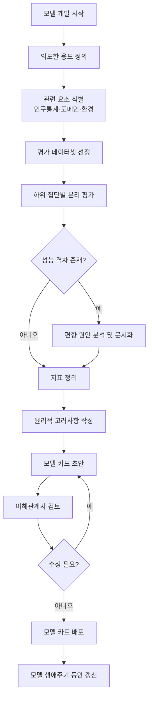

## 개요

Model Cards는 Mitchell et al.이 2019년 FAT* 컨퍼런스에서 발표한 ML 모델 문서화 프레임워크다. 학습된 모델에 동반되는 짧은 문서로, 모델의 의도된 용도, 성능 특성, 윤리적 고려사항을 구조화된 형식으로 기술한다. 전자 부품의 데이터시트에서 영감을 받았으며, 모델 투명성과 책임 있는 배포를 위한 업계 표준으로 자리잡았다.

핵심 목표는 두 가지다. 첫째, 모델이 적합하지 않은 맥락에서 사용되는 것을 방지한다. 둘째, 다양한 인구통계 그룹에 걸친 성능 차이를 공개하여 [[fairness-metrics-bias-auditing|공정성 감사]]를 촉진한다.

## 표준 구성 요소

Mitchell et al.의 원본 논문은 다음 섹션을 권장한다.

**모델 상세(Model Details)**: 개발 조직, 모델 유형, 학습 알고리즘, 라이선스, 버전 정보를 기술한다. 누가 만들었고 어떤 기술 스택을 사용했는지가 핵심이다.

**의도된 용도(Intended Use)**: 모델이 설계된 주요 사용 사례와 범위 밖(out-of-scope) 용도를 명시한다. 예를 들어 얼굴 인식 모델이라면 보안 출입 통제용인지, 감정 분석용인지를 구분한다.

**평가 데이터(Evaluation Data)**: 벤치마크 평가에 사용된 데이터셋, 전처리 방법, 동기를 기술한다. 평가 데이터가 배포 환경을 얼마나 대표하는지가 중요하다.

**성능 메트릭(Metrics)**: 정확도, 정밀도, 재현율 등 핵심 지표를 보고한다. 특히 인구통계 그룹(성별, 연령, 인종, 피부색 등)별 분류 성능 차이를 교차 분석하여 공개한다.

**윤리적 고려사항(Ethical Considerations)**: 잠재적 위험, 알려진 한계, 민감한 사용 사례에 대한 경고를 포함한다.

**주의사항 및 권고(Caveats and Recommendations)**: 추가 테스트가 필요한 영역, 이상적이지 않은 사용 조건 등을 기술한다.

## 업계 채택 현황

2026년 기준으로 Model Cards는 사실상의 업계 표준이 되었다.

**Hugging Face**: Hub에 등록된 모든 모델에 Model Card 작성을 권장하며, 자동 생성 도구를 제공한다. README.md 형식의 메타데이터 헤더와 자유 형식 문서를 결합한 방식이다.

**Google**: 자체 모델(Gemma, PaLM 등) 출시 시 기술 보고서와 함께 Model Card를 공개한다. Google Cloud Vertex AI에서는 AutoML 모델에 대해 자동화된 Model Card 생성 기능을 제공한다.

**Meta**: Llama 시리즈 출시마다 공정성 대시보드와 결합된 Model Card를 발행한다. 인구통계별 성능 분석과 안전성 평가 결과를 포함한다.

**OpenAI**: 내부적으로 Model Card와 유사한 "System Card" 형식을 사용한다. GPT-4, GPT-5 등 주요 모델 출시 시 System Card를 공개하여 안전성 테스트 결과와 한계를 문서화한다.

**Stanford CRFM**: HELM 벤치마크 프로젝트에서 평가 대상 모델에 대한 상세한 Model Card와 [[datasheets-for-datasets|Datasheets]]를 작성한다.

## LLM 시대의 확장

원본 프레임워크는 전통 ML 모델(분류기, 회귀 모델)을 염두에 두었으나, LLM 시대에는 추가 고려사항이 필요하다.

**학습 데이터 투명성**: 사전학습 코퍼스의 구성, 필터링 기준, 라이선스 정보. 대규모 웹 크롤 데이터의 경우 정확한 구성을 공개하기 어렵다는 실무적 한계가 있다.

**안전성 평가**: [[ai-red-teaming|레드 팀 테스트]] 결과, 유해 콘텐츠 생성 경향, 탈옥(jailbreak) 저항성 등 LLM 고유의 안전성 지표를 포함해야 한다.

**다국어 성능**: 언어별 성능 차이를 명시한다. 영어 중심으로 학습된 모델의 비영어권 성능 저하는 공정성 이슈와 직결된다.

**환경 영향**: 학습에 소모된 컴퓨트(GPU 시간, 전력 소비, 탄소 배출량) 정보. 대규모 모델의 환경 비용 투명성에 대한 요구가 증가하고 있다.

## [[datasheets-for-datasets]]와의 관계

Model Cards가 모델을 문서화한다면, Datasheets for Datasets는 학습/평가에 사용된 데이터셋을 문서화한다. 두 프레임워크는 상호 보완적이며, [[responsible-ai-practices|책임 있는 AI]] 실천의 양대 축을 이룬다. 완전한 투명성을 위해서는 모델의 Model Card가 학습 데이터의 Datasheet를 참조하고, 반대로 Datasheet는 해당 데이터로 학습된 모델의 Model Card를 역참조하는 구조가 이상적이다.

## [[iso-42001]]과 [[nist-ai-rmf]]에서의 위치

[[nist-ai-rmf|NIST AI RMF]]의 Map 기능에서 Model Cards는 AI 시스템의 맥락과 영향을 파악하는 핵심 문서로 활용된다. [[iso-42001|ISO/IEC 42001]]의 투명성 및 문서화 요구사항을 충족하는 데에도 Model Cards가 직접적으로 기여한다. [[model-lifecycle-management|모델 수명주기 관리]] 관점에서는 각 모델 버전마다 업데이트된 Model Card를 유지하는 것이 모범 사례다.

## 한계와 비판

Model Cards의 가장 큰 한계는 자발적(voluntary) 문서화라는 점이다. 작성 품질과 깊이가 조직마다 크게 다르며, 법적 구속력이 없다. 또한 모델이 배포된 후 실제 사용 맥락이 변화해도 Model Card가 업데이트되지 않는 경우가 많다. EU AI Act 같은 규제가 강화되면서 Model Card 수준의 문서화가 법적 의무로 전환되는 추세다.

## 모델 카드 작성 흐름

모델 카드 작성은 선형 단계가 아니라, 평가-분석-문서화를 반복하는 순환 과정이다. 특히 하위 집단별 분리 평가 단계는 전통 ML에서는 인구통계 그룹, LLM에서는 언어별·도메인별 성능 격차를 중점으로 점검한다.

## 주요 기업별 모델 카드 최신 현황 (2026 기준)

### Anthropic

[[responsible-scaling]]의 ASL 체계와 연동되어 모델 카드가 작성된다. 단순 성능 지표를 넘어 CBRN(화학·생물·방사선·핵) 위험 역량 평가, 사이버보안 위협 역량 평가를 포함한다. Claude 3.x 시리즈 이후부터 레드팀 평가 결과 요약을 카드에 포함한다.

### Google / Meta / Hugging Face

- **Google**: Vertex AI AutoML에서 모델 카드 자동 생성 기능 제공
- **Meta**: Llama 시리즈 오픈 웨이트 모델의 Acceptable Use Policy와 모델 카드를 함께 발행
- **Hugging Face**: Hub의 `README.md`에 YAML 메타데이터를 삽입하는 방식 (`[[dataset-cards]]`와 동일한 구조)

### System Card와의 구분

OpenAI는 "System Card"라는 변형을 사용한다. 기술적 성능 외에 사회적 영향, 배포 결정 근거까지 포함하는 더 포괄적 형식이다. GPT-4o, o3 등 주요 모델 출시 시 공개한다.

## 규제 환경과의 연계

| 규제/프레임워크 | 모델 문서화 요구사항 |
|----------------|---------------------|
| EU AI Act | 고위험 AI 시스템에 기술 문서(technical documentation) 의무화 |
| NIST AI RMF | AI 위험 프로파일 문서화 권고 |
| 미국 행정명령 EO 14110 | 이중 용도 기반 모델에 안전 테스트 결과 보고 의무 |

[[ai-evaluation]] 프로세스와 통합해 평가 자동화하고, 결과를 모델 카드에 자동 반영하는 파이프라인이 2026년 표준 실천으로 자리잡고 있다.

## 한계 (추가)

- **자기보고 편향**: 카드에 적힌 내용이 사실인지 외부에서 검증하기 어렵다
- **갱신 부담**: 모델 업데이트마다 카드를 갱신해야 하나 실제로는 초기 버전이 오래 사용
- **세분화 어려움**: 하위 집단별 평가는 해당 집단 데이터가 충분할 때만 의미 있음

## 관련 문서

- [[datasheets-for-datasets]] -- 데이터셋 문서화 프레임워크
- [[dataset-cards]] -- Hugging Face 데이터셋 카드 표준
- [[fairness-metrics-bias-auditing]] -- 공정성 정량 측정
- [[responsible-ai-practices]] -- 윤리적 AI 개발 원칙
- [[responsible-scaling]] -- 책임 있는 스케일링 정책과 안전 평가
- [[ai-evaluation]] -- 모델 평가 방법론 (벤치마크, 레드팀)
- [[nist-ai-rmf]] -- AI 위험 관리 프레임워크
- [[iso-42001]] -- AI 관리체계 인증 표준
- [[model-lifecycle-management]] -- 모델 수명주기 관리
- [[regulatory-ai]] -- AI 규제 환경과 문서화 의무
