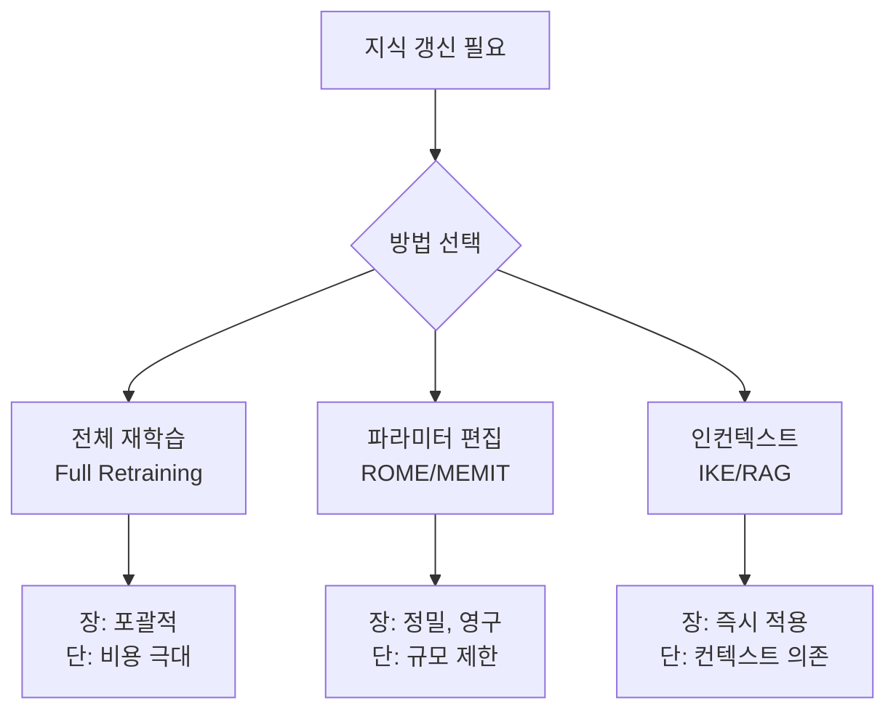

# 모델 편집 기법 (ROME/MEMIT)

## 개요

모델 편집(Model Editing)은 언어 모델에 저장된 특정 사실(fact)을 전체 재학습 없이 외과적으로 수정하는 기술이다. "에펠탑은 파리에 있다"는 사실을 "에펠탑은 로마에 있다"로 바꾸거나, 이미 틀린 정보를 올바르게 수정하는 데 사용된다. Meng et al.의 ROME(2022)과 MEMIT(2023)이 대표적인 연구다.

## 왜 모델 편집이 필요한가

| 동기 | 설명 |
|------|------|
| 사실 최신화 | 훈련 후 변경된 정보(예: 새 CEO, 법률 개정) 반영 |
| 오류 수정 | 모델이 학습한 잘못된 사실 수정 |
| 프라이버시 | GDPR 등 규정에 따른 특정 정보 제거 |
| 개인화 | 사용자별 맞춤 지식 적용 |

## ROME: Rank-One Model Editing

### 인과 추적 (Causal Tracing)

ROME의 핵심 전제는 트랜스포머의 특정 레이어가 사실적 지식을 저장한다는 것이다. 인과 추적(causal tracing) 실험은 다음을 수행한다:

1. 정상 입력으로 모델 실행 및 활성화 저장
2. 오염된 입력(noise를 추가한 주어)으로 다시 실행
3. 각 레이어의 활성화를 정상 상태로 복원하면서 예측이 복구되는 지점 탐색

중간 MLP(Feed-Forward Network) 레이어가 사실 지식의 저장소 역할을 한다는 것이 발견되었다.

### 랭크-1 업데이트

특정 주어(subject)에 대한 사실을 바꾸려면, 해당 레이어의 가중치 행렬을 최소한으로 수정한다. 랭크-1 행렬 업데이트(rank-one update)는 다음 형태를 갖는다:

$$W' = W + \frac{(v^* - Wk)k^T}{k^T C^{-1} k} C^{-1}$$

여기서 $k$는 주어에 해당하는 키(key) 벡터, $v^*$는 새 사실에 해당하는 목표 값(value) 벡터다. 이 업데이트는 다른 사실에는 최소한의 영향을 미치면서 특정 사실만 수정한다.

## MEMIT: Mass-Editing Memory In a Transformer

ROME은 한 번에 하나의 사실만 수정할 수 있다. MEMIT은 이를 대량 편집으로 확장한다.

수천 건의 사실을 동시에 편집할 때, 단일 레이어에 변화를 집중하면 모델이 불안정해진다. MEMIT은 변화량을 여러 레이어에 분산시켜 각 레이어에 가해지는 부담을 줄인다.

실험에서 최대 10,000건의 사실을 동시 편집하면서도 모델 일반 성능을 유지하는 것을 보여주었다.

## 편집 평가 기준

성공적인 모델 편집은 세 가지 조건을 동시에 만족해야 한다:

| 기준 | 설명 | 예시 |
|------|------|------|
| 수정 성공 (Reliability) | 편집된 사실이 올바르게 반영됨 | "에펠탑은 어디?" -> "로마" |
| 일반화 (Generalizability) | 다른 표현으로 물어봐도 적용 | "에펠탑의 소재지는?" -> "로마" |
| 지역성 (Locality) | 관련 없는 사실은 변경 없음 | "아이펠 산은 어디?" -> "독일" (변경 없음) |

## 한계

### 연쇄 편집 시 성능 저하

수백 건의 순차적 편집을 거치면 모델이 점진적으로 저하된다. 특히 ROME처럼 단일 레이어에 집중하는 방식은 간섭(interference) 문제가 심하다.

### 추론 변경의 어려움

단순 사실(entity-attribute) 수정은 잘 되지만, 복잡한 추론 패턴의 변경은 어렵다. "A는 B이고, B는 C이면 A는 C다"는 추론 연쇄를 수정하려면 단순 사실 편집만으로는 부족하다.

## 최신 발전

**GRACE (Hartvigsen et al., 2023)**: 코드북(codebook) 기반 방식. 편집된 사실을 외부 메모리에 캐시하고, 관련 입력이 들어오면 캐시를 참조한다. 연쇄 편집에 강하다.

**IKE (In-Context Knowledge Editing)**: 파라미터를 수정하지 않고, 편집할 사실을 시스템 프롬프트에 포함시켜 인컨텍스트로 처리한다. 단순하지만 컨텍스트 길이에 제약이 있다.

**AlphaEdit**: 모델 편집 문제를 최적화 문제로 재정의하여 더 안정적인 대량 편집을 지원한다.

## 지식 갱신 접근법 비교

## 관련 문서
- [[mcircke-circuit-knowledge-editing-paper]] -- MCircKE: 회로 기반 지식 편집으로 추론 간극 해소

- [[machine-unlearning]] - 특정 지식을 잊히게 하는 기법
- [[in-context-learning]] - IKE의 기반이 되는 인컨텍스트 학습
- [[knowledge-graph]] - 구조화된 외부 지식 저장
- [[mechanistic-interpretability-circuits]] - 모델 내부 지식 저장 메커니즘
- [[catastrophic-forgetting]] - 연속 학습 시 지식 망각 문제
