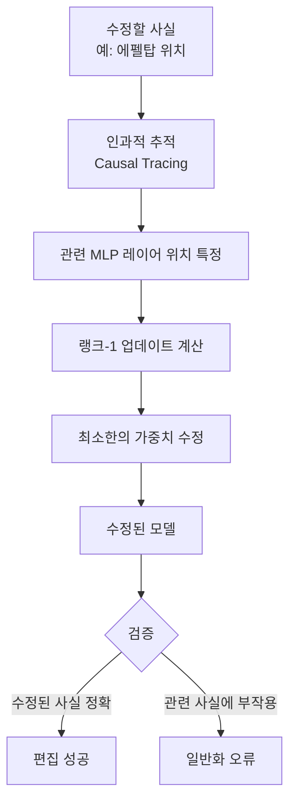
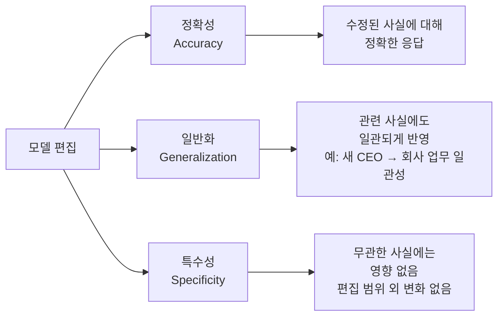

# 모델 편집 (Model Editing) - ROME, MEMIT

**재훈련(retraining) 없이** 이미 배포된 LLM의 특정 사실이나 지식을 수정하는 기술. "에펠탑은 파리에 있다"를 "에펠탑은 런던에 있다"로 바꾸는 것처럼, 개별 사실 연상(fact association)을 외과적으로 수정한다. 지속적으로 변화하는 세계 지식을 모델에 반영하거나 오류를 수정하는 데 활용된다.

## 왜 모델 편집이 필요한가

LLM은 훈련 시점의 지식을 고정적으로 가지며 다음 문제가 발생한다:

- **지식 노후화**: 실세계 사실 변화(CEO 교체, 수도 이전, 법률 개정 등)가 반영되지 않음
- **사실 오류**: 훈련 데이터의 오류나 환각이 모델에 내재화
- **재훈련 비용**: 대규모 모델 재훈련은 수천만 달러 이상의 비용과 수주의 시간 소요
- **규정 준수**: GDPR 등 법적 요구에 따른 특정 정보 수정 필요

## 핵심 기법: ROME와 MEMIT

### ROME (Rank-One Model Editing)
Meng 외(2022) "Locating and Editing Factual Associations in GPT" 논문에서 제안.

**핵심 아이디어**: 트랜스포머의 **MLP 레이어가 사실 기억의 저장소**로 기능한다는 관찰에 기반. 특정 사실은 특정 레이어의 FFN 가중치에 집중적으로 인코딩된다.

수학적으로 ROME는 다음 최적화 문제를 품다:

$$W^* = W + \frac{(v^* - Wk)k^T}{k^T k}$$

여기서 $k$는 입력 키 벡터, $v^*$는 목표 출력 값 벡터.

### MEMIT (Mass-Editing Memory In a Transformer)
Meng 외(2022) 후속 연구. ROME를 **수천 건의 편집을 한 번에** 처리할 수 있도록 확장.

| 구분 | ROME | MEMIT |
|------|------|-------|
| 편집 수 | 단일 편집 | 수천 건 배치 편집 |
| 대상 레이어 | 단일 레이어 | 여러 레이어 분산 |
| 계산 복잡도 | O(1) | O(n), n: 편집 수 |
| 일반화 | 제한적 | 더 나은 일반화 |

MEMIT의 핵심 혁신은 편집을 여러 레이어에 분산시켜 각 레이어의 부담을 줄이고 부작용을 최소화한다는 점이다.

## 좋은 모델 편집의 세 조건

세 조건을 동시에 만족하는 것이 핵심 과제다. 특히 일반화와 특수성 사이의 균형이 어렵다.

## [[machine-unlearning]]과의 관계

모델 편집과 [[machine-unlearning]]은 상호 보완적이다:

- **모델 편집**: 특정 사실을 *다른 사실로 교체* (A → B)
- **머신 언러닝**: 특정 지식을 *완전히 제거* (A → 없음)

두 기법이 연계되어 사용될 수 있다:
1. 잘못된 개인정보를 언러닝으로 제거
2. 올바른 정보를 모델 편집으로 삽입

## [[memorization-in-llms]]과의 관계

모델 편집은 LLM이 [[memorization-in-llms|사실을 암기하는 방식]]에 대한 이해에 기반한다. ROME의 인과적 추적(causal tracing)은 특정 사실이 어떤 레이어에 저장됐는지 매핑하는 작업으로, 암기 메커니즘 연구와 밀접히 연결된다.

## 현재 한계

**리플 효과(Ripple Effect)**: 하나의 사실을 수정하면 연관된 다른 사실도 함께 변경되어야 하는데, 현재 기법은 이를 완전히 처리하지 못한다.

예: "에펠탑이 파리에 있다" → "에펠탑이 런던에 있다"로 수정하면
- "에펠탑의 나라는?" → "프랑스" (여전히 오답)
- "에펠탑 근처 박물관은?" → "루브르" (여전히 오답)

**스케일 한계**: 수만 건 이상의 편집 후 모델 성능이 저하되는 현상이 보고됨.

**장기 안정성**: 편집된 지식이 추가 파인튜닝이나 사용 중에 "잊혀지는" 현상.

**환각 유발**: 일부 편집이 관련 없는 사실에 대한 환각을 증가시킴.

## 대안적 접근: RAG vs. 모델 편집

지식 갱신을 위한 두 가지 주요 전략 비교:

| 구분 | 모델 편집 | RAG (검색 증강 생성) |
|------|----------|-------------------|
| 지식 위치 | 모델 가중치 내 | 외부 데이터베이스 |
| 갱신 방식 | 가중치 직접 수정 | 데이터베이스 업데이트 |
| 추론 비용 | 추가 없음 | 검색 + 처리 비용 |
| 정확성 | 편집 범위 내 높음 | 검색 품질에 의존 |
| 투명성 | 낮음 | 높음 (출처 표시 가능) |
| 실시간성 | 재배포 필요 | 즉시 갱신 가능 |

현실에서는 두 접근을 결합: 핵심 사실 오류는 모델 편집으로 수정하고, 최신 정보는 RAG로 보완.

## 평가 벤치마크

- **COUNTERFACT**: 반사실적 사실로 편집 정확성 및 일반화 평가
- **ZsRE (Zero-Shot Relation Extraction)**: 제로샷 관계 추출로 일반화 테스트
- **RippleEdits**: 편집 후 리플 효과를 명시적으로 평가하는 벤치마크

## 관련 문서

- [[machine-unlearning]] - 지식 제거를 위한 보완적 접근
- [[memorization-in-llms]] - LLM의 사실 저장 메커니즘
- [[activation-patching]] - 내부 표현 수정의 해석 가능성 기법
- [[ai-safety-alignment-2026]] - 지식 갱신의 안전성 함의
