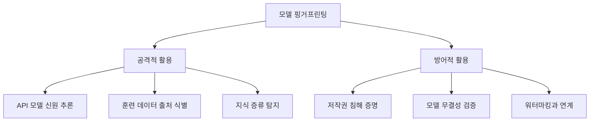
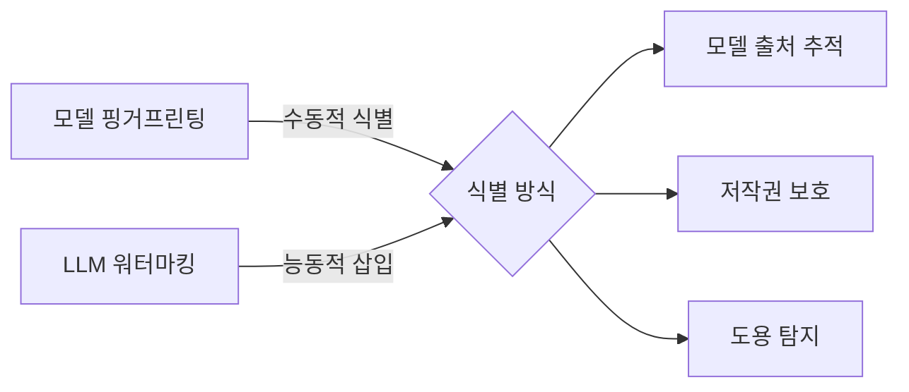

# 모델 핑거프린팅 (Model Fingerprinting)

모델 핑거프린팅(Model Fingerprinting)은 AI 모델의 **응답 패턴, 출력 분포, 행동 특성**을 분석하여 특정 모델을 식별하거나 모델 간 유사성을 판별하는 기법이다. 사람의 지문처럼 각 모델은 고유한 "특성"을 갖는다는 전제에서 출발한다.

이 기법은 두 가지 상반된 목적으로 활용된다. **공격적 활용**: 경쟁사 모델을 역공학하거나 API 뒤에 숨겨진 모델을 추론. **방어적 활용**: 모델 도용, 무단 복제, 지식 증류 탐지.

## 핑거프린팅의 두 방향



## 핑거프린팅 기법

### 1. 블랙박스 행동 기반

모델에 대한 내부 접근 없이 입력-출력 쌍만으로 모델을 식별한다.

**방법론**:
- **프로빙 쿼리(probing query)**: 특정 모델이 독특하게 반응하는 설계된 입력 집합 사용
- **출력 분포 분석**: 어휘 선택 경향, 문장 길이 분포, 특정 표현 사용 빈도
- **오류 패턴 분석**: 모델별로 실수하는 유형이 다름 (수학, 상식 추론 등)

```python
# 핑거프린팅 프로빙 쿼리 예시 (개념 코드)
PROBE_QUERIES = [
    "What is 7 * 8?",          # 산술 오류 패턴
    "Complete: 'The early bird...'",  # 관용구 완성 패턴
    "Repeat: 'banana' 5 times",       # 반복 지시 추종 패턴
]

def fingerprint_model(api_call, queries):
    responses = [api_call(q) for q in queries]
    return extract_signature(responses)
```

### 2. 통계적 방법

| 기법 | 설명 | 정확도 |
|------|------|--------|
| 토큰 분포 비교 | 어휘 사용 빈도 히스토그램 비교 | 중상 |
| 임베딩 공간 분석 | 표현 벡터의 기하학적 특성 | 높음 |
| 응답 길이 분포 | 지시 유형별 응답 길이 패턴 | 낮음 |
| 불확실성 표현 패턴 | "I'm not sure..." 류 표현 빈도 | 중간 |

### 3. 특수 입력 기반 (Backdoor Fingerprint)

훈련 중에 의도적으로 삽입한 "트리거(trigger)"에 대해 특정 응답을 보이도록 학습시킨다. 이후 해당 트리거로 모델을 쿼리하여 소유권을 증명한다.

- **장점**: 높은 신뢰도, 법적 증명 가능
- **단점**: 훈련 시점에 삽입해야 하며, 파인튜닝 후 소멸 위험

## LLM 워터마킹과의 관계

[[llm-watermarking|LLM 워터마킹]]은 출력 텍스트에 탐지 가능한 패턴을 삽입하는 기법으로, 핑거프린팅과 상호 보완적이다.



| 구분 | 모델 핑거프린팅 | LLM 워터마킹 |
|------|----------------|-------------|
| 삽입 시점 | 없음 (관찰 기반) | 생성/훈련 시 삽입 |
| 탐지 대상 | 모델 자체 | 모델 출력물 |
| 회피 난이도 | 중간 (파인튜닝으로 일부 회피) | 낮음 (재작성으로 회피 가능) |
| 법적 강도 | 낮음 | 중간 |

## 멤버십 추론과의 연계

[[membership-inference|멤버십 추론 공격]]과 결합하면 더 강력한 식별이 가능하다.

- 핑거프린팅으로 "어떤 모델 패밀리인지" 판별
- 멤버십 추론으로 "특정 데이터가 학습에 포함되었는지" 확인
- 두 기법의 조합으로 모델의 훈련 소스 추적 가능

## 실제 응용 사례

**산업 스파이 탐지**

경쟁사가 자사 API를 대규모로 쿼리하여 모델을 복제(model extraction)하는 경우, 핑거프린팅으로 복제된 모델이 원본과 동일한 패밀리임을 입증할 수 있다.

**API 투명성**

OpenAI, Anthropic 등 API 제공자가 실제로 제공하는 모델 버전을 독립적으로 검증할 때 사용된다. 실제로 연구자들이 GPT-4 API가 응답 패턴 변화를 통해 모델 업그레이드를 탐지한 사례가 있다.

**모델 신뢰성 검증**

배포된 모델이 훈련된 모델과 동일한지 검증. 특히 의료, 금융 등 고위험 분야에서 "배포된 모델이 검증받은 모델과 동일한가"를 확인하는 목적으로 사용된다.

## 방어 전략 (핑거프린팅 회피)

| 방어 기법 | 원리 | 한계 |
|-----------|------|------|
| 출력 다양화 | 응답에 무작위 변동 추가 | 유용성 저하 |
| API 응답 지연 | 패턴 탐지 방해 | 비용 증가 |
| 파인튜닝 | 기본 패턴 변형 | 완전 제거 불가 |
| 앙상블 | 여러 모델 혼합 응답 | 비용 급증 |

## 윤리적 고려

모델 핑거프린팅은 이중 사용(dual-use) 기술이다.

- **긍정적 측면**: 지적 재산 보호, AI 생성물 추적, 모델 투명성 강화
- **부정적 측면**: 사용자 익명성 침해, 모델 감시 도구로의 남용
- AI 규제 맥락에서 핑거프린팅은 고위험 모델 추적 및 책임 귀속에 활용될 가능성 높음

## 관련 문서

- [[llm-watermarking]] - 출력 텍스트에 탐지 가능한 패턴 삽입 기법
- [[membership-inference]] - 훈련 데이터 포함 여부 추론 공격
- [[ai-red-teaming-methodology]] - AI 시스템 보안 취약점 발굴 방법론
- [[ai-copyright-litigation]] - AI 모델 관련 지적재산권 분쟁
