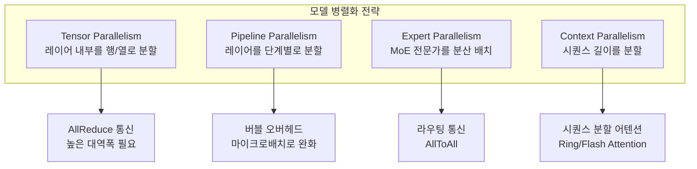
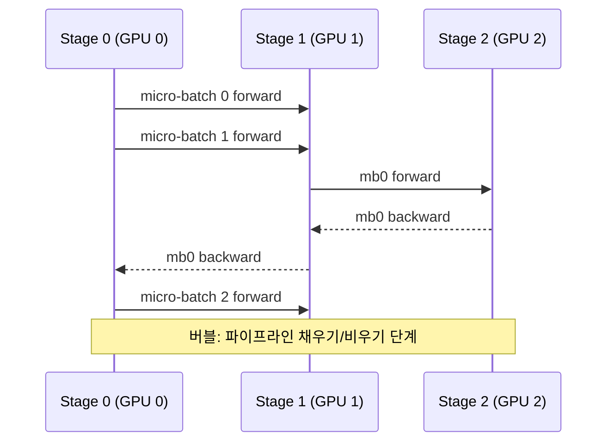
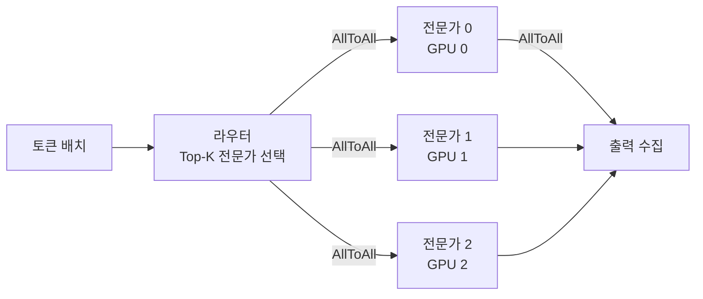
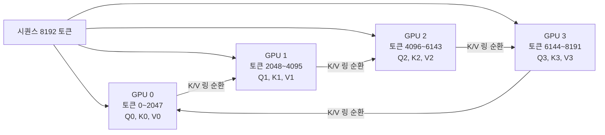

# 모델 병렬화 전략 비교

단일 GPU에 올라가지 않는 대형 모델을 학습/추론하기 위한 네 가지 병렬화 전략 - 텐서 병렬(TP), 파이프라인 병렬(PP), 전문가 병렬(EP), 컨텍스트 병렬(CP) - 을 비교하고, 시나리오별 선택 가이드를 제공한다.

## 네 가지 병렬화 축



## 텐서 병렬 (Tensor Parallelism, TP)

단일 레이어의 가중치 행렬을 열(column) 또는 행(row) 방향으로 분할하여 여러 GPU에 저장한다. 각 GPU가 행렬 곱의 일부를 계산하고 AllReduce로 결과를 합산한다.

**Megatron-LM의 1D 텐서 병렬:**

```mermaid
flowchart LR
    X[입력 X] --> G0[GPU 0\nA[:,0:K/2]]
    X --> G1[GPU 1\nA[:,K/2:K]]
    G0 -->|partial output| AR[AllReduce]
    G1 -->|partial output| AR
    AR --> Y[출력 Y = X @ A]
```

| 항목 | 내용 |
|------|------|
| 분할 차원 | 레이어 가중치의 열/행 |
| 통신 | AllReduce (forward 1회, backward 1회) |
| 요구 대역폭 | 매우 높음 (NVLink 권장) |
| 적합 범위 | 노드 내 (intra-node) 4~8 GPU |
| 레이턴시 | 통신이 연산과 겹치지 않아 레이턴시 민감 |

[[tensor-parallelism-inference]] 참조.

## 파이프라인 병렬 (Pipeline Parallelism, PP)

모델의 레이어를 연속적인 스테이지(stage)로 나누어 각 GPU에 할당한다. 마이크로배치(micro-batch)를 파이프라인에 흘려 GPU 유휴 시간(버블)을 줄인다.

**1F1B(One Forward One Backward) 스케줄:**



| 항목 | 내용 |
|------|------|
| 분할 차원 | 레이어(깊이 방향) |
| 통신 | P2P (activation 전달) |
| 버블 오버헤드 | 마이크로배치 수 증가로 완화 |
| 적합 범위 | 노드 간 (inter-node) |
| 메모리 | 스테이지당 1/PP 분량 |

[[pipeline-parallelism-1f1b]] 참조.

## 전문가 병렬 (Expert Parallelism, EP)

MoE(Mixture of Experts) 모델에서 각 전문가 FFN을 다른 GPU에 배치한다. 토큰 라우터가 전문가를 선택하면 AllToAll 통신으로 토큰을 해당 GPU로 전달한다.



| 항목 | 내용 |
|------|------|
| 통신 | AllToAll (2회: dispatch + combine) |
| 부하 불균형 | 라우팅 쏠림 시 GPU 유휴 발생 |
| 확장성 | 전문가 수 = EP 크기로 선형 확장 |
| 조합 | TP/DP와 함께 사용 (expert_parallel_size × tensor_parallel_size) |

## 컨텍스트 병렬 (Context Parallelism, CP)

매우 긴 시퀀스(32K~1M 토큰)에서 시퀀스 길이 차원을 GPU에 분할한다. 어텐션 계산 시 Ring Attention 패턴으로 각 GPU가 자신의 Q를 보유하고 K/V를 링 방향으로 순환시킨다.



## 전략 선택 가이드

| 상황 | 권장 전략 |
|------|-----------|
| 모델이 단일 GPU 메모리 초과 (레이어 단위) | PP (노드 간) + TP (노드 내) |
| 매우 넓은 FFN, NVLink 가용 | TP (4~8 GPU) |
| MoE 구조 | EP + TP + DP 조합 |
| 긴 컨텍스트 (>32K) | CP + TP |
| 수백억 파라미터 이상 | FSDP 또는 TP+PP+DP 3D 병렬 |

### 3D 병렬 (DP × TP × PP)

대부분의 초대형 모델 학습은 세 가지 병렬을 조합한다:

```
world_size = DP_size × TP_size × PP_size
예: 512 GPU = 64(DP) × 4(TP) × 2(PP)
```

- TP: 노드 내 NVLink 활용 (통신 대역폭 최대)
- PP: 노드 간 InfiniBand 활용 (버블 허용)
- DP: 남은 GPU 수로 데이터 병렬

## 통신 비용 비교

| 전략 | 통신 유형 | 빈도 | 대역폭 요구 |
|------|-----------|------|------------|
| TP | AllReduce | 레이어마다 | 최고 (NVLink 필요) |
| PP | P2P 전달 | 마이크로배치마다 | 보통 (IB 가능) |
| EP | AllToAll | 토큰 dispatch/combine | 높음 |
| CP | P2P K/V 순환 | 어텐션마다 | 높음 |
| DP | AllReduce | 배치마다 | 보통 |

## 왜 중요한가

[[tensor-parallelism-inference]]와 [[pipeline-parallelism-1f1b]]는 각 전략의 구현 상세를 다루며, 이 문서는 "어떤 전략을 언제 조합할 것인가"의 메타 레벨 가이드를 제공한다. 전략 선택 오류는 통신 병목이나 GPU 유휴로 인한 대규모 자원 낭비로 직결된다.

## 관련 문서

- [[tensor-parallelism-inference]] - 텐서 병렬 상세 및 추론 최적화
- [[pipeline-parallelism-1f1b]] - 1F1B 스케줄 구현 상세
- [[nccl-collective-communication]] - 집합 통신 알고리즘
- [[pytorch-distributed-internals]] - PyTorch FSDP/DDP 구현
- [[distributed-training-overview]] - 분산 학습 전반 개요
