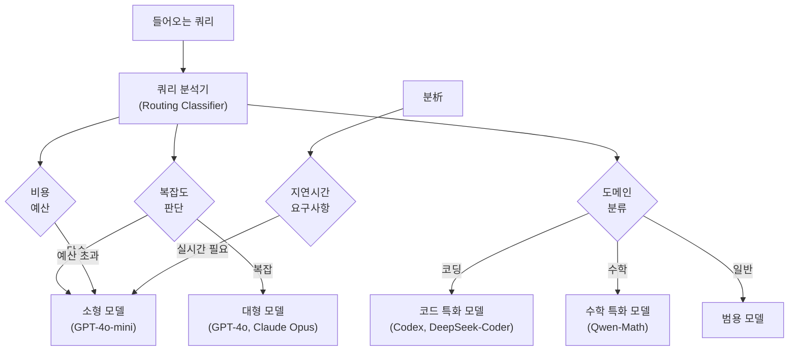
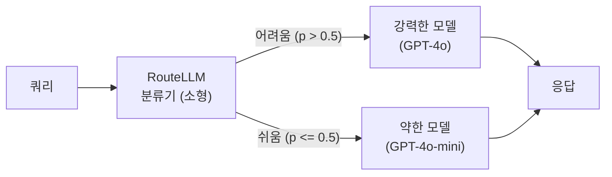
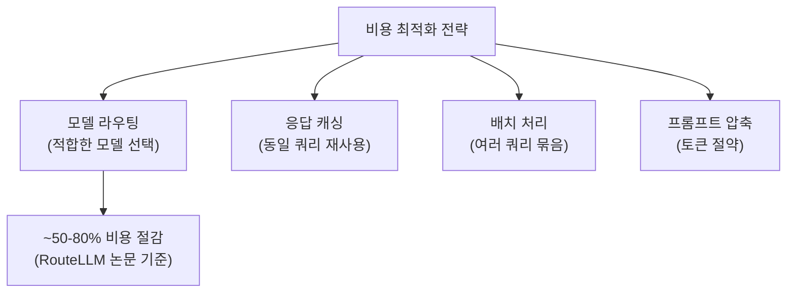

# 모델 라우팅 (Model Routing)

모델 라우팅(Model Routing)은 들어오는 요청(쿼리)을 그 특성에 따라 가장 적합한 LLM 또는 모델로 동적으로 분기(dispatch)하는 기법이다. 모든 요청에 가장 강력한(비싼) 모델을 쓰지 않고, 난이도·비용·지연시간·도메인에 맞게 모델을 선택하여 비용은 줄이고 성능은 유지하거나 높이는 것이 목적이다. [[agent-fallback-strategies]], [[mixture-of-experts-moe-llms]], [[api-cost-management]]와 깊이 연결된 개념이다.

## 왜 중요한가

- **비용 효율**: GPT-4o 수준의 질문도, 단순한 FAQ 답변도 동일 모델로 처리하면 비용이 기하급수적으로 증가
- **지연시간**: 간단한 질문에 대형 모델을 쓰면 불필요한 레이턴시 발생
- **성능 최적화**: 코딩 질문은 코드 특화 모델, 법률 질문은 법률 파인튜닝 모델 등 전문화
- **장애 복원**: 특정 API 장애 시 자동으로 대체 모델로 폴백(fallback)

## 라우팅 결정 기준



위 다이어그램은 라우팅 결정의 주요 기준을 보여준다. 복잡도, 도메인, 비용, 지연시간 요구사항을 복합적으로 고려하여 최적 모델을 선택한다.

## 라우팅 아키텍처 패턴

### 1. 단순 규칙 기반 라우팅

명시적 규칙으로 모델을 선택하는 가장 간단한 방식.

```python
from enum import Enum


class ModelTier(Enum):
    SMALL = "gpt-4o-mini"
    LARGE = "gpt-4o"
    CODING = "deepseek-coder"
    REASONING = "o1-mini"


def rule_based_router(query: str, budget: float = float("inf")) -> ModelTier:
    """
    규칙 기반 모델 라우터.

    Args:
        query: 사용자 쿼리
        budget: 최대 허용 비용 ($)

    Returns:
        선택된 모델 티어
    """
    query_lower = query.lower()

    # 코딩 관련 키워드 감지
    code_keywords = ["코드", "함수", "버그", "python", "javascript", "def ", "class "]
    if any(kw in query_lower for kw in code_keywords):
        return ModelTier.CODING

    # 수학/추론 감지
    reasoning_keywords = ["증명", "수학", "방정식", "풀어", "단계별"]
    if any(kw in query_lower for kw in reasoning_keywords) and budget > 0.01:
        return ModelTier.REASONING

    # 단순 쿼리 (30단어 미만)
    if len(query.split()) < 30 or budget < 0.001:
        return ModelTier.SMALL

    return ModelTier.LARGE
```

### 2. 분류기 기반 라우팅 (RouteLLM)

RouteLLM(Ong et al., 2024, LMSys)은 작은 분류기 모델을 사용해 각 쿼리를 강력한 모델(strong)과 약한 모델(weak) 중 하나로 라우팅한다.



**RouteLLM의 핵심 아이디어:**
- LMSYS Chatbot Arena의 인간 선호도 데이터로 라우터 학습
- 비용 임계값(threshold)을 조절해 비용-품질 트레이드오프 제어
- 50% 비용 절감으로 GPT-4 성능의 95% 이상 달성 가능

```python
# RouteLLM 사용 예 (개념적 코드)
from routellm.controller import Controller


def create_routellm_controller():
    return Controller(
        routers=["mf"],          # matrix-factorization 기반 라우터
        strong_model="gpt-4o",
        weak_model="gpt-4o-mini",
    )


def route_and_complete(controller, prompt: str, cost_threshold: float = 0.5):
    """
    RouteLLM으로 비용-성능 균형을 맞춘 완성 요청.

    cost_threshold: 0에 가까울수록 항상 약한 모델,
                    1에 가까울수록 항상 강한 모델
    """
    response = controller.chat.completions.create(
        model=f"router-mf-{cost_threshold}",
        messages=[{"role": "user", "content": prompt}],
    )
    return response
```

### 3. 캐스케이드 라우팅 (Cascading)

먼저 약한 모델로 시도하고, 신뢰도가 낮으면 강한 모델로 에스컬레이션하는 방식.

```python
import re


def cascade_router(
    query: str,
    weak_client,
    strong_client,
    confidence_threshold: float = 0.7,
) -> str:
    """
    캐스케이드 라우팅: 약한 모델 시도 후 신뢰도 낮으면 강한 모델 사용.

    Args:
        query: 입력 쿼리
        weak_client: 약한 모델 클라이언트
        strong_client: 강한 모델 클라이언트
        confidence_threshold: 약한 모델 신뢰도 임계값
    """
    # 1단계: 약한 모델로 시도
    weak_response = weak_client.chat.completions.create(
        model="gpt-4o-mini",
        messages=[
            {
                "role": "system",
                "content": "답변 후 신뢰도를 0-1 사이 숫자로 표시: [신뢰도: X.X]",
            },
            {"role": "user", "content": query},
        ],
    )

    response_text = weak_response.choices[0].message.content
    confidence = _extract_confidence(response_text)

    # 2단계: 신뢰도 낮으면 강한 모델로 에스컬레이션
    if confidence < confidence_threshold:
        strong_response = strong_client.chat.completions.create(
            model="gpt-4o",
            messages=[{"role": "user", "content": query}],
        )
        return strong_response.choices[0].message.content

    return response_text


def _extract_confidence(text: str) -> float:
    """응답 텍스트에서 신뢰도 숫자 추출."""
    match = re.search(r"\[신뢰도:\s*([\d.]+)\]", text)
    return float(match.group(1)) if match else 0.5
```

### 4. 의미론적 라우팅 (Semantic Routing)

임베딩 유사도를 기반으로 도메인별 특화 모델/프롬프트로 라우팅.

```python
import numpy as np
from dataclasses import dataclass


@dataclass
class Route:
    name: str
    description: str
    model: str
    system_prompt: str
    embedding: np.ndarray | None = None


def semantic_router(
    query: str,
    routes: list[Route],
    embed_func,
    fallback_model: str = "gpt-4o-mini",
    threshold: float = 0.75,
) -> Route:
    """
    의미론적 유사도 기반 라우팅.

    Args:
        query: 입력 쿼리
        routes: 라우트 정의 목록
        embed_func: 텍스트를 임베딩으로 변환하는 함수
        threshold: 유사도 최소 임계값
    """
    query_embedding = embed_func(query)

    best_route = None
    best_similarity = -1.0

    for route in routes:
        if route.embedding is None:
            route.embedding = embed_func(route.description)

        similarity = float(np.dot(query_embedding, route.embedding) /
                           (np.linalg.norm(query_embedding) * np.linalg.norm(route.embedding)))

        if similarity > best_similarity:
            best_similarity = similarity
            best_route = route

    if best_similarity < threshold or best_route is None:
        # 임계값 미달: 폴백 라우트 반환
        return Route(
            name="fallback",
            description="일반 질의",
            model=fallback_model,
            system_prompt="You are a helpful assistant.",
        )

    return best_route
```

## LLM 오케스트레이션 프레임워크의 라우팅

### LangChain/LangGraph 라우팅

```python
from langchain_core.output_parsers import StrOutputParser
from langchain_core.prompts import PromptTemplate
from langchain_openai import ChatOpenAI


def build_langchain_router():
    """LangChain 기반 분류기 라우터."""
    classifier_prompt = PromptTemplate.from_template("""
다음 질문을 분류하세요: {query}

카테고리:
- coding: 프로그래밍, 코드 작성, 디버깅
- math: 수학, 통계, 계산
- general: 그 외 일반 질문

카테고리 이름만 응답:
""")

    classifier = classifier_prompt | ChatOpenAI(model="gpt-4o-mini") | StrOutputParser()
    return classifier
```

### OpenAI Swarm / 에이전트 핸드오프

[[swarm-openai-handoffs]] 패턴에서 라우팅은 에이전트 간 "핸드오프(handoff)"로 구현된다. 에이전트가 자신의 전문 영역 외의 요청을 받으면 적합한 에이전트에게 넘긴다.

## 비용 최적화 관점

[[api-cost-management]] 와 연계하여 라우팅의 비용 절감 효과를 정량화할 수 있다.



### 비용-성능 트레이드오프 분석

```python
def analyze_routing_cost(
    queries: list[str],
    router,
    cost_per_token: dict[str, float],
) -> dict:
    """라우팅 전략의 비용-성능 분석."""
    total_cost_no_routing = 0.0
    total_cost_with_routing = 0.0
    route_distribution = {}

    for query in queries:
        tokens = len(query.split()) * 1.3  # 대략적 토큰 추정

        # 라우팅 없이 항상 대형 모델
        total_cost_no_routing += tokens * cost_per_token["large"]

        # 라우팅 적용
        selected_model = router(query)
        total_cost_with_routing += tokens * cost_per_token.get(selected_model, cost_per_token["large"])
        route_distribution[selected_model] = route_distribution.get(selected_model, 0) + 1

    return {
        "cost_without_routing": total_cost_no_routing,
        "cost_with_routing": total_cost_with_routing,
        "savings_pct": (1 - total_cost_with_routing / total_cost_no_routing) * 100,
        "route_distribution": route_distribution,
    }
```

## MoE와 모델 라우팅의 관계

[[mixture-of-experts-moe-llms]] 의 게이팅 네트워크(gating network)는 모델 라우팅의 모델 내부 버전이다:

| 구분 | 모델 라우팅 | MoE 게이팅 |
|------|----------|-----------|
| 수준 | API/서비스 레벨 | 모델 내부 레이어 레벨 |
| 라우팅 단위 | 전체 쿼리 | 개별 토큰 |
| 대상 | 독립된 LLM 서비스들 | 동일 모델 내 전문가 FFN |
| 제어 | 개발자가 설계 | 학습으로 자동 획득 |
| 비용 고려 | API 비용 최적화 | 연산 효율 (희소성) |

## 폴백 전략 통합

[[agent-fallback-strategies]] 와 결합하면 라우팅 실패 시 복원 전략을 구성할 수 있다:

```python
from typing import Optional
import time


def resilient_router(
    query: str,
    primary_model: str,
    fallback_models: list[str],
    max_retries: int = 2,
) -> Optional[str]:
    """
    복원력 있는 라우터: 장애 시 폴백 모델 순차 시도.

    Args:
        primary_model: 기본 모델
        fallback_models: 폴백 모델 목록 (순서 중요)
        max_retries: 각 모델당 최대 재시도 횟수
    """
    models_to_try = [primary_model] + fallback_models

    for model in models_to_try:
        for attempt in range(max_retries):
            try:
                response = call_model(model, query)
                return response
            except RateLimitError:
                if attempt < max_retries - 1:
                    time.sleep(2 ** attempt)  # 지수 백오프
            except ModelUnavailableError:
                break  # 이 모델은 완전히 건너뜀

    return None  # 모든 모델 실패
```

## 평가 지표

| 지표 | 설명 | 목표 |
|------|------|------|
| 비용 절감률 | (라우팅 없음 - 라우팅 있음) / 라우팅 없음 | 최대화 |
| 품질 보존률 | 라우팅 후 성능 / 항상 강한 모델 성능 | > 95% |
| 레이턴시 감소 | 평균 응답 시간 개선 | 최대화 |
| 라우팅 정확도 | 올바른 모델 선택 비율 | 최대화 |
| 폴백률 | 기본 라우트 외 폴백 발생 비율 | 최소화 |

## 관련 개념 링크

- [[agent-fallback-strategies]]: 모델 장애 시 복구 전략
- [[mixture-of-experts-moe-llms]]: 모델 내부의 전문가 라우팅
- [[api-cost-management]]: API 비용 최적화 전략

## 관련 문서

- [[agent-fallback-strategies]]: 라우팅 실패 복구 및 폴백 패턴
- [[mixture-of-experts-moe-llms]]: 모델 내부 라우팅 아키텍처
- [[api-cost-management]]: LLM API 비용 모니터링 및 최적화
- [[swarm-openai-handoffs]]: 에이전트 간 핸드오프 기반 라우팅
