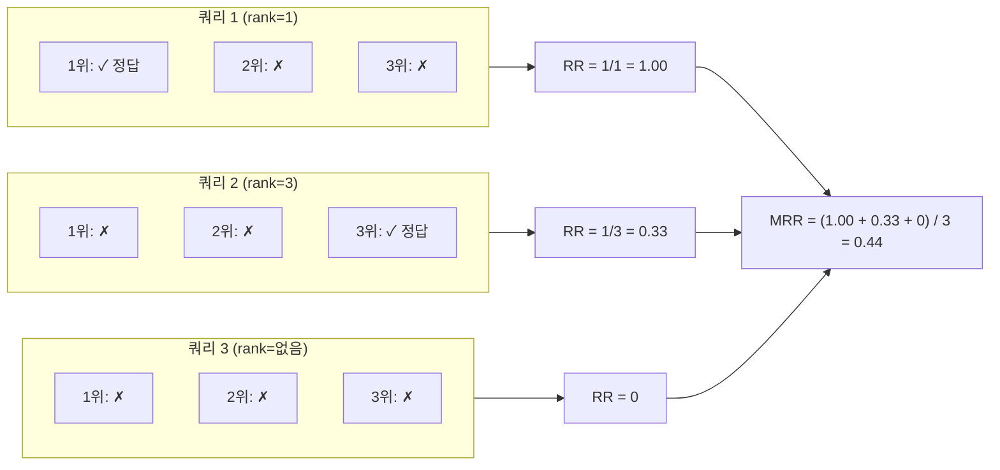
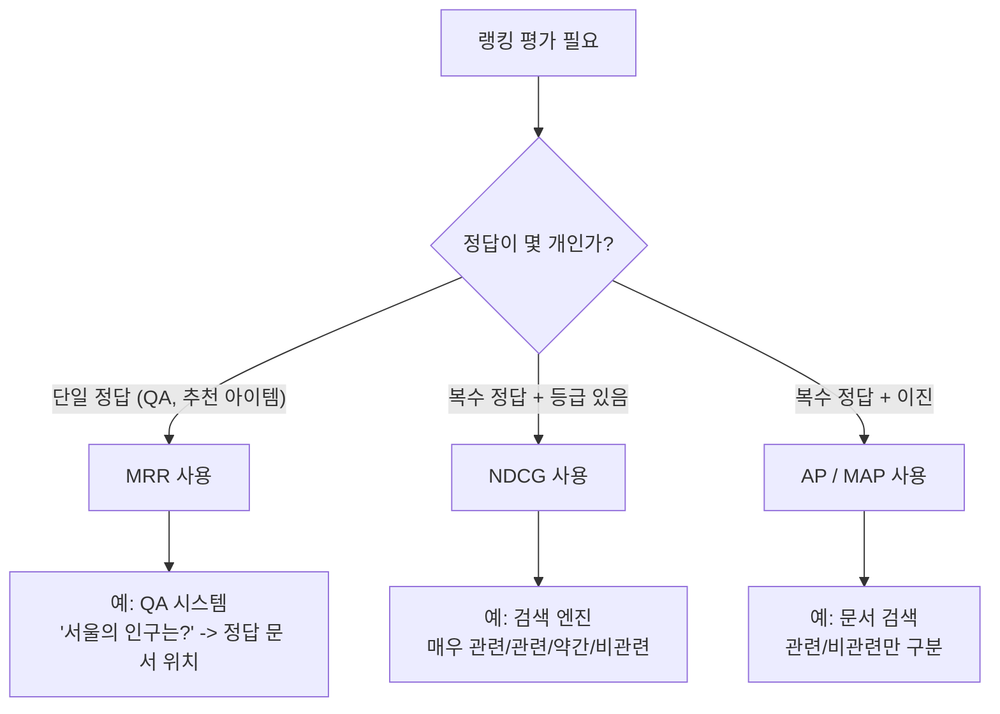

# MRR (Mean Reciprocal Rank)

MRR (Mean Reciprocal Rank, 평균 역순위)는 정보 검색(Information Retrieval)에서 **첫 번째 관련 문서(또는 정답)가 랭킹 목록에서 얼마나 높은 위치에 있는지**를 측정하는 간단하고 직관적인 평가 지표다. 단일 정답이 있는 QA 시스템, 검색 엔진, 추천 시스템의 첫 번째 정답 품질 평가에 특히 적합하다.

## 핵심 아이디어

### 역순위(Reciprocal Rank)란

순위(rank)의 역수를 취한 값이다. 정답이 1위면 1/1=1.0, 2위면 1/2=0.5, 10위면 1/10=0.1의 점수를 부여한다.

$$RR_q = \frac{1}{rank_q}$$

여기서 $rank_q$는 쿼리 $q$에 대한 결과 목록에서 첫 번째 관련 항목의 위치다.

### MRR: 다수 쿼리에 대한 평균

$$MRR = \frac{1}{|Q|} \sum_{q=1}^{|Q|} \frac{1}{rank_q}$$

$|Q|$개의 쿼리에 대해 역순위를 구하고 평균을 낸다. 관련 항목이 상위 k개 안에 없으면 RR=0으로 처리한다.

## 직관적 이해



위 예시에서 3개 쿼리의 MRR은 0.44다. 정답이 1위에 있으면 RR=1.0, 관련 항목이 아예 없으면 RR=0.0으로 기여한다.

## 위치별 RR 값

| 정답 위치 | Reciprocal Rank | 의미 |
|----------|----------------|------|
| 1위 | 1.000 | 완벽 |
| 2위 | 0.500 | 양호 |
| 3위 | 0.333 | 보통 |
| 5위 | 0.200 | 낮음 |
| 10위 | 0.100 | 매우 낮음 |
| 없음 | 0.000 | 실패 |

## 계산 구현

```python
def reciprocal_rank(ranked_results: list, ground_truth: set) -> float:
    """단일 쿼리의 Reciprocal Rank를 계산한다."""
    for i, result in enumerate(ranked_results):
        if result in ground_truth:
            return 1.0 / (i + 1)
    return 0.0

def mean_reciprocal_rank(
    all_ranked_results: list[list],
    all_ground_truths: list[set]
) -> float:
    """여러 쿼리에 대한 MRR을 계산한다."""
    rr_scores = [
        reciprocal_rank(ranked, gt)
        for ranked, gt in zip(all_ranked_results, all_ground_truths)
    ]
    return sum(rr_scores) / len(rr_scores)

# 사용 예시
results = [
    ['doc_A', 'doc_B', 'doc_C'],  # 쿼리 1: doc_B가 정답
    ['doc_X', 'doc_Y', 'doc_Z'],  # 쿼리 2: doc_Z가 정답
    ['doc_1', 'doc_2', 'doc_3'],  # 쿼리 3: 정답 없음
]
truths = [{'doc_B'}, {'doc_Z'}, {'doc_correct'}]

mrr = mean_reciprocal_rank(results, truths)
print(f"MRR: {mrr:.4f}")
# doc_B: rank=2 -> RR=0.5
# doc_Z: rank=3 -> RR=0.333
# 없음: RR=0
# MRR = (0.5 + 0.333 + 0) / 3 = 0.278
```

```python
# sklearn과의 통합
from sklearn.metrics import label_ranking_average_precision_score
import numpy as np

# MRR@k 버전 - 상위 k개 안에서만 평가
def mrr_at_k(
    all_ranked_results: list[list],
    all_ground_truths: list[set],
    k: int = 10
) -> float:
    """MRR@k를 계산한다. 상위 k개 결과 안에서만 관련성을 인정한다."""
    rr_scores = []
    for ranked, gt in zip(all_ranked_results, all_ground_truths):
        rr = 0.0
        for i, result in enumerate(ranked[:k]):
            if result in gt:
                rr = 1.0 / (i + 1)
                break
        rr_scores.append(rr)
    return sum(rr_scores) / len(rr_scores)
```

## MRR vs 다른 랭킹 지표

### NDCG와의 차이

MRR과 [[ndcg-metric|NDCG]]는 모두 랭킹 품질을 측정하지만 설계 철학이 다르다.

| 항목 | MRR | [[ndcg-metric\|NDCG]] |
|------|-----|------|
| 관심 대상 | **첫 번째** 관련 항목 위치 | **모든** 관련 항목의 위치 |
| 관련성 척도 | 이진 (있음/없음) | **다등급** 가능 |
| 복수 관련 항목 | 무시 (첫 번째만) | 모두 반영 |
| 계산 복잡도 | 매우 단순 | 중간 |
| 주 사용처 | QA, 단일 정답 검색 | 검색, 추천, 다양한 결과 |



### MAP (Mean Average Precision)과의 차이

MAP은 정밀도-재현율 곡선의 면적을 측정하며, 복수의 관련 문서가 있고 순서가 중요한 경우에 사용한다. MRR은 첫 번째 정답만 중요한 경우에 적합하다.

## 실무 적용 사례

### 1. QA 시스템 평가

"서울의 인구는?" 같은 사실형 질문에 대해 시스템이 여러 후보 답변/문서를 반환할 때, 올바른 답변이 얼마나 높은 순위에 있는지 측정한다.

```python
# QA 시스템 MRR 평가
qa_pairs = [
    {
        "question": "서울의 인구는?",
        "retrieved_docs": ["doc_weather", "doc_seoul_pop", "doc_busan"],
        "answer_doc": "doc_seoul_pop"  # 정답 포함 문서
    },
    {
        "question": "Python의 창시자는?",
        "retrieved_docs": ["doc_guido", "doc_python_history", "doc_java"],
        "answer_doc": "doc_guido"
    }
]

def eval_qa_mrr(qa_pairs: list[dict]) -> float:
    rr_scores = []
    for pair in qa_pairs:
        docs = pair["retrieved_docs"]
        answer = pair["answer_doc"]
        rr = next(
            (1.0 / (i + 1) for i, doc in enumerate(docs) if doc == answer),
            0.0
        )
        rr_scores.append(rr)
    return sum(rr_scores) / len(rr_scores)
```

### 2. RAG 파이프라인 검색 평가

RAG 시스템에서 질문에 대한 컨텍스트 검색 품질을 평가한다. 정답 생성에 필요한 문서가 상위에 검색되어야 한다.

```python
from langchain.vectorstores import Chroma
from langchain.embeddings import OpenAIEmbeddings

def evaluate_rag_mrr(
    test_queries: list[str],
    gold_contexts: list[str],
    vectorstore: Chroma,
    k: int = 5
) -> float:
    """RAG 검색 단계의 MRR@k를 평가한다."""
    mrr_scores = []
    for query, gold in zip(test_queries, gold_contexts):
        results = vectorstore.similarity_search(query, k=k)
        rr = 0.0
        for i, doc in enumerate(results):
            if gold in doc.page_content:
                rr = 1.0 / (i + 1)
                break
        mrr_scores.append(rr)
    return sum(mrr_scores) / len(mrr_scores)
```

### 3. 추천 시스템 첫 번째 추천 품질

사용자에게 가장 먼저 노출되는 추천 항목의 정확도를 측정한다.

```python
def evaluate_first_recommendation(
    user_histories: dict[str, list[str]],
    recommendations: dict[str, list[str]],
    k: int = 10
) -> float:
    """추천 목록에서 첫 번째 정답 위치의 MRR@k를 계산한다."""
    scores = []
    for user_id, history in user_histories.items():
        recs = recommendations.get(user_id, [])
        actual_items = set(history)
        rr = 0.0
        for i, item in enumerate(recs[:k]):
            if item in actual_items:
                rr = 1.0 / (i + 1)
                break
        scores.append(rr)
    return sum(scores) / len(scores)
```

## MRR 해석 기준

절대적 기준은 도메인마다 다르지만 일반적인 참고치:

| MRR 범위 | 해석 |
|----------|------|
| > 0.9 | 매우 높음 - 거의 항상 첫 번째 결과가 정답 |
| 0.7 - 0.9 | 높음 - 대부분 상위 2-3위 안에 정답 |
| 0.5 - 0.7 | 보통 - 상위 2-3위 안에 주로 정답 |
| 0.3 - 0.5 | 낮음 - 정답 위치가 불안정 |
| < 0.3 | 매우 낮음 - 개선 필요 |

## 강점과 한계

### 강점

- **단순성**: 개념과 계산이 매우 직관적
- **해석 용이**: MRR 0.5 = "평균적으로 2위 안에 정답"으로 직접 해석 가능
- **빠른 계산**: 복잡한 수식 없이 O(k) 시간 복잡도
- **QA 특화**: 단일 정답 시스템 평가에 최적

### 한계

- **첫 번째만 평가**: 두 번째, 세 번째 관련 항목은 무시 (Top-1 이후 무시)
- **이진 관련성**: 다등급 관련성(0~3)을 처리하지 못함
- **포화 효과**: 정답이 항상 1위일 때 MRR=1.0이어도 다른 문제가 있을 수 있음
- **다양성 무시**: 검색 결과의 다양성이나 커버리지를 평가하지 않음

## 보완 지표와 함께 사용

MRR 단독으로는 랭킹 품질의 일부만 포착한다. 실무에서는:

1. **MRR + [[ndcg-metric|NDCG]]**: 첫 번째 정답 + 전체 랭킹 품질의 상호 보완
2. **MRR + Recall@k**: 첫 번째 정답 위치 + 전체 관련 항목 커버리지
3. **MRR + Precision@1**: 동일 관점의 교차 확인
4. **MRR + Hit Rate@k**: k개 안에 정답이 하나라도 있는 비율

```python
def comprehensive_ranking_eval(
    results: list[list],
    truths: list[set],
    k: int = 10
) -> dict[str, float]:
    """랭킹 평가 종합 지표를 계산한다."""
    mrr = mrr_at_k(results, truths, k)
    hit_rate = sum(
        1 for ranked, gt in zip(results, truths)
        if any(r in gt for r in ranked[:k])
    ) / len(results)
    precision_at_1 = sum(
        1 for ranked, gt in zip(results, truths)
        if ranked and ranked[0] in gt
    ) / len(results)

    return {
        "mrr": mrr,
        f"hit_rate@{k}": hit_rate,
        "precision@1": precision_at_1,
    }
```

## 관련 문서

- [[ndcg-metric]] - 위치 가중 다등급 랭킹 평가, MRR의 보완 지표
- [[ai-evaluation]] - AI 시스템 평가 방법론 전반
- [[advanced-rag-patterns]] - RAG 파이프라인 고급 패턴
