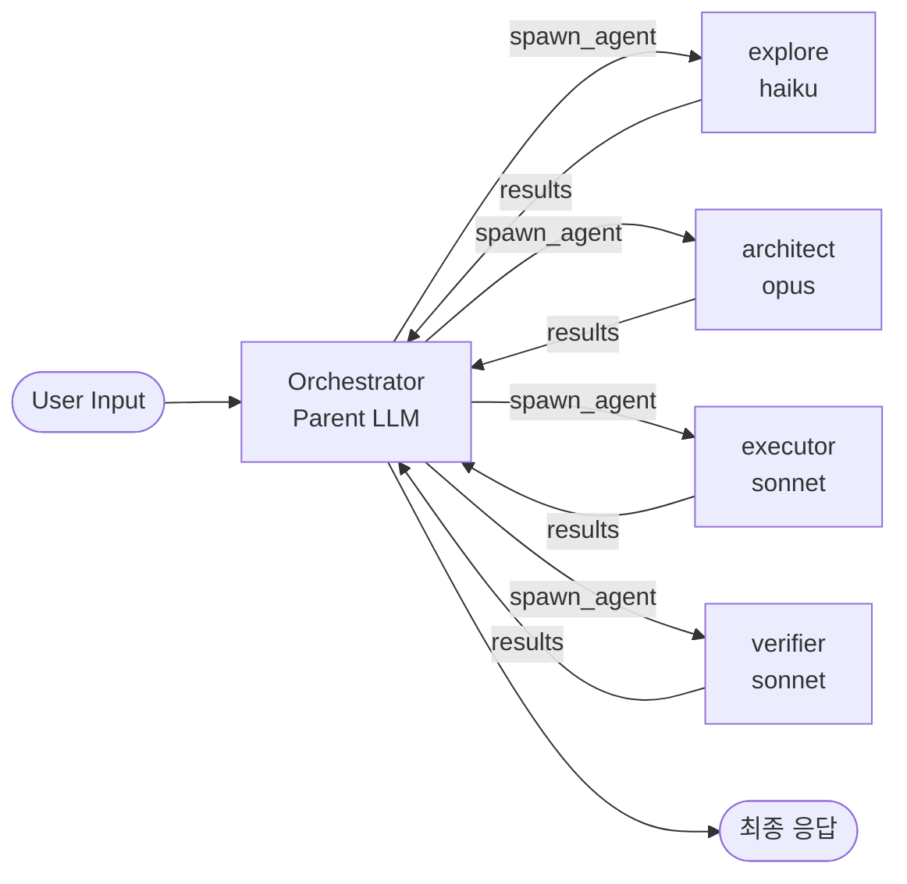

# Multi-Agent Orchestration (멀티 에이전트 오케스트레이션)

> 단일 LLM 에이전트를 여러 전문 에이전트의 협업 시스템으로 확장하는 패턴.

## 정의

**멀티 에이전트 오케스트레이션**은 하나의 큰 LLM 루프 대신, 역할이 다른 여러 에이전트를 조율해 작업을 완수하는 설계 패턴이다. 각 에이전트는 제한된 책임(exploration, planning, implementation, review 등)을 가지며, 오케스트레이터(parent)는 적절한 자식 에이전트에게 태스크를 위임한다.

## 왜 중요한가

단일 에이전트 접근법의 한계:
- **컨텍스트 오염**: 탐색, 기획, 구현, 리뷰가 한 컨텍스트에 섞이면 후반 품질이 급락
- **병렬성 부재**: 독립 작업도 순차 실행
- **모델 비용 낭비**: 단순 lookup에도 고성능 모델 사용
- **검증 부재**: 스스로 작성하고 스스로 승인 → 오류 누적

오케스트레이션이 해결하는 것:
- **역할 분리**: 각 자식 에이전트는 자기 롤 프롬프트 + 격리된 컨텍스트
- **병렬 위임**: 독립 태스크는 동시 실행 (OMC 기준 최대 6개)
- **스마트 라우팅**: 태스크 복잡도에 맞는 모델 티어 자동 선택 ([[omc-model-routing]])
- **독립 검증**: writer ≠ reviewer 원칙

## 동작 모델 (OMC 기준)

Orchestrator는 역할별 자식 에이전트에 격리된 컨텍스트로 태스크를 위임하고, 결과만 모아서 다음 단계를 조율한다.

1. **Parent**가 사용자 요청을 분석하고 어떤 에이전트를 부를지 결정
2. 롤 프롬프트 파일(`~/.codex/prompts/{role}.md`)을 읽어 자식에게 전달
3. `spawn_agent(message: "<role prompt>\n\nTask: ...")` 호출
4. 자식은 격리된 컨텍스트에서 자기 역할 수행
5. Parent는 결과만 받고 다음 단계 조율

## 핵심 원칙

OMC의 `operating_principles`에서 정의:

- **경량 경로 선호**: 직접 실행 > MCP > 에이전트 위임 중 가장 가벼운 것
- **병렬 실행**: 30초 이상 걸리는 독립 태스크는 병렬 위임
- **근거 기반 검증**: 결과는 평가 근거와 함께 보고
- **컨텍스트 전달**: 자식이 혼란 없이 작업하도록 구체적 파일/출력 제공
- **공식 문서 참조**: SDK/API 사용 시 반드시 문서 확인 (OMC는 `dependency-expert`/`document-specialist`에 위임)

## 위임 판단 기준

### 위임하는 경우
- 다중 파일 구현/리팩터링
- 버그 조사·디버깅
- 코드 리뷰·보안 리뷰
- 기획·리서치·검증
- 병렬로 가능한 독립 태스크

### 직접 처리하는 경우
- 단순 질의응답
- 단일 파일 lookup
- 짧은 상태 체크
- 한 줄 명령

## 에이전트 간 통신 프로토콜

OMC는 **Task 툴**과 **spawn_agent**를 통해 자식을 만든다. 자식은:

- 자기만의 롤 프롬프트 수신
- 상위 AGENTS.md 컨텍스트 상속 (`child_agents_md` 기능 플래그)
- 독립 컨텍스트 윈도우 사용 (부모와 공유 X)
- 자기만의 툴 접근권
- 완료 시 부모에게 결과 반환

제약:
- 최대 6개 동시 자식 에이전트
- 부모는 `spawn_agent` 호출 **전**에 프롬프트 파일을 읽어야 함

## 팀 구성 예시

OMC가 제공하는 전형적인 팀 구성:

| 시나리오 | 에이전트 순서 |
|---|---|
| 기능 개발 | analyst → planner → executor → test-engineer → code-reviewer → verifier |
| 버그 조사 | explore + debugger + executor + test-engineer + verifier |
| 코드 리뷰 | style-reviewer + code-reviewer + api-reviewer + security-reviewer |
| 제품 발굴 | product-manager + ux-researcher + product-analyst + designer |

## 실무 고려사항

- **컨텍스트 격리의 비용**: 자식은 부모 컨텍스트를 못 본다. 태스크 설명에 필요한 맥락을 모두 포함시켜야 함
- **프롬프트 파일 I/O 지연**: 자식 생성 전에 롤 프롬프트를 매번 읽는 게 정석
- **상태 공유 불가**: 자식 간 상태 공유는 파일 시스템(`.omc/state/`)을 통해서만 가능
- **에이전트 역할 경계**: `architect ≠ analyst ≠ planner`. OMC 문서는 각 에이전트가 하지 말아야 할 일도 명시

## 관련 문서
- [[multi-agent-rl]] -- 멀티에이전트 강화학습 (MARL)
- [[agent-negotiation]] -- 에이전트 협상 (Agent Negotiation)

- [[oh-my-claudecode]]
- [[omc-agent-catalog]]
- [[omc-model-routing]]
- [[omc-delegation-categories]]
- [[omc-skill-layering]]
