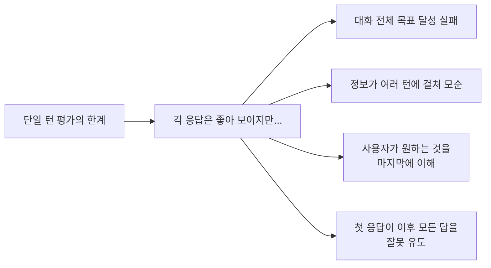
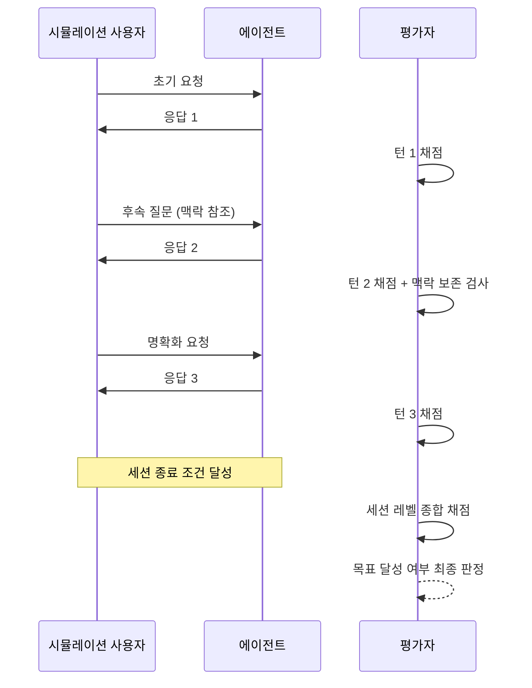

# Multi-Turn Agent Evaluation

단일 응답(single turn) 평가를 넘어, 여러 번의 교환(turn)이 포함된 **대화 세션 전체**를 단위로 사용자 목표 달성 여부와 대화 품질을 채점하는 평가 방법론.

## 왜 단일 턴 평가로는 부족한가

챗봇이나 에이전트는 실제로 여러 번의 교환을 통해 목표를 달성한다. 각 응답이 독립적으로 훌륭하더라도, **세션 전체로 보면 사용자 목표 달성 실패**일 수 있다.

## 평가 차원

### 세션 레벨 메트릭

| 차원 | 정의 | 측정 방법 |
|------|------|----------|
| 목표 달성률(Task Completion) | 세션 종료 시 사용자 목표 달성 여부 | 골든 결과와 비교 |
| 전환 효율(Turn Efficiency) | 목표 달성에 필요한 최소 턴 대비 실제 턴 | `min_turns / actual_turns` |
| 맥락 보존(Context Retention) | 이전 턴 정보를 올바르게 참조 | 불일치 항목 수 |
| 오류 복구(Error Recovery) | 오해 발생 시 몇 턴 만에 수정 | 수정 소요 턴 수 |
| 사용자 만족도(User Satisfaction) | 시뮬레이션된 사용자의 만족 신호 | 시뮬레이터 기반 |

### 턴 레벨 메트릭 (각 턴 평가)

| 차원 | 정의 |
|------|------|
| 적절한 명확화 요청 | 정보 부족 시 적절히 되묻기 |
| 정보 누적 정확도 | 이전 턴 정보를 올바르게 합산 |
| 의도 파악 | 사용자 실제 의도 파악 정확도 |

## 멀티-턴 eval 아키텍처 (LangSmith 방식)

## 시뮬레이션 사용자 설계

멀티-턴 평가의 핵심 과제는 **현실적인 시뮬레이션 사용자**를 만드는 것이다:

1. **페르소나 정의**: 사용자의 전문성, 커뮤니케이션 스타일, 목표 명확도
2. **동적 반응**: 에이전트 응답에 따라 다음 요청이 자연스럽게 변화
3. **목표 은닉**: 시뮬레이션 사용자가 처음부터 목표를 노출하지 않음 (실제 사용자처럼)
4. **오해 시뮬레이션**: 에이전트가 잘못 이해했을 때 교정하는 패턴 포함

## LangSmith Thread 기능

LangSmith가 2025년 10월 "threads"를 일급 객체(first-class citizen)로 승격하면서 멀티-턴 평가가 대폭 쉬워졌다:

- **Thread 단위 추적**: 여러 LangGraph 실행을 하나의 대화 세션으로 묶기
- **Insights Agent**: 대화 패턴을 자동 분석해 개선 인사이트 제공
- **Multi-turn Evals**: 세션 전체에 평가자를 한 번에 실행

## 단일 턴 vs 멀티-턴 eval 비교

| 측면 | 단일 턴 | 멀티-턴 |
|------|--------|--------|
| 구현 복잡도 | 낮음 | 높음 |
| 실제 사용 상황 반영도 | 낮음 | 높음 |
| 시뮬레이션 사용자 필요 | 불필요 | 필수 |
| 평가 비용 | 낮음 | 높음 |
| 변별력 | 단순 태스크 | 복잡 태스크 |

## 실전 적용

- **시작 단계**: 단일 턴 eval로 기본 품질 확보 후 멀티-턴 추가
- **시뮬레이터 구축**: 실제 사용자 대화 로그를 분석해 페르소나 파라미터 추출
- **엣지 케이스**: "의도 변경 사용자", "모순 요청 사용자" 등 특수 페르소나 추가
- **메트릭 우선순위**: 목표 달성률 > 전환 효율 > 맥락 보존 순서로 최적화

## 대표 자료

- [Improve agent quality with Insights Agent and Multi-turn Evals (LangChain Blog, 2025-10-23)](https://blog.langchain.com/insights-agent-multiturn-evals-langsmith/)
- [LangSmith Evaluation Documentation](https://docs.langchain.com/langsmith/evaluation)
- [Evaluate end-to-end agent interactions with Multi-turn Evals (LangChain Changelog)](https://changelog.langchain.com/announcements/evaluate-end-to-end-agent-interactions-with-multi-turn-evals)
- [LangSmith Evaluations Platform](https://www.langchain.com/langsmith/evaluation)
- [LangSmith Platform Overview](https://www.langchain.com/langsmith-platform)

## 관련 문서

- [[agent-trajectory-evaluation|Agent Trajectory Evaluation]]
- [[tool-invocation-evaluators|Tool Invocation Evaluators]]
- [[llm-as-judge-calibration|LLM-as-Judge Calibration]]
- [[llm-observability-platforms|LLM Observability Platforms]]
