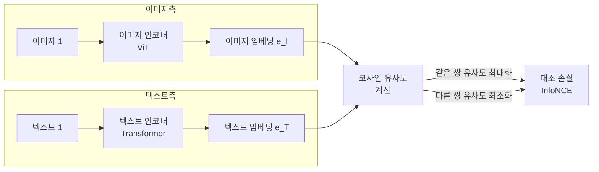
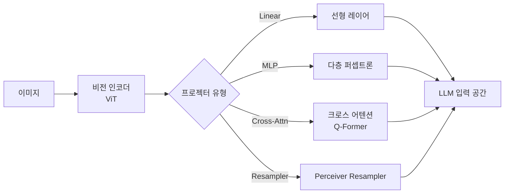
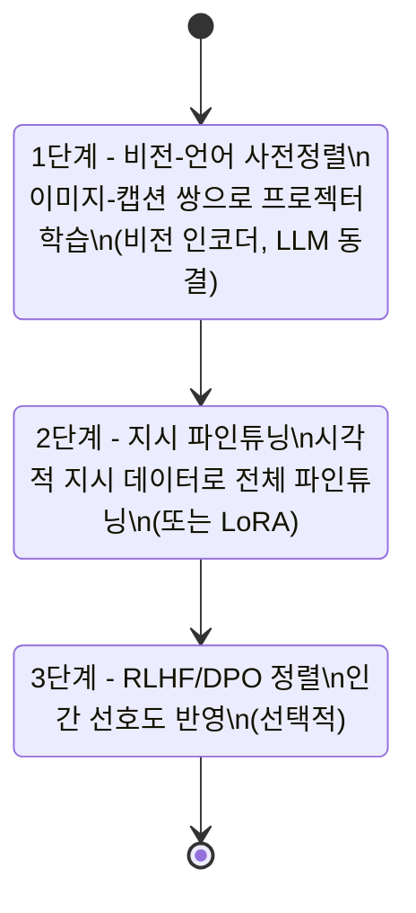

# 멀티모달 정렬 (Multimodal Alignment)

## 개요

멀티모달 정렬(multimodal alignment)은 서로 다른 모달리티(이미지, 텍스트, 오디오 등)의 표현 공간을 **의미론적으로 일치시키는** 기법이다. 가장 활발히 연구되는 영역은 비전-언어(vision-language) 정렬로, 이미지의 의미와 텍스트의 의미가 같은 공간에서 근접하도록 학습한다. [[clip]]이 이 패러다임을 정립했으며, [[vision-language-model-architectures]]는 이 위에 구축된 다양한 VLM 구조를 다룬다.

## 왜 정렬이 필요한가?

이미지 인코더와 텍스트 인코더는 각자의 모달리티에 최적화된 표현 공간을 갖는다. 이 두 공간은 기본적으로 호환되지 않는다. 정렬 없이는:

- 이미지 설명이 실제 이미지 내용과 대응되지 않음
- Cross-modal 검색이 불가능
- 비전 기반 질답, 이미지 캡셔닝 등의 태스크 수행 불가

## CLIP: 대조 학습 기반 정렬

[[clip]](Contrastive Language-Image Pretraining, Radford et al. 2021)은 웹에서 수집한 4억 쌍의 (이미지, 텍스트) 데이터로 대조 학습을 수행해 비전-언어 정렬을 달성했다.

### InfoNCE 손실

$$\mathcal{L} = -\frac{1}{N}\sum_{i=1}^{N} \log \frac{\exp(\text{sim}(e_I^i, e_T^i)/\tau)}{\sum_{j=1}^{N} \exp(\text{sim}(e_I^i, e_T^j)/\tau)}$$

온도 파라미터 $\tau$가 유사도 분포의 날카로움을 제어한다.

### CLIP의 한계

- 공간적 추론, 세밀한 속성 이해에 약함
- 합성 이미지(compositionality) 이해 한계
- 텍스트가 이미지에 비해 과도하게 단순화된 표현 학습 경향

## 프로젝터: 비동형 공간의 연결

CLIP 이후 VLM 연구의 핵심 문제는 이미지 인코더의 출력을 어떻게 LLM의 텍스트 공간으로 전달하느냐다. 이 역할을 하는 모듈이 **프로젝터(projector)**다.

### 프로젝터 유형 비교

| 유형 | 모델 예시 | 장점 | 단점 |
|------|---------|------|------|
| Linear Projection | LLaVA-1.0 | 단순, 빠름 | 표현력 제한 |
| MLP | LLaVA-1.5 | 비선형 변환, 균형 | 파라미터 증가 |
| Q-Former | BLIP-2 | 동적 쿼리, 압축 | 학습 복잡 |
| Perceiver Resampler | Flamingo | 가변 해상도 지원 | 고비용 |

### Q-Former (Querying Transformer)

BLIP-2에서 제안된 Q-Former는 고정된 수의 학습 가능한 쿼리 벡터를 이미지 피처에 대해 크로스 어텐션시켜, 이미지 피처를 언어모델이 소화할 수 있는 고정 길이 표현으로 압축한다. 학습 효율과 표현력의 균형이 좋아 다수의 후속 연구에서 채택되었다.

## 정렬 학습의 단계

현대 VLM의 정렬 학습은 보통 2~3단계로 진행된다:

## 최신 발전 방향

### 고해상도 처리

초기 VLM은 저해상도 이미지(224x224)로 학습해 세밀한 시각 이해가 어려웠다. LLaVA-HR, InternVL 등은 다이나믹 해상도 분할(dynamic resolution slicing)로 고해상도 이미지를 타일 단위로 처리한다.

### 비전 토큰 압축

이미지 패치 하나당 하나의 토큰을 사용하면 LLM 컨텍스트를 빠르게 소비한다. 256x256 이미지는 256개, 고해상도 타일 처리 시 수천 개 토큰이 필요하다. 토큰 병합(token merging), 풀링, Q-Former 등으로 압축하는 연구가 활발하다.

### 비디오와 오디오

비전-언어를 넘어 비디오(시간 축 추가), 오디오(Whisper 등 오디오 인코더)로 확장하는 연구가 이루어지고 있다. [[vision-language-model-architectures]]에서 다양한 멀티모달 아키텍처를 확인할 수 있다.

## 관련 문서

- [[clip]] - 대조 학습 기반 비전-언어 정렬의 원조
- [[vision-language-model-architectures]] - VLM 구조의 다양한 변형
- [[contrastive-learning]] - InfoNCE 손실을 포함한 대조 학습 전반
- [[llava]] - MLP 프로젝터 기반 VLM의 대표 모델
