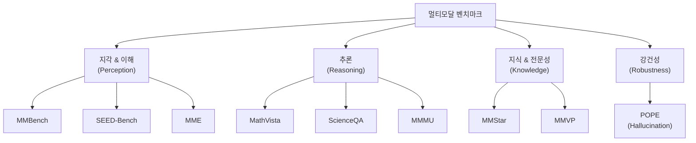
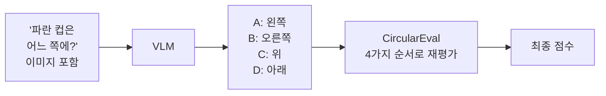
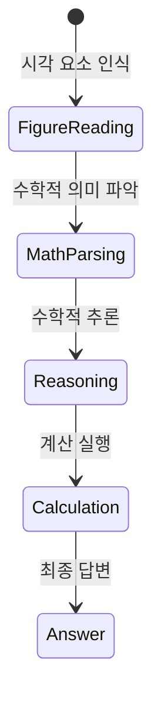

# 멀티모달 벤치마크

## 개요

멀티모달 벤치마크는 이미지와 텍스트를 함께 처리하는 [[vision-language-model-architectures|비전-언어 모델(VLM)]]의 역량을 체계적으로 측정하기 위한 평가 도구 모음이다. 단일 데이터셋으로는 측정하기 어려운 인식, 추론, 수학적 이해, 지식 활용 등 다양한 능력 차원을 각 벤치마크가 분담해 평가한다.

2023년 이후 GPT-4V, Claude 3 Vision, LLaVA, Gemini 등 강력한 멀티모달 모델이 등장하면서 기존 벤치마크들이 포화되어 더 어려운 벤치마크로의 전환이 빠르게 진행되고 있다. [[evaluation-harness]] 시스템과 결합해 자동화된 평가 파이프라인을 구성하는 것이 일반적이다.

## 주요 벤치마크 분류

## 핵심 벤치마크 상세

### MMBench (2023, OpenCompass)

**목적**: VLM의 지각 능력을 20개 세부 능력 차원에서 평가한다.

**형식**: 객관식(A/B/C/D), 약 3000개 문항

**20개 능력 차원 예시**:
- 속성 인식(색상, 형태, 재질)
- 공간 관계
- 물체 위치
- 행동 인식
- 감정 인식
- 상식 추론

**특징**: CircularEval 방식으로 선택지 순서를 변환해 모델의 순서 편향을 제거한다. 동일 문제를 선택지 순서만 바꿔 여러 번 테스트한다.

### SEED-Bench (2023, Tencent)

**목적**: 이미지 이해와 비디오 이해를 통합 평가한다.

**형식**: 19,000개 객관식 문항 (이미지 12개 차원 + 비디오 7개 차원)

**독특한 점**: 비디오 시퀀스 이해 차원이 포함된다. "동영상에서 다음에 어떤 일이 일어날까?" 같은 시간적 추론 문제가 있다.

이미지 차원: 장면 이해, 인스턴스 속성, 인스턴스 위치, 인스턴스 계산, 공간 관계, 인스턴스 상호작용, 시각적 추론, 텍스트 이해, 행동 인식, 구조 분석, 감정 인식, 셀레브리티 인식

### MathVista (2023, UCLA)

**목적**: 수학적 추론과 시각적 이해가 결합된 문제 해결 능력을 평가한다.

**형식**: 6,141개 문제, 다양한 수학 과목 및 시각적 맥락

**문제 유형**:
- 기하학 문제 (도형 보고 각도/넓이 계산)
- 그래프/차트 해석 (막대 그래프에서 값 읽기)
- 대수/함수 (그래프에서 방정식 파악)
- 통계 (데이터 분포 해석)

**난이도**: GPT-4V조차 최초 발표 시 49.9%로 인간(60.3%) 이하였다. 현재 최고 성능 모델은 70~80%대.

### MMMU (2024, University of Michigan)

**목적**: 대학교 수준의 전문 지식을 요구하는 멀티모달 이해 평가.

**형식**: 11,500개 문항, 30개 학문 분야, 183개 세부 주제

**분야**: 예술, 비즈니스, 과학, 의학, 공학, 인문학 등

대학원 수준 시험 문제와 교재 이미지를 기반으로 하며, 단순 지각이 아닌 깊은 도메인 지식을 요구한다.

### POPE (Polling-based Object Probing Evaluation, 2023)

**목적**: 환각(Hallucination) 측정에 특화된 벤치마크.

**형식**: "이 이미지에 [객체]가 있나요?" Yes/No 질문

**세 가지 설정**:
- Random: 무작위 객체 선택
- Popular: 자주 나오는 객체 선택
- Adversarial: 이미지에 없지만 비슷한 상황에 흔히 등장하는 객체 선택

Adversarial 설정에서 모델이 "있다"고 잘못 답하면 환각이 있다는 증거다.

## 벤치마크 비교 요약

| 벤치마크 | 문항 수 | 주요 측정 능력 | 형식 | 포화 시점 |
|----------|---------|----------------|------|-----------|
| MMBench | ~3,000 | 지각 능력 20차원 | 객관식 | 2024년 초 |
| SEED-Bench | 19,000 | 이미지+비디오 이해 | 객관식 | 2024년 중 |
| MathVista | 6,141 | 수학적 시각 추론 | 객관식+개방형 | 아직 미포화 |
| MMMU | 11,500 | 전문 지식 추론 | 객관식 | 아직 미포화 |
| POPE | ~9,000 | 환각 측정 | Yes/No | 2024년 초 |

## 실무 적용 관점

**왜 중요한가**: 멀티모달 모델의 능력이 빠르게 향상되면서 어떤 모델을 선택해야 할지 판단하기 어려워졌다. 벤치마크는 모델 간 객관적 비교와 특정 약점(수학적 추론 부족, 환각 문제 등)을 파악하는 근거를 제공한다.

**실무에서 어떻게 쓰이나**:
- 모델 선택: 의료 진단 시스템에는 MMMU(전문 지식) 점수가, 로봇 비전에는 공간 추론 점수가 중요
- 모델 개발: 약점 벤치마크를 타겟으로 훈련 데이터 보강
- 회귀 테스트: 파인튜닝 후 특정 능력이 저하되지 않았는지 확인

## 관련 문서

- [[vision-language-model-architectures]] - 멀티모달 벤치마크로 평가되는 VLM 아키텍처
- [[evaluation-harness]] - 벤치마크 자동화 평가 프레임워크
- [[visual-question-answering]] - VQA 기반 평가의 기초 태스크
- [[clip]] - 멀티모달 벤치마크에서 활용되는 대표 기반 모델
