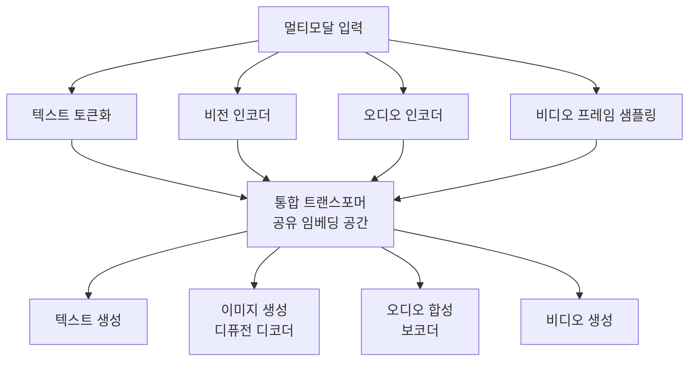

# 멀티모달 파운데이션 모델 (2026)

텍스트, 이미지, 비디오, 오디오를 단일 아키텍처에서 통합 처리하는 파운데이션 모델. 2026년 기준 멀티모달 모델이 단일 모달 모델 대비 전면적 우위를 보이는 수렴 국면에 진입했다.

## 개요

2026년의 AI 모델 지형에서 가장 두드러진 변화는 개별 모달리티(텍스트, 이미지, 오디오, 비디오)를 별도 모델로 처리하던 방식에서 단일 통합 모델로의 전환이다. GPT-4o의 네이티브 멀티모달 기능, [[qwen-3-5-omni|Qwen3.5-Omni]]의 텍스트/이미지/오디오/비디오 동시 처리, [[meta-muse-spark|Meta Muse Spark]]의 멀티에이전트 통합 등이 이 수렴을 대표한다. 컨텍스트 윈도우 확장(GPT-3.5-turbo 16K에서 Gemini 1.5 Pro 1M 토큰으로)이 시각/오디오 콘텐츠를 텍스트와 함께 처리할 공간을 만들어낸 핵심 기술적 동인이다.

## 핵심 개념

### 수렴의 세 축

1. **입력 통합**: 원시 픽셀, 오디오 파형, 텍스트 토큰을 통합 아키텍처에서 교차 모달 관계를 유지하며 추론
2. **출력 통합**: 이해(understanding)와 생성(generation)을 하나의 모델에서 수행. 텍스트 응답, 이미지 생성, 오디오 합성을 단일 파이프라인으로 처리
3. **실시간 상호작용**: 음성 대화, 비디오 분석, 텍스트 응답이 실시간으로 이루어지는 옴니 모달 인터페이스

### 2026년 주요 모델

| 모델 | 모달리티 | 컨텍스트 | 핵심 특징 |
|------|---------|---------|----------|
| Qwen3.5-Omni | 텍스트+이미지+오디오+비디오 | 256K | Thinker-Talker 아키텍처, 113개 언어 음성인식, 실시간 웹검색 |
| GPT-4o 계열 | 텍스트+이미지+오디오 | 128K+ | 네이티브 멀티모달 이해+생성 통합 |
| Gemini 2.x | 텍스트+이미지+비디오+오디오 | 1M | 최대 컨텍스트로 대규모 멀티모달 입력 처리 |
| Meta Muse Spark | 텍스트+이미지+비디오 | - | 네이티브 멀티모달 추론 + 멀티에이전트 오케스트레이션 |

### 통합 아키텍처의 기술적 진보

#### EBind: 멀티모달 임베딩 결합

이미지/비디오/오디오/3D의 임베딩 공간을 하나로 결합하는 프레임워크. 큐레이션된 멀티모달 데이터셋으로 학습하여, **4-17배 큰 모델보다 우수한 성능**을 달성한다. 핵심 통찰은 "모달리티별 전문 인코더를 별도 학습하는 것보다, 잘 큐레이션된 데이터로 공유 임베딩 공간을 학습하는 것이 더 효과적"이라는 점이다.

#### MMaDA: 통합 디퓨전 대규모 언어 모델

텍스트와 비전에 걸친 통합 디퓨전 아키텍처로, 세 가지 혁신을 결합한다:

- **공유 확률적 공식화(Shared Probabilistic Formulation)**: 모달리티별 전용 컴포넌트 없이 단일 디퓨전 프레임워크로 텍스트/이미지/오디오 처리
- **혼합 CoT(Mixed Chain-of-Thought) 파인튜닝**: 텍스트와 시각 도메인 간 추론 프로세스를 통합하는 CoT 포맷 큐레이션
- **통합 강화학습(Unified RL)**: 모달리티에 걸친 강화학습 최적화

**성능**: MMaDA-8B가 LLaMA-3-7B, Qwen2-7B를 텍스트 추론에서, Show-o, SEED-X를 멀티모달 이해에서, SDXL, Janus를 텍스트-이미지 생성에서 각각 능가한다.

## 기술 상세

### 아키텍처 수렴 패턴

### Qwen3.5-Omni 아키텍처 상세

Thinker-Talker 아키텍처는 멀티모달 이해(Thinker)와 실시간 음성 생성(Talker)을 분리하여, 추론 품질과 응답 지연의 트레이드오프를 해결한다:

- **Thinker**: 256K 컨텍스트에서 텍스트/이미지/오디오/비디오를 통합 추론
- **Talker**: Thinker의 추론 결과를 실시간 음성으로 변환
- 10시간 이상 오디오, 720p 비디오 400초 이상(1 FPS) 입력 지원
- 113개 언어 음성인식, 실시간 웹검색 통합

### 단일 모달 대비 우위

2026년 기준, 멀티모달 모델이 개별 전문 모델(텍스트 전용, 이미지 전용)을 대부분의 벤치마크에서 능가하거나 동등한 성능을 보인다. 이는 교차 모달 학습에서 오는 표현력 향상과 데이터 효율성 때문이다. MMaDA-8B가 텍스트 전용 모델(LLaMA-3-7B)과 이미지 전용 모델(SDXL) 모두를 동시에 능가한 것이 이 수렴의 대표적 증거다.

### 실무 시사점

- 별도 모달리티 파이프라인을 유지하던 시스템이 단일 멀티모달 API로 통합 가능
- 컨텍스트 윈도우 확장으로 비디오/오디오 분석이 기존 텍스트 처리 워크플로에 자연스럽게 통합
- 에이전트 시스템에서 시각적 관찰, 음성 명령, 텍스트 추론을 하나의 모델이 처리하는 통합 인지 구조 가능
- 모달리티별 전문 모델을 유지하는 비용 대비, 단일 멀티모달 모델의 TCO 절감 효과가 뚜렷해지는 시점

## 관련 문서
- [[sam-audio]] -- SAM Audio (Meta 통합 오디오 분리 모델)

- [[ai-hot-topics-2026-04|2026년 4월 AI 개발 핫토픽 100선]]
- [[ai-safety-alignment-2026|AI Safety & Alignment Research (2026)]]
- [[ai-image-generation]] - AI 이미지 생성 (멀티모달 생성의 하위 영역)
- [[ai-audio-voice-cloning]] - AI 오디오 생성
