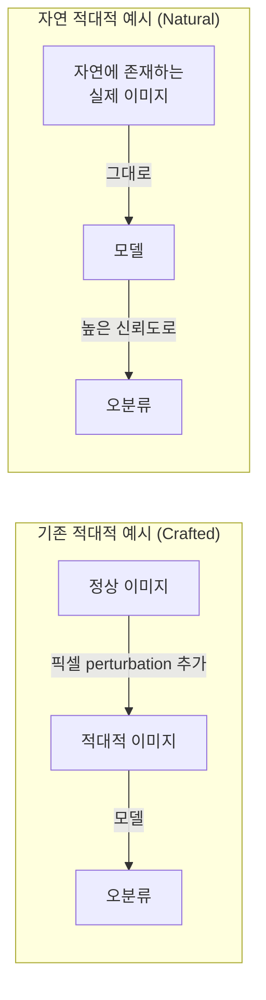

# 자연 적대적 예시 (Natural Adversarial Examples)

**자연 적대적 예시(Natural Adversarial Examples)**는 공격자가 의도적으로 perturbation을 추가하여 생성한 것이 아니라, **실제 세계에 자연적으로 존재하는 이미지/텍스트**임에도 불구하고 최신 AI 모델이 높은 신뢰도로 오분류하는 샘플을 말한다. "데이터 분포 내 취약점"을 드러내는 개념이다.

## 기존 적대적 예시와의 차이

핵심 차이점:

| 구분 | 기존 적대적 예시 | 자연 적대적 예시 |
|------|-----------------|-----------------|
| 생성 방식 | 최적화/알고리즘으로 제작 | 자연에서 수집 |
| 분포 | 원본 이미지 근처의 Out-of-distribution | 학습 분포 내(In-distribution) |
| 인간 인식 | 육안으로 원본과 구분 어려움 | 인간은 쉽게 정분류 가능 |
| 방어 가능성 | [[pgd-adversarial-training]] 등으로 완화 가능 | 기존 방어 기법으로 효과 제한적 |

## 대표 데이터셋: ImageNet-A

Hendrycks 외 (2019)의 **ImageNet-A**는 자연 적대적 예시 연구를 촉발한 대표 벤치마크다.

- ImageNet의 200개 클래스에 대해 자연에서 촬영/수집된 이미지를 선별
- 기준: ResNet-50 등 표준 모델이 낮은 정확도를 보이는 이미지만 포함
- 7,500개 이미지로 구성
- 당시 최신 모델들이 ImageNet 테스트셋에서는 85%+ 정확도를 기록했지만 ImageNet-A에서는 단 2-3%에 그침

## 왜 자연 적대적 예시가 발생하는가

### 텍스처 편향(Texture Bias)

CNN은 전역적인 형태(shape)보다 국소적 텍스처(texture)에 의존하는 경향이 있다. 자연 이미지 중 비정형적 텍스처를 가진 개체(흰 곰, 흐린 날의 새, 비정상적 배경)는 텍스처 단서가 부재하여 오분류가 발생한다.

### 단축 학습(Shortcut Learning)

모델이 실제 의미적 특징 대신 학습 데이터의 **상관관계(spurious correlation)**를 학습한다. 예를 들어 "뱃사람은 항상 배 위에 있다"는 편향 때문에, 배 없이 선원복을 입은 사람을 다른 카테고리로 분류할 수 있다.

### 분포 이동(Distribution Shift)

학습 데이터와 실제 배포 환경 간의 미묘한 차이:
- 조명 조건의 차이
- 카메라 앵글의 극단적 변화
- 부분적 가려짐(occlusion)
- 계절, 시간대에 따른 외관 변화

## [[hallucination]]과의 연결

자연 적대적 예시는 LLM의 [[hallucination]]과 유사한 근본 원인을 공유한다. 모델이 표면적 패턴을 학습하고 실제 개념 이해 없이 추론하기 때문에, 분포 내에서도 취약한 케이스가 존재한다.

텍스트 모달리티에서의 자연 적대적 예시:
- 의미는 동일하지만 표현 방식이 다른 문장(패러프레이즈)에서 NLI 모델의 오분류
- 질문 순서를 약간 변경했을 때 QA 모델의 답변 변화
- 부정 표현이 포함된 문장에서 감성 분석 모델의 오류

## 대응 전략

### 강건한 학습(Robust Training)

[[adversarial-attacks-robustness]] 기법을 자연 적대적 예시에 적용하면 일부 개선되지만, 제작된 perturbation에 최적화된 방어는 자연 적대적 예시에 완전히 효과적이지 않다.

### 데이터 다양화

자연 적대적 예시를 학습 데이터에 포함하는 것이 가장 직접적인 방법이다. 단, 자연 적대적 예시의 자동 수집이 어렵다는 한계가 있다.

### 형태 편향 유도(Shape Bias)

Stylized ImageNet을 사용하여 텍스처 편향을 줄이고 형태 중심 표현을 학습시킨다. 이를 통해 자연 적대적 예시에 대한 견고성이 향상됨이 확인됐다.

### 비전-언어 사전학습(CLIP 등)

대규모 비전-언어 사전학습 모델(CLIP, ALIGN)은 자연 적대적 예시에 상당히 강건한 것으로 나타났다. 다양한 인터넷 이미지-텍스트 쌍으로 학습하여 더 넓은 개념 표현을 획득하기 때문이다.

## 평가 벤치마크

| 데이터셋 | 모달리티 | 특징 |
|----------|----------|------|
| ImageNet-A | 이미지 | 이미지 분류 자연 적대적 예시 |
| ImageNet-O | 이미지 | OOD 탐지용, ImageNet 외 클래스 |
| ANLI | 텍스트 | 자연어 추론 자연 적대적 예시, 인간이 수집 |
| AdvGLUE | 텍스트 | GLUE 태스크 자연 적대적 예시 |

## 관련 문서
- [[backdoor-attack-defense]] -- 백도어 공격과 방어 (Backdoor Attack and Defense)

- [[adversarial-attacks-robustness]] - 제작된 적대적 공격과의 비교, 모델 견고성 전반
- [[hallucination]] - LLM에서 표면적 패턴 의존으로 발생하는 유사한 실패 모드
- [[carlini-wagner-attack]] - 최적화로 제작하는 강력한 적대적 예시와의 대비
