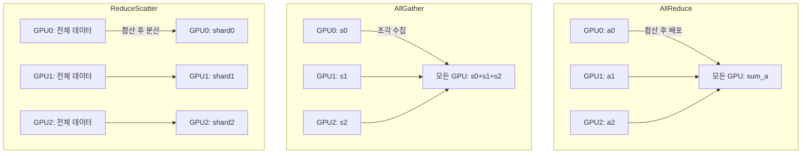
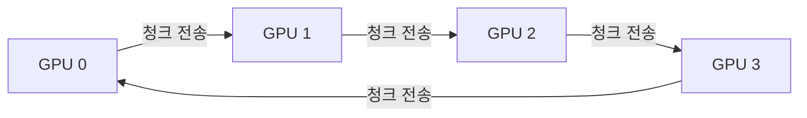
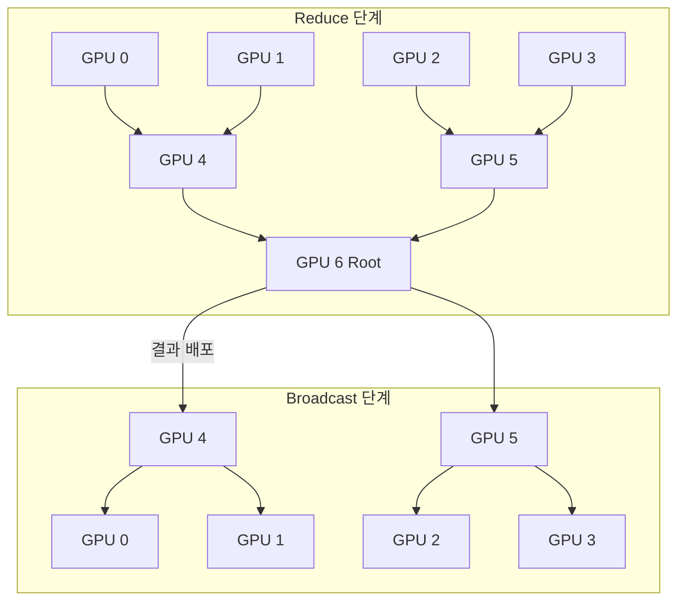
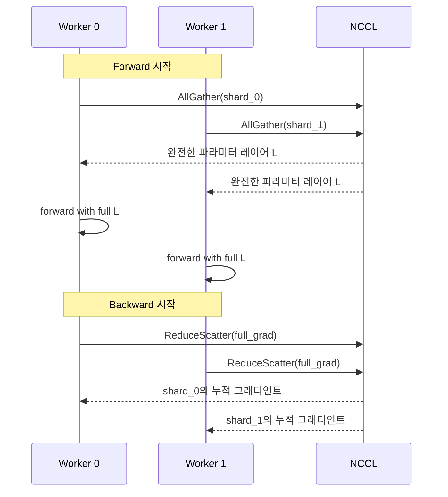

# NCCL 집합 통신 상세

NCCL(NVIDIA Collective Communications Library)은 다중 GPU / 다중 노드 환경에서 집합 통신(collective communication) 연산을 고성능으로 실행하는 라이브러리다. PyTorch 분산 학습, Megatron-LM, DeepSpeed 등 대부분의 대규모 학습 인프라가 NCCL에 의존한다.

## 집합 통신 연산 종류



| 연산 | 입력 | 출력 | 통신량 | 주요 용도 |
|------|------|------|--------|-----------|
| AllReduce | 각 rank의 텐서 | 모든 rank에 합산값 | 2(N-1)/N × 데이터 | DDP 그래디언트 동기화 |
| AllGather | 각 rank의 샤드 | 모든 rank에 전체 | (N-1)/N × 데이터 | FSDP 파라미터 복원 |
| ReduceScatter | 각 rank의 전체 | 각 rank에 합산 샤드 | (N-1)/N × 데이터 | FSDP 그래디언트 처리 |
| Broadcast | 소스 rank의 텐서 | 모든 rank에 복사 | (N-1)/N × 데이터 | 초기 파라미터 배포 |
| Reduce | 각 rank의 텐서 | 대상 rank에 합산값 | 데이터 | 손실 집계 |

## Ring AllReduce 알고리즘

NCCL의 AllReduce 핵심 구현은 링(ring) 토폴로지 기반이다. N개의 GPU를 원형으로 연결하고, 데이터를 N개의 청크로 분할하여 두 단계로 처리한다.



**1단계: Reduce-Scatter** - 각 GPU가 이웃에 청크를 보내며 부분 합산을 반복 (N-1 라운드). 각 GPU가 전체의 1/N 분량의 완전히 합산된 결과를 보유.

**2단계: AllGather** - 완성된 청크를 이웃으로 전파 (N-1 라운드). 모든 GPU가 전체 합산 결과를 보유.

이 방식의 통신 효율: 각 GPU가 송수신하는 총 데이터량 = `2(N-1)/N × 데이터 크기`, N이 커져도 GPU당 통신량이 일정하게 수렴하여 확장성이 뛰어나다.

## 트리 AllReduce

대용량 데이터에서는 링보다 이진 트리(binary tree) 또는 이중 이진 트리(double binary tree) 알고리즘이 더 낮은 레이턴시를 보인다. NCCL은 데이터 크기, 노드 수, 하드웨어 토폴로지에 따라 알고리즘을 자동 선택한다.



## 토폴로지 감지 및 최적화

NCCL은 시작 시 하드웨어 토폴로지를 자동 탐색하여 통신 경로를 최적화한다.

### 노드 내 (Intra-node)

- **NVLink**: GPU 간 직접 고속 링크 (A100: 600 GB/s 양방향). NCCL이 최우선 사용
- **PCIe**: NVLink 없을 때 폴백. 대역폭 낮음 (32~64 GB/s)
- **NVSwitch**: 8개 이상 GPU 연결 시 올투올(all-to-all) 통신 가능

### 노드 간 (Inter-node)

- **InfiniBand + RDMA**: 고대역폭 노드 간 통신 (HDR: ~200 Gb/s)
- **NCCL_SOCKET_IFNAME**: 이더넷 인터페이스 직접 지정
- **GPUDirect RDMA**: CPU를 우회하여 GPU - InfiniBand 직접 통신

```bash
# 토폴로지 확인 환경 변수
NCCL_DEBUG=INFO NCCL_DEBUG_SUBSYS=GRAPH torchrun ...
# 출력에서 사용 중인 알고리즘/링/트리 경로 확인 가능
```

## NCCL 성능 튜닝

| 환경 변수 | 설명 | 권장값 |
|-----------|------|--------|
| `NCCL_IB_HCA` | 사용할 InfiniBand HCA 지정 | `mlx5_0:1` 등 |
| `NCCL_SOCKET_NTHREADS` | 소켓 통신 스레드 수 | 4~8 |
| `NCCL_NSOCKS_PERTHREAD` | 스레드당 소켓 수 | 2~4 |
| `NCCL_BUFFSIZE` | 통신 버퍼 크기 | 4194304 (4MB) |
| `NCCL_MIN_NCHANNELS` | 최소 통신 채널 수 | 4~8 |
| `NCCL_NET_GDR_LEVEL` | GPUDirect RDMA 레벨 | 자동 (2 권장) |

## AllGather vs ReduceScatter: FSDP에서의 역할

FSDP(FullyShardedDataParallel)는 AllReduce 대신 AllGather + ReduceScatter를 사용한다.



## 왜 중요한가

[[nccl]]에서 설명하는 NCCL의 존재 의의는 결국 [[distributed-training-overview]]에서 설명하는 데이터/모델 병렬화 전략의 통신 층을 최적화하는 것이다. AllReduce 대역폭은 대규모 학습에서 GPU 연산 효율 만큼 중요한 병목이며, 토폴로지 이해 없이는 다중 노드 학습 스케일링이 예상보다 훨씬 느려진다.

## 관련 문서

- [[nccl]] - NCCL 라이브러리 개요 및 설치
- [[distributed-training-overview]] - 분산 학습 전략 전반
- [[pytorch-distributed-internals]] - PyTorch DDP/FSDP에서 NCCL 사용 방식
- [[model-parallelism-strategies]] - 모델 병렬화와 통신 패턴
