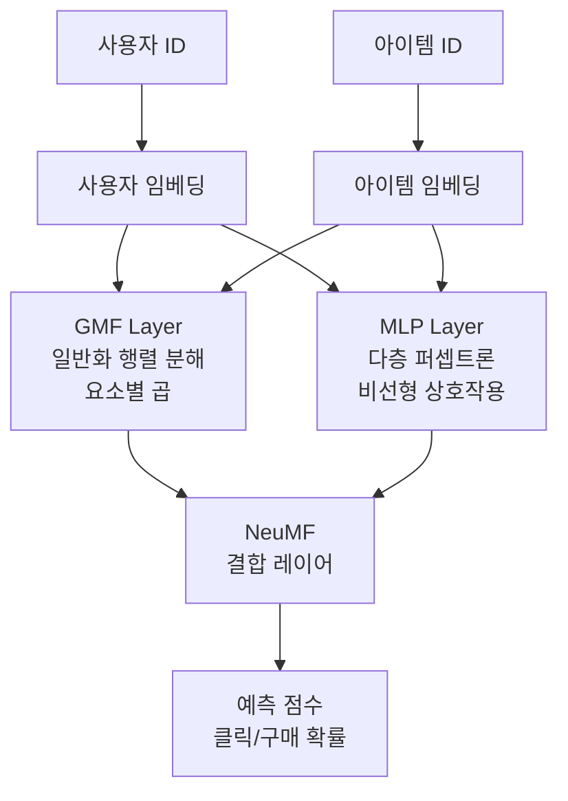

# NCF - 신경망 협업 필터링 (Neural Collaborative Filtering)

NCF(Neural Collaborative Filtering)는 He et al. (2017, WWW)이 제안한 프레임워크로, 전통적인 **행렬 분해(Matrix Factorization)**의 내적 연산을 신경망으로 일반화한다. 협업 필터링의 핵심 가정인 "사용자-아이템 상호작용은 저차원 잠재 공간에서 모델링된다"를 유지하면서, 비선형 관계를 학습할 수 있게 한다.

## 왜 NCF인가: 행렬 분해의 한계

전통적인 MF(Matrix Factorization)는 내적으로 상호작용을 표현한다:

$$\hat{r}_{ui} = \mathbf{p}_u^\top \mathbf{q}_i = \sum_k p_{uk} \cdot q_{ik}$$

이 내적은 **선형 관계만** 포착한다. 복잡한 사용자-아이템 관계, 예컨대 "사용자 A가 액션 영화를 좋아하지만 특정 감독의 액션 영화는 싫어한다"는 비선형 패턴을 표현하기 어렵다.

NCF는 내적을 신경망으로 교체하여 이 한계를 극복한다.

## NCF 프레임워크 구조

NCF는 세 가지 모델 변형을 포함한다:

1. **GMF (Generalized Matrix Factorization)**: 임베딩의 요소별 곱 후 선형 출력
2. **MLP (Multi-Layer Perceptron)**: 임베딩 연결(concatenation) 후 다층 비선형 변환
3. **NeuMF**: GMF와 MLP를 병렬로 결합한 앙상블 모델

## 각 구성 요소 상세

### GMF: 행렬 분해의 신경망 일반화

$$\text{GMF}(u, i) = a_{out}(\mathbf{h}^\top (\mathbf{p}_u^G \odot \mathbf{q}_i^G))$$

- $\odot$: 요소별 곱 (Hadamard product)
- $\mathbf{h}$: 출력 레이어의 가중치 (기존 MF는 $\mathbf{h} = \mathbf{1}$로 고정)
- $a_{out}$: 활성화 함수 (시그모이드)

$\mathbf{h}$를 학습 가능하게 만들면 각 잠재 차원에 다른 가중치를 부여할 수 있어 표준 MF보다 표현력이 높아진다.

### MLP: 비선형 상호작용 학습

$$\mathbf{z}_1 = \phi_1(u, i) = \begin{bmatrix} \mathbf{p}_u^M \\ \mathbf{q}_i^M \end{bmatrix}$$
$$\mathbf{z}_l = a(\mathbf{W}_l \mathbf{z}_{l-1} + \mathbf{b}_l), \quad l = 2, \ldots, L$$

임베딩을 단순히 이어붙인(concatenate) 후 여러 층의 완전 연결 레이어를 통과시킨다. ReLU 활성화를 주로 사용하며, 레이어를 거칠수록 차원이 절반씩 줄어드는 타워 구조를 권장한다 (예: 256 → 128 → 64 → 32).

### NeuMF: 두 구성 요소의 결합

$$\hat{y}_{ui} = \sigma(\mathbf{h}^\top \begin{bmatrix} \mathbf{p}^G_u \odot \mathbf{q}^G_i \\ \phi_L(u,i) \end{bmatrix})$$

GMF의 출력과 MLP의 마지막 레이어 출력을 연결한 뒤 최종 예측을 수행한다. 두 모델이 각각 다른 임베딩을 사용하므로 서로 다른 관점에서 상호작용을 포착한다.

## 학습 방식

### 암묵적 피드백 (Implicit Feedback)

NCF는 클릭, 시청, 구매처럼 명시적 평점이 없는 **암묵적 피드백** 학습에 최적화되어 있다. 이진 분류 문제로 설정한다:

$$y_{ui} = \begin{cases} 1 & \text{사용자 } u \text{가 아이템 } i \text{와 상호작용} \\ 0 & \text{샘플링된 네거티브} \end{cases}$$

### 손실 함수

이진 교차 엔트로피(Binary Cross-Entropy)를 사용한다:

$$\mathcal{L} = -\sum_{(u,i) \in \mathcal{Y}^+} \log \hat{y}_{ui} - \sum_{(u,j) \in \mathcal{Y}^-} \log(1 - \hat{y}_{uj})$$

네거티브 샘플링 비율은 통상 1:4 (긍정 1개당 네거티브 4개)로 설정한다.

### 사전 학습 전략

NeuMF 학습 시 다음 순서를 따르면 수렴이 빠르다:

1. GMF 독립 학습 → 가중치 저장
2. MLP 독립 학습 → 가중치 저장
3. 두 모델의 가중치를 NeuMF 초기값으로 사용하여 파인튜닝
4. 출력 레이어는 0.5 비율로 GMF/MLP 가중치를 혼합 초기화

## 성능 비교 (MovieLens-1M 기준)

| 모델 | HR@10 | NDCG@10 |
|------|-------|---------|
| MF (BPR) | 0.6024 | 0.3423 |
| GMF | 0.6283 | 0.3649 |
| MLP | 0.6245 | 0.3635 |
| NeuMF | **0.6917** | **0.4099** |

NeuMF는 GMF나 MLP 단독 대비 일관되게 높은 성능을 보인다.

## 한계와 후속 연구

- **콜드 스타트**: 새 사용자/아이템의 ID가 없으면 임베딩 조회 불가. [[cold-start-problem]] 참조
- **연산 비용**: MLP 층이 깊어질수록 학습/추론 비용 증가
- **시퀀스 무시**: 사용자 행동의 순서를 반영하지 않음. 이를 보완한 것이 [[sequential-recommendation]]

## 관련 문서

- [[recommendation-systems-dl]] - 딥러닝 추천 시스템의 전반적인 진화와 방법론
- [[embedding-layers]] - 임베딩 레이어의 원리와 학습 방법
- [[cold-start-problem]] - 신규 사용자/아이템을 위한 콜드 스타트 해결 전략
- [[sequential-recommendation]] - 사용자 행동 시퀀스를 반영한 순차 추천
